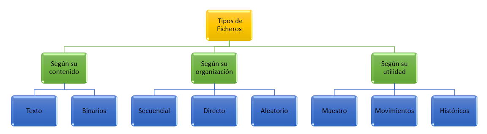
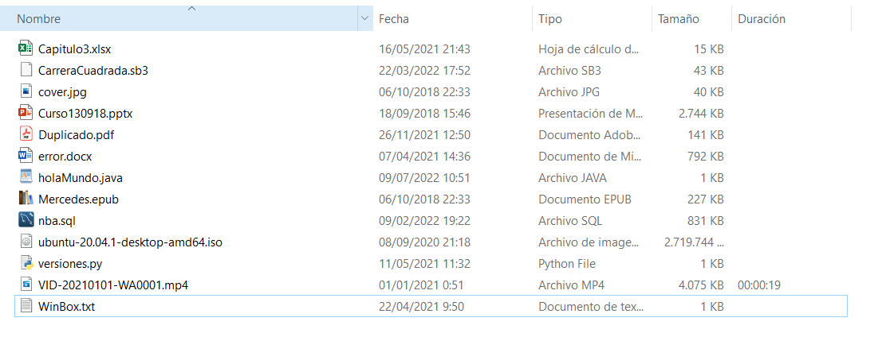
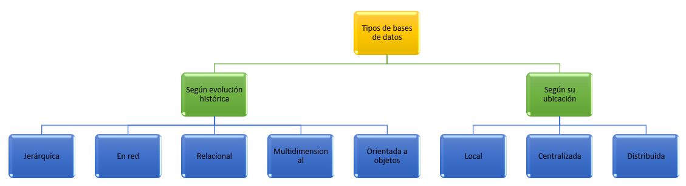
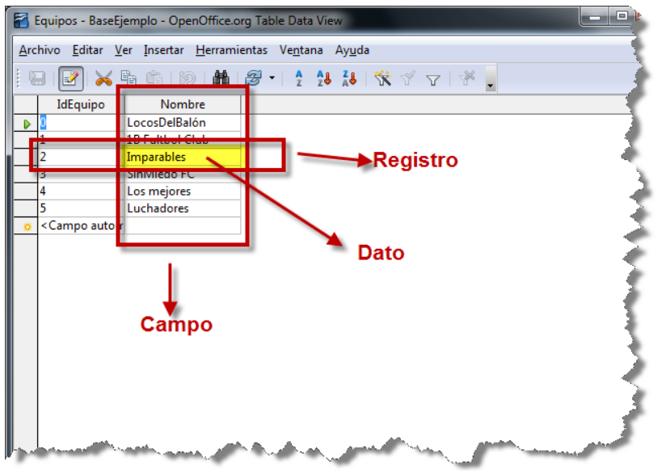
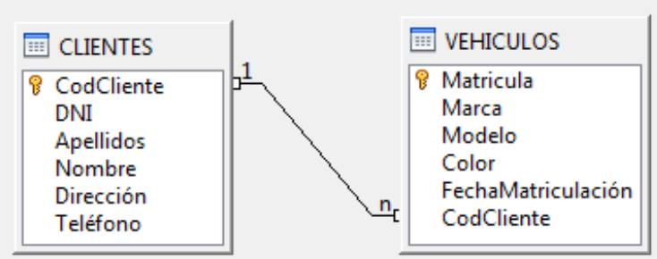

# UNIDAD 1. SISTEMAS DE INFORMACIÓN

- [UNIDAD 1. SISTEMAS DE INFORMACIÓN](#unidad-1-sistemas-de-información)
  - [1.- FICHEROS](#1--ficheros)
    - [1.1.- Tipos de ficheros y formatos](#11--tipos-de-ficheros-y-formatos)
  - [2.- BASES DE DATOS](#2--bases-de-datos)
    - [2.1.- Tipos de bases de datos](#21--tipos-de-bases-de-datos)
  - [3.- BASES DE DATOS RELACIONALES](#3--bases-de-datos-relacionales)
    - [3.1.- Conceptos](#31--conceptos)
    - [3.2.- Otros conceptos más específicos de las bases de datos](#32--otros-conceptos-más-específicos-de-las-bases-de-datos)
    - [3.3.- Sistemas Gestores de Bases de Datos](#33--sistemas-gestores-de-bases-de-datos)
    - [3.4.- Tipos de SGBD](#34--tipos-de-sgbd)
  - [HOJAS DE EJERCICIOS](#hojas-de-ejercicios)

## 1.- FICHEROS

Un ordenador almacena muchos tipos de información. Toda esta información está almacenada en los dispositivos de almacenamiento del ordenador. Para poder organizar toda la información, se utilizan ficheros o archivos. 

Los ficheros son estructuras de información que crean los sistemas operativos de los ordenadores para almacenar datos. Suelen tener un nombre y una extensión, que determina el formato de la información que contiene.

### 1.1.- Tipos de ficheros y formatos

El formato y tipo de fichero determina la forma de interpretar la información que contiene. Un fichero es una ritra de bits (ceros y unos), de forma que es necesaria su interpretación para dar sentido a la información que almacena. 

Tradicionalmente, los ficheros se han clasificado de muchas formas. Vemos una clasificación de los ficheros en función de varias categorías.

1. **Según el contenido:** un fichero puede ser tratado como _texto_, o como datos _binarios_, es decir, los bits almacenados en un fichero pueden ser traducidos por el sistema operativo a caracters alfabéticos y números que entiene el ser humano, o ser tratados como componentes de estructuras de datos más complejas, como ficheros que almacenan sonido, video, imágenes, etc...

2. **Según la organización:** dicta la forma en que se han de acceder a los datos. Los ficheros con _organización secuencial_, estan dispuestos siguiendo una secuencia ordenada, es decir, los datos estan unos detrás de otros. para acceder a un dato concreto, se han de recorrer todos los datos anteriores. Los ficheros de _organización directa_, permiten acceder a un dato en concreto sin necesidad de acceder a los anteriores. Finalmente, los de _organización indexada_ acceden a los datos consultando un índice, es decir, una estructura de datos que permite acceder a la información rápidamente, simulando la forma en que el índice de un libro facilitaq el acceso a los contenidos. Existen variantes de las anteriores que mezclan las mejores características de cada una de ellas.

3. **Según la utilidad:** indica el uso que se va a hacer de el fichero. Si va a contener datos fundamentales para la organización, se denomina _fichero maestro_. Si hay variaciones en los ficheros maestros, se almacenan en los _ficheros de movimientos_. Y cuando se almacenan datos que ya no son necesario para su proceso diario forman parte de los _ficheros históricos_.

**Realiza los siguientes ejercicios:**

1. Busca en tu ordenador un fichero con extensión docx y ábrelo con el bloc de notas. ¿Porqué no se ve bien el contenido del fichero?.
2. Conectaté a Internet y busca una tabla de códigos ascii de 8 bits. Observa las siguientes características:
    - Los 32 primeros caracteres, se llaman caracteres no imprimibles y se utilizaban tradicionalmente para el control de transmisiones.
    - La distancia entre mayúsculas y minúsculas es exactamente de 32 caracteres.
3. La siguiente imagen es una captura de una carpeta en el sistema Windows. Indica de que tipo es cada fichero y que contiene.

## 2.- BASES DE DATOS

Una **Base de datos**  es un conjunto de datos estructurados que pertenecen a un mismo contexto y, en cuanto a su función, se utiliza para administrar de forma electrónica grandes cantidades de información.

Anteriormente a las bases de datos, se utilizaban ficheros tradicionales, como los que hemos visto en el apartado anterior. Veamos según su definición cuales son sus diferencias.

- Los ficheros tradicionales almacenan los datos en archivos individuales, exclusivos de cada aplicación en particular. Los datos de un fichero no están relacionados con datos de otros ficheros. Son unidades independientes. En este sistema, los datos pueden ser redundantes y la actualización de los datos es más lenta.
- Bases de datos: el almacenamiento de datos está formalmente definido, controlado centralmente para intentar servir a múltiples y diferentes aplicaciones. La base de datos es una fuente de datos que son compartidos por numerosos usuarios para diversas aplicaciones.

Así, en un Sistema de ficheros tradicional, la información está dispersa en varios ficheros de datos y existe un cierto número de programas que los recuperan y agrupan. Aunque los sistemas de ficheros o archivos supusieron un gran avance sobre los sistemas manuales, tienen inconvenientes bastante importantes que se solventaron, en gran medida, con la aparición de los sistemas de bases de datos.

### 2.1.- Tipos de bases de datos

Coincidiendo con la evolución histórica de las bases de datos éstas han utilizado distintos modelos:

- Jerárquicos: La estructura jerárquica fue usada en las primeras bases de datos, donde las relaciones entre los distintos datos almacenados forman una estructura de árbol.
- En red: La estructura en red contiene relaciones más complejas que las jerárquicas. Adminte relaciones de cada registro con varios que se pueden seguir por distintos caminos.
- Relacionales: La estructura relacional es la más extendida y es la que vamos a estudiar nosotros. Almacena los datos en filas o registros y columnas o campos. EStas tablas estarán relacionadas entre sí por claves comunes.
- Multidimensionales: La estructura multidimensional se parece a la del modelo relacional, pero en vez de las dos dimensiones fila-columna, tiene N dimensiones. Ofrece el aspecto de una hoja de cálculo.
- De objetos: la estructura orientada a objetos está diseñada siguiendo el paradigma de los lenguajes orientados a objetos. De este modo soporta los tipos de datos gráficos, imágenes, voz y texto de manera natural. Esta estructura tiene gran difusión en aplicaciones web para aplicaciones multimedia.

Otro modo de clasificar las bases de datos es según su ubicación. Veamos las más importantes:

- Bases de datos locales. En modo local tenemos la base de datos y el usuario ubicados en el mismo ordenador. Un ejemplo de base de datos que funciona en modo local es Microsoft Access, que es una base de datos fácil de manejar por usuarios poco expertos que funciona bien en modo local y mientras no tenga que albergar grandes cantidades de información.
- Bases de datos centralizadas. En los sistemas centralizados tenemos la base de datos completa en un mismo servidor, y todos los usuarios acceden a ese servidor. Que la base de datos esté en un mismo servidor no implica que esté en un solo archivo o en el mismo disco, puede estar repartida.En modo Cliente/Servidor, la base de datos se encuentra en un ordenador (el Servidor) y los usuarios acceden simultáneamente a esa base de datos a través de la red (sea una red local o Internet) desde sus ordenadores a través de un programa Cliente. A nivel de empresas es el sistema que más se utiliza en la actualidad.
- Bases de datos distribuidas. Tenemos la información repartida en distintas localizaciones unidas todas ellas mediante red y un sistema gestor de bases de datos distribuidas. Las distintas localizaciones suelen ser distintas geográficamente.

**Realiza los siguientes ejercicios:**

1. Busca por Internet las ventajas y desventajas de utilizar un sistema de ficheros tradicional frente a un sistemas de bases de datos para almacenar información.
2. Busca por Internet un esquema o imagen que te ayude a identificar cada uno de los tipos de datos de las bases de datos que hemos visto.

## 3.- BASES DE DATOS RELACIONALES

Como ya hemos comentado, en este curso vamos a trabajar con las bases de datos relacionales. Veremos una serie de conceptos básicos sobre las bases de datos en general, y de las bases de datos relacionales en particular.

### 3.1.- Conceptos

**Datos:** son hechos conocidos que pueden registrarse y que tienen un significado implícito. Pueden constituir datos los nombres, números telefónicos y direcciones de personas que conocemos.

**Tipo de Dato:** El tipo de dato indica la naturaleza del campo. Así, se puede tener datos numéricos, que son aquellos con los que se pueden realizar cálculos aritméticos (sumas, restas, multiplicaciones…), los datos alfanuméricos, que son los que contienen caracteres alfabéticos y números…

**Tabla:** Es un conjunto de filas y columnas bajo un mismo nombre que representa el conjunto de valores almacenados para una serie de datos. Por ejemplo,la información de todos los clientes de una BD se almacenarán en una tabla llamada CLIENTES.

**Campo:** Cada una de las columnas de una tabla. Identifica una familia de datos. Por ejemplo, el campo fechaNacimiento representa las fechas de nacimiento de todos los clientes que contiene una tabla CLIENTES.

**Registro:** Corresponde a cada una de las filas de la tabla. También se llaman tuplas. Por ejemplo en la siguiente tabla CLIENTES, observamos dos registros, que corresponden a la información sobre los clientes Juan García y Fernándo Martínez.

**Campo clave:** Es un campo especial que identifica de forma única a cada registro. Por ejemplo, el NIF es único para cada persona, por tanto puede ser su campo clave. Existen distivos tipos de campos clave que veremos más adelante.

**Consulta:** Es una instrucción para hacer peticiones a una base de datos. Las consultas, o querys, pueden ser solo para mostrar información contenida en una o varias tablas de la base de datos, o para modificar, eliminar o añadir datos a una o varias tablas de la base de datos.
   
**Índice:** Es una estructura que almacena los campos clave de una tabla, organizándolos para hacer más fácil encontrar y ordenar los registros.
   
**Vista:** Se obtienen al guardar una consulta de una o varias tablas. De esta forma se obtiene una tabla virtual, es decir, no está almacenada en los dispositivos de almacenamiento del ordenador, aunque sí se almacena su definición.

**Guiones o scripts:** Son un conjunto de instrucciones, que ejecutadas de forma ordenada, realizan operaciones avanzadas o mantenimiento de los datos almacenados en la BD.
    
**Procedimientos:** Son un tipo especial de script que están almacenados en la BD y forman parte de su esquema.

### 3.2.- Otros conceptos más específicos de las bases de datos

**Entidades:** Una entidad es todo aquello de lo cual interesa guardar datos, por ejemplo:
- Guardar datos de una persona, de un producto, de un animal...
- Imaginad que queremos almacenar datos de la entidad Persona, cuyos atributos pueden ser: DNI, nombre, apellidos, dirección, teléfono...

**Claves primarias y claves foráneas o ajenas. Relaciones:** Cada entidad tiene una clave primaria o campo clave o llave que identifica unívocamente al conjunto de datos. Cuando en una entidad figura la clave primaria de otra entidad, ésta se denomina clave foránea o clave ajena. Las entidades se relacionan entre sí a través de las claves foráneas.

- En este gráfico tenemos dos entidades: Clientes y Vehículos. 
- La clave primaria de Clientes es: CodCliente
- La clave primaria de Vehículos es: Matricula
- La clave foránea de Vehículos es CodCliente. Los Clientes se relacionan con Vehículos a través del CodCliente que figura en ambas tablas.

**Restricción de integridad referencial:** Esta restricción significa que el valor de un campo que es clave ajena siempre deben estar relacionadas con un valor correcto de la clave primaria en la tabla principal. La integridad referencial garantiza que la relación entre dos tablas permanezca sincronizada durante las operaciones de actualización y eliminación. 

- En el ejemplo anterior, no podemos tener un Vehículo cuyo codigo de cliente no exista previamente en la tabla de Clientes.

**Metadatos:** Metadatos son datos acerca de los datos presentes en la base de datos. Por ejemplo:

- qué tipo de datos se van a almacenar (si son texto o números o fechas …)
- qué nombre se le da a cada dato (nombre, apellidos, fecha, precio, edad,…)
- cómo están agrupados los datos
- cómo se relacionan,….

### 3.3.- Sistemas Gestores de Bases de Datos

Un sistema gestor de bases de datos (SGBD) es una aplicación que permite a los usuarios definir, crear y mantener una base de datos, y proporciona acceso controlado a la misma.

En general, un SGBD proporciona los siguientes servicios:

- Permite la definición de la base de datos mediante el lenguaje de definición de datos **(DDL – Data Description Language)**. Este lenguaje permite especificar la estructura y el tipo de los datos, así como las restricciones sobre los datos. Todo esto se almacenará en la base de datos.
- Permite la inserción, actualización, eliminación y consulta de datos mediante el lenguaje de manejo o manipulación de datos **(DML - Data Manipulation Language)**.
- Proporciona un acceso controlado a la base de datos mediante:
    - Un sistema de seguridad, de modo que los usuarios no autorizados no puedan acceder a la base de datos, mediante el lenguaje de control de datos **(DCL - Data Control Language)**.
    - Un sistema de integridad que mantiene la integridad y la consistencia de los datos;
    - Un sistema de control de concurrencia que permite el acceso compartido a la base de datos;
    - Un sistema de control de recuperación que restablece la base de datos después de que se produzca un fallo del hardware o del software;
    - Un diccionario de datos o catálogo accesible por el usuario que contiene la descripción de los datos de la base de datos.

La principal herramienta de un SGBD es la interfaz de programación con el usuario. Esta interfaz consiste en un lenguaje muy sencillo mediante el cual el usuario interactua con el servidor. Este lenguaje comúnmente se denomina SQL, Structure Query Language, está estandarizado, es decir, todas las BD que soporten SQL deben tener la misma sintaxis a la hora de aplicar el lenguaje.

### 3.4.- Tipos de SGBD

Los SGBD se pueden clasificar según las BD que gestionan (jerárquicas, relacionales, orientadas a objetos,…), pero como actualmente la mayoría de los SGBD integran múltiples filosofías, los clasificaremos según su capacidad y potencia del propio gestor, resultado los siguientes SGBD:

- SGBD ofimáticos: manipulas BD pequeñas orientadas a almacenar datos domésticos o de pequeñas empresas. Ejemplos típicos son Microsoft ACCESS y LibreOffice Base.
- SGBD corporativos: tienen la capacidad de gestionar BD enormes, de medianas o grandes empresas con una carga de datos y transacciones que requieren de un servidor de gran capacidad. Un ejemplo típico de BD corporativas es ORACLE, actualmente junto de DB2 el servidor de BD más potente del mercado (también el más caro). Nosotros para nuestro aprendizaje utilizamos una versión gratuita con fines educativos, que aunque bastante limitada, nos sirve para introducirnos en la filosofía de ORACLE.

## HOJAS DE EJERCICIOS

💻 Hoja de ejercicios 1.

💻 Hoja de ejercicios 2.

💻 Hoja de ejercicios 3.

💻 Hoja de ejercicios 4.

💻 Hoja de ejercicios 5.

