# UNIDAD 2. DISEÑO LÓGICO DE LA BASE DE DATOS.

# INDICE
- [UNIDAD 2. DISEÑO LÓGICO DE LA BASE DE DATOS.](#unidad-2-diseño-lógico-de-la-base-de-datos)
- [INDICE](#indice)
  - [1.- MODELO DE DATOS](#1--modelo-de-datos)
    - [1.1.- Clasificación de los modelos de datos](#11--clasificación-de-los-modelos-de-datos)
  - [2.- LOS DIAGRAMAS E/R](#2--los-diagramas-er)
    - [2.1.- Entidades](#21--entidades)
    - [2.2.- Atributos y tipos](#22--atributos-y-tipos)
      - [Tipos de atributos.](#tipos-de-atributos)
    - [2.3.- Relaciones](#23--relaciones)
    - [2.4.- Cardinalidad](#24--cardinalidad)
    - [2.5.- Tipo de Correspondencia](#25--tipo-de-correspondencia)
  - [HOJAS DE EJERCICIOS](#hojas-de-ejercicios)
    - [2.6.- Debilidad](#26--debilidad)
  - [HOJAS DE EJERCICIOS](#hojas-de-ejercicios-1)
  - [3.- EL MODELO E/R AMPLIADO](#3--el-modelo-er-ampliado)
  - [4.- CONSTRUCCIÓN DE UN DIAGRAMA E/R](#4--construcción-de-un-diagrama-er)
  - [HOJAS DE EJERCICIOS](#hojas-de-ejercicios-2)
  - [5.- MODELO RELACIONAL](#5--modelo-relacional)
    - [5.1.- Elementos de una relación](#51--elementos-de-una-relación)
    - [5.2.- Restricciones del modelo relacional](#52--restricciones-del-modelo-relacional)
    - [5.3.- Claves primarias y claves ajenas](#53--claves-primarias-y-claves-ajenas)
    - [5.4.- Integridad referencial](#54--integridad-referencial)
    - [5.5.- Representación del modelo Relacional](#55--representación-del-modelo-relacional)
    - [5.6.- Paso del modelo E/R al modelo Relacional](#56--paso-del-modelo-er-al-modelo-relacional)
  - [HOJAS DE EJERCICIOS](#hojas-de-ejercicios-3)
  - [6.- NORMALIZACIÓN](#6--normalización)
    - [6.1.- Primera forma normal (1FN)](#61--primera-forma-normal-1fn)
    - [6.2.- Segunda forma normal (2FN)](#62--segunda-forma-normal-2fn)
    - [6.3.- Tercera forma normal (3FN)](#63--tercera-forma-normal-3fn)
  - [HOJAS DE EJERCICIOS](#hojas-de-ejercicios-4)

## 1.- MODELO DE DATOS

Un modelo pretende crear una simplificación de la realidad para poder comprenderla mejor. Para realizar un modelo se realiza una abstracción más simple de la realidad. Se usan modelos en diferentes áreas de la informática, como por ejemplo UML en Ingeniería del software o el modelo Entidad/Relación para BD.

Un **modelo de datos** es un conjunto de herramientas y reglas para representar los datos, las relaciones entre éstos y las restricciones de una base de datos.

Fundamentalmente se han utilizado los siguientes modelos de datos:

- Relacional
- Jerárquico
- En red
- Orientado a Objetos
- Relacional orientado a objetos

### 1.1.- Clasificación de los modelos de datos

Una opción bastante usada a la hora de clasificar los modelos de datos es hacerlo de acuerdo al nivel de abstracción que presentan:

- Modelos de Datos Conceptuales: Describe las estructuras de datos y restricciones de integridad. Se usan en la fase de Análisis y representan los datos y las relaciones entre ellos. El esquema más típico es el *Modelo Entidad-Relación*.
- Modelos de Datos Lógicos: Describe la estructura que tendrá la base de datos en función del tipo de SGBD que hayamos elegido. El ejemplo más típico es el *Modelo Relacional*.
- Modelos de Datos Físicos: Describe exactamente como se implementan los datos dentro del SGBD elegido. Puede ser en Access, MySQL, PostgreSQL, Oracle...

En este tema vamos a trabajar el modelo conceptual, más concretamente el modelo Entidad-Relación, o modelo E-R.

## 2.- LOS DIAGRAMAS E/R

El modelo Entidad-Relación es un modelo puramente conceptual. Representa el funcionamiento de un sistema de información mediante un diagrama Entidad Relación (E/R).
Facilita enormemente el diseño de una base de datos. Es muy representativo del funcionamiento del sistema de información y es independiente del SGBD. Toma como referencia la percepción que tenemos del funcionamiento del mundo real:

- Esa percepción se basa en entidades que actúan sobre otras entidades haciendo procesos.
- Consta de una colección de objetos básicos llamados **entidades** y de unas **relaciones** establecidas entre dichas entidades.  

Se han desarrollado varios modelos E/R y diagramas de representación para el modelo. En este curso vamos a usar el modelo de Chen. Vemos en la siguiente imagen un ejemplo de Diagrama E-R siguiendo el modelo de Chen:

En los siguientes apartados vamos a ir desgranando los elementos que componen un diagrama E-R y como se construye.

### 2.1.- Entidades

Las entidades son uno de los elementos usados en los diagramas E/R. Una entidad es un objeto, sujeto o concepto sobre el que se recoge información básica en el sistema para poder realizar los procesos que se requieran. En un sistema de información que permite gestionar el funcionamiento de un centro de estudios.

En el esquema anterior, serían entidades:

- ALUMNO
- MODULO
- PROFESOR

Una entidad se representa en un diagrama E/R mediante un rectángulo.

### 2.2.- Atributos y tipos

Un atributo es una propiedad o una característica de una entidad. Como veremos más adelante, las relaciones también pueden tener atributos.Por ejemplo, la entidad ALUMNO puede tener los atributos:

- Numero
- Nombre
- Apellidos
- Fecha Nac.
- Poblacion

Los atributos de una entidad, se representan mediante pequeños círculos unidos a la entidad por una línea. Al lado de cada círculo se escribe el nombre del atributo. 

El dominio de un atributo es todo el conjunto de valores que se pueden asignar a ese atributo. Ejemplos de atributos y dominios de una entidad EMPLEADO:

| Atributo | Dominio |
| ------------- | ------------- |
| DNI  | Cadena de caracteres de longitud 9  | 
| Nombre  | Cadena de caracteres de longitud 20  | 
| Apellidos  | Cadena de caracteres de longitud 30  | 
| Antigüedad  | Fecha  | 
| Salario  | Numero real con dos decimales  |
| Categoría  | Enumerado de categorías  |
| JornadaCompleta  | Verdadero o Falso  |

**Realiza el siguiente ejercicio:**

1. Indica cual sería el dominio de cada uno de los siguientes atributos de la entidad PERSONA:

- Fecha de nacimiento
- Localidad de nacimiento
- Edad
- EsMayorDeEdad
- DNI
- Teléfonos
- Nombre
- Apellidos

#### Tipos de atributos.

1. *Atributos simples y atributos compuestos*: 
    - Un atributo es simple si su contenido no se considera dividido en partes, por ejemplo NOMBRE. 
    - Es compuesto si admite dividirse en partes. Por ejemplo, FECHA podría ser compuesto si se considera que de FECHA se puede usar aisladamente DIA, MES y AÑO.

2. *Atributos monovaluados y atributos multivaluados*: 
    - Un atributo es monovaluado si admite para cada elemento de la entidad un solo valor, por ejemplo nombre de una persona sería monovaluado. 
    - Si un atributo admite una lista de valores para cada elemento, sería multivaluado, por ejemplo si un atributo de la entidad CLIENTE fuese teléfono_cliente, éste podría ser  atributo multivaluado. 

3. *Atributos obligatorios y atributos opcionales*: 
    - Un atributo es obligatorio si para todo elemento debe contener algún valor y es opcional si puede haber elementos que no tengan asignado ningún valor para ese atributo. Por ejemplo, el atributo Aficiones podría ser opcional para una entidad CLIENTE.
    - Un atributo opcional se representa:

4. *Atributos derivados y no derivados*: 
    - Un atributo es derivado si se puede obtener a partir de los datos contenidos en otros atributos. Un atributo derivado podría ser IMPORTE DE VENTA si los valores para ese atributo se obtuviesen a través de los atributos UNIDADES VENDIDAS y PRECIO UNIDAD. No es recomendable usar atributos derivados.
    - Un atributo es no derivado si su valor no depende de ningún otro atributo. 

5. *Clave* : Una clave sirve para identificar de forma única a cada elemento de una entidad. Una clave puede estar formada por un solo atributo o por varios. En una clave no se pueden repetir valores, es decir, no puede haber dos elementos de la misma entidad con la misma clave. En una entidad puede haber dos tipos de clave:
    - Clave primaria o principal: Dentro de los conjuntos de atributos que pueden permitir identificar a los elementos de una entidad, debería ser la que se considera más adecuada en base a una serie de requisitos: simplicidad, longitud, representatividad, estabilidad.
    - Clave secundaria o alternativa. Puede haber varias en una entidad pero no se debe abusar de estas claves. Serán todas aquellas que decidamos, aparte de la primaria.

Representación de los atributos: 

**Observa y analiza el siguiente ejemplo:**

**Realiza el siguiente ejercicio:**

1. Justifica si los siguientes atributos sería obligatorios-opcionales, compuestos-simples,  derivado-no derivado, monovaluado-multivaluado.

- Fecha de nacimiento
- Localidad de nacimiento
- Edad
- EsMayorDeEdad
- DNI
- Teléfonos
- Nombre
- Apellidos

### 2.3.- Relaciones

Una relación es una asociación entre varias entidades a través de una acción realizable entre esas entidades. Suelen ser verbos o formas verbales. Por ejemplo:

- COMPRAR (entre CLIENTE y PRODUCTO)
- CURSAR (entre ALUMNO y MODULO)
- SER_HIJO (entre ALUMNO y PADRE).
- SER_JEFE (EMPLEADO consigo misma)
- COMPRAR (entre las entidades CLIENTE, PRODUCTO, VENDEDOR)

Vamos a ver que tipos de relaciones nos podemos encontrar.

1. *Relación binaria o de grado dos*: Cuando se da entre dos entidades.

En este ejemplo vemos que las relaciones también pueden tener atributos.

2. *Relación unaria, reflexiva o de grado uno*: Cuando se da entre elementos de la misma entidad, es decir, un elemento de una entidad se relaciona con uno o más elementos de la misma entidad.

3. *Relación ternaria o de grado tres*: Cuando se da entre tres entidades.

### 2.4.- Cardinalidad

En este apartado vemos una serie de definiciones para seguir entendiendo como construir un diagrama E-R.

- **Ocurrencia**: Es una unidad del conjunto de elementos que representa una entidad. Para la entidad ALUMNO, una ocurrencia de ALUMNO es un alumno concreto. 
- **Cardinalidad** de una entidad A respecto de otra B en una relación: indica el número mínimo y máximo de ocurrencias de la entidad A que pueden estar relacionadas con una ocurrencia de la entidad B. (A veces aparece como participación y no cardinalidad).

La cardinalidad se indica mediante una pareja números encerrados entre paréntesis. El primer número indica el mínimo número de ocurrencias relacionadas (será siempre un valor 0 o 1). El segundo número indica el máximo número de ocurrencias relacionadas (será siempre un valor 1 o N para muchos).

Vamos a ver ahora que preguntas debemos hacernos para obtener mínimo y máximo de una entidad con la otra. Lo haremos pensando en la imagen anterior.

- ¿Cada alumno como mínimo cuantas materias puede cursar?
    - Al menos 1, ya que si no este no estaría matriculado.
- ¿Cada alumno como máximo cuantas materias puede cursar?
    - N, ya que puede cursar más de una
- ¿Cada materia puede ser cursada como mínimo por cuantos alumnos?
    - 0, ya que podría haber una materia sin alumnos. Convalidada.
- ¿Cada materia puede ser cursada como máximo por cuantos alumnos?
    - N, ya que puede haber varios alumnos matriculados en ella.
    
 
 
 
 
NOTA: Fíjate que lo obtenido de las 2 primeras preguntas lo ponemos al otro lado de la relación en Materia. Y las dos últimas en Alumno

Las cardinalidades que se pueden dar en las relaciones son:

| Cardinalidad | Significado |
| ------------- | ------------- |
| (0,1)  | Mínimo cero, máximo uno  | 
| (1,1)  | Minimo uno, máximo uno  | 
| (0,N)  | Mínimo cero, máximo muchos  | 
| (1,N)  | Mínimo uno, máximo muchos  | 

### 2.5.- Tipo de Correspondencia

El tipo de correspondencia o relación de cardinalidad expresa el número máximo de elementos u ocurrencias que se pueden llegar a relacionar entre las entidades de una relación.

- Uno a uno (1:1): Sería el caso de la relación CASADO entre las entidades PERSONA y PERSONA. Un persona podrá estar casada con otra persona pero no con muchas.
- Uno a muchos (1:N): Sería el caso de la relación PERTENECE entre las entidades MUNICIPIO y PROVINCIA. Un municipio sólo puede pertenecer a una provincia, mientras que a una provincia pertenecen muchos municipios.
- Muchos a muchos (N:M): Sería el caso de la relación COMPRA entre las entidades PRODUCTOS y CLIENTES. Un cliente puede comprar varios productos y un mismo tipo de producto será comprado por varios clientes. 

Representación de cardinalidad y tipo de correspondencia

 

 

**Realiza el siguiente ejercicio:**

1. En un supermercado hay productos organizados en categorías. Cada producto pertenece a una única categoría. Están previstas categorías que aún pueden no tener productos. Calcula las cardinalidades de cada entidad y el tipo de correspondencia y represéntalos en el esquema E/R.

## HOJAS DE EJERCICIOS

💻 Hoja de ejercicios 1.

Vamos a ver ahora que tipos de correspondencia nos podemos encontrar en una relación ternaria y como se puede obtener.

Tomamos en cuenta una de la entidades y es necesario ver que relación o participación presenta esta con la agrupación de las otras dos. Los casos posibles que se pueden dar son estos:

- 1:1:1
- 1:1:M
- 1:N:M
- M:N:P

Vamos a ver con un ejemplo como obtener las cardinalidades en una relación ternaria. Partamos del siguiente caso:

 

1.- Elegimos dos entidades y las ponemos cardinalidad a 1, y preguntamos que relación tiene la tercera entidad con las dos que hemos puesto a uno. Puede ser una relación "a uno" o "a muchos".

En el ejemplo, fijamos 1 asignatura en 1 semestre y nos preguntamos: ¿Cuantos alumnos puede haber matriculados en 1 asignatura para 1 semestre? 

La respuesta sería qué puede haber muchos estudiantes matriculados dado que varios estudiantes pueden matricularse de una misma asignatura en el mismo semestre. Por lo tanto el tipo de entidad estudiante participa con grado n en la relación de matrícula.

2.- En segundo lugar, nos preguntaremos, por ejemplo, sí fijados un estudiante y una asignatura concretos puede estar matriculado en 1 o muchos semestres. 

La respuesta es que puede estar matriculado en muchos semestres dado que un estudiante se puede matricular más de una vez en diferentes semestres hasta que apruebe la asignatura. 

Por lo tanto el tipo de entidad semestre participa con grado en la relación matriculado. 

3.- En Tercer lugar no preguntamos sí fijados un estudiante y un semestre en concreto pueden estar matriculados de una o muchas asignaturas. 

La respuesta es que se pueden tener muchas asignaturas en las cuales el alumno está matriculado puesto que un alumno se puede matricular de varias asignaturas dentro de un mismo semestre.

Por lo tanto la entidad asignatura también participa con N en la relación matriculada. 

Por lo tanto nos queda el diagrama así:

Este es un ejemplo de una relación ternaria 1:1:1.

En este caso suponemos la relación de defensa de un proyecto por parte de un alumno en el tribunal en 2º curso. ALUMNO-PROYECTO: un alumno que hace un proyecto 

**Realiza el siguiente ejercicio:**

1. Obtén la cardinalidad de cada una de las entidades en la siguiente relación: (Resuelto)
    - Cardinalidad de autores: ¿Cuántos autores pueden tener un determinado libro publicado en una determinada editorial?
    - Cardinalidad de Libro: ¿Cuántos libros Puedes tener un determinado autor publicado en una determinada editorial.
    - Cardinalidad de editorial: ¿En cuantas  editoriales puede un determinado autor publicar un mismo libro? 

2. Calcula los tipos de correspondencia de las siguientes relaciones:

    - Persona casada con persona (en España)
    - Persona casada con persona (en Arabia Saudí)
    - Jugador juega en equipo (datos registrados actuales)
    - Producto contiene pieza

### 2.6.- Debilidad

Una entidad es débil frente a otra que es fuerte cuando para existir un elemento de la débil es necesario que exista un elemento de la fuerte.

Por ejemplo, en la gestión de pedidos y ventas de un comercio, un pedido consta de varias líneas de pedido (una por cada producto). Si PEDIDO es una entidad y LINEA_PEDIDO es otra entidad, PEDIDO sería entidad fuerte y LINEA_PEDIDO una entidad débil respecto de la anterior.

Una entidad débil solo se da en una relación de 1:N.

En el ejemplo expuesto, para identificar la línea de pedido además de su campo id_línea, necesito el id_pedido.

Las entidades débiles se representan en los diagramas E/R rodeadas por una línea doble:

Hay dos tipos de dependencias en relaciones de debilidad:

1.- **Dependencia en existencia**: Las ocurrencias de una entidad débil no tienen ningún sentido en la base de datos sin una ocurrencia de la entidad fuerte con la que están relacionadas.

2.- **Dependencia en identificación**: Además de la dependencia en existencia, la entidad débil necesita a la fuerte para poder crear una clave a partir de la clave que tiene la entidad fuerte. Es decir, en el ejemplo, cada línea de pedido se identificaría con numPed y numLinea.

## HOJAS DE EJERCICIOS

💻 Hoja de ejercicios 2.

## 3.- EL MODELO E/R AMPLIADO

El **Modelo E/R ampliado** recoge todos los conceptos y especificaciones del modelo E/R y añade otros para mejorar el diseño de las bases de datos. Se definen los siguientes conceptos dentro de este modelo:

- **Superclase**: Es una entidad genérica de la que derivan otras entidades. La superclase tiene unos atributos que van a tener también las entidades que derivan de ellas. 

- **Subclase**: Es una entidad que deriva de una entidad genérica o superclase. La subclase va a tener los atributos de la superclase más unos atributos específicos. Los elementos que hay en la subclase también estarán en la superclase, aunque esta contendrá normalmente muchos más elementos. 

Por ejemplo, EMPLEADO sería una superclase y OPERARIO y ENCARGADO serían subclases de ésta. 

Otro ejemplo, en un centro de estudios PERSONA podría ser una superclase mientras ALUMNO y PROFESOR serían subclases.

- **Generalización** es el proceso de construir una superclase a partir de las características comunes o que comparten varias subclases del sistema de información. 

Una generalización se representa mediante un triángulo invertido 
que une la superclase y las subclases.

- **Especialización** es el proceso inverso a la generalización. En la especialización se trata de buscar los atributos específicos de las subclases y las restricciones de existencia de elementos de las entidades.

Conforme a las restricciones de existencia de elementos de las entidades, nos podemos encontrar con los siguientes tipos de especialización o generalización:

1. **Especialización exclusiva total**: Por ser exclusiva, un elemento de la superclase sólo puede estar en una subclase. Por ser total, todos los elementos de la superclase están en alguna de las subclases.
   

2. **Especialización exclusiva parcial**: Por ser exclusiva, un elemento de la superclase sólo puede estar en una subclase. Por ser parcial, no tienen porque estar todos los elementos de la superclase en alguna de las subclases.
 

3. **Especialización solapada total**: Por ser solapada, un elemento de la superclase podría pertenecer a varias subclases. Por ser total, todos los elementos de la superclase están en alguna de las subclases.

4. **Especialización solapada parcial**: Por ser solapada, un elemento de la superclase podría pertenecer a varias subclases. Por ser parcial, no tienen porque estar todos los elementos de la superclase están en alguna de las subclases.
   

Las cardinalidades de la especialización para los cuatro casos que hemos visto son de la siguiente manera:

## 4.- CONSTRUCCIÓN DE UN DIAGRAMA E/R

Los pasos a seguir serán:
1. Leer el documento varias veces hasta entender bien el problema y tener clara toda la información de que disponemos.
2. Obtener una lista de candidatos a entidades, relaciones y atributos:
    - Identificar las entidades. Los sujetos básicos en el sistema. 
    - Buscar los atributos de cada entidad. Proponer la clave principal de cada uno. Establecer los tipos de atributos (compuestos, multivaluados, opcionales, derivados). Establecer sus dominios (Fecha, numero real con dos decimales, cadena de caracteres de longitud 9, V/F…) 
    - Identificar las generalizaciones y especializaciones (tipos de especializaciones exclusiva total, solapada parcial…)
    - Identificar las relaciones de debilidad, entidades fuertes y débiles. Dependencias de existencia o de identificación.
3. Averiguar las cardinalidades y los tipos de correspondencia en cada relación.
4. Revisar lo obtenido para:
    - Eliminar entidades derivadas.
    - Ver si es necesario añadir entidades a alguna relación.
    - Ver si algunos atributos de una entidad se deben agrupar como atributos de una nueva entidad.
5. Realizar una distribución de las entidades y representar sus relaciones en el diagrama así como los atributos.
6. Volver a leer el problema para ver si nos hemos dejado algo. Revisar que toda la información está representada en el esquema y refinarlo si es necesario.

## HOJAS DE EJERCICIOS

💻 Hoja de ejercicios 3.

💻 Hoja de ejercicios 4.

💻 Hoja de ejercicios 5.

💻 Hoja de ejercicios 6.

💻 Hoja de ejercicios 7.

## 5.- MODELO RELACIONAL

El modelo relacional es el más apropiado en la actualidad para representar la estructura de una base de datos. Ellos es debido a:

- Es un modelo sencillo, potente y flexible para el diseño de una base de datos.
- Tiene una base matemática en el álgebra relacional. Cualquier operación sobre elementos del modelo relacional deriva en una operación del álgebra relacional.
- A partir de este álgebra relacional se ha podido realizar la construcción del lenguajes SQL para manipular los datos.
- La mayoría de los SGBD relacionales se basan en este modelo.

### 5.1.- Elementos de una relación

El elemento principal del modelo relacional es la **RELACION**. Una relación es una tabla. Cada elemento de la relación es una fila y se le denomina tupla de la relación. Cada propiedad, atributo o característica de los elementos es una columna.

No debes confundir el concepto de relación en el modelo relacional con el concepto de relación en el modelo E/R.

Al conjunto de valores que puede tomar una columna se le denomina dominio. Y estos pueden ser de dos tipos:

- General: si los valores pueden ser todos los existentes dentro del tipo de dato correspondiente a la columna.
- Restringido: si sólo puede tomar valores dentro de un rango de un dominio general, por ejemplo, números reales comprendidos entre 0 y 10.

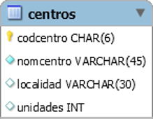

### 5.2.- Restricciones del modelo relacional

Los datos que almacenan las BD tienen como objetivo fundamental representar situaciones del mundo real. En ocasiones esto no es así.

Supongamos, por ejemplo, el caso de una relación empleados en el que su sueldo es negativo (-1000 euros). Esto hace necesario la  creación de restricciones que nos permita representar de manera coherente dicha información.

Existen dos tipos de restricciones:

- Las propias o inherentes al modelo relacional: son condiciones más generales, propias de un modelo de datos, y se deben cumplir en toda base de datos que siga dicho modelo. 
    - No puede haber dos tuplas o filas que tengan el mismo contenido en todas sus columnas.
    - Ninguna columna que sea clave primaria (restricción de usuario) admite nulos. 
    - Ninguna columna que sea clave primaria admite valores repetidos en las tuplas.
    - Ninguna columna que sea clave alternativa admite valores repetidos en las tuplas.

- Las propias del usuario: son condiciones específicas de una base de datos concreta, es decir, son las que se deben cumplir en una base de datos particular con unos usuarios concretos, pero que no son necesariamente relevantes en otra base de datos. Por ejemplo, tener empleados con sueldo negativo. En otra BD, puede que no haya sueldo, o que sea siempre positivo. El modelo permite que el usuario establezca:
    - Clave primaria (Primary Key) 
    - Unicidad o clave alternativa(UNIQUE)
    - Obligatoriedad (NOT NULL)
    - Clave ajena (FOREIGN KEY)
    - Verificación o chequeo (CHECK)
    - Aserciones o asertos (ASSERTION)
    - Disparadores (TRIGGER)
  
### 5.3.- Claves primarias y claves ajenas

La **Clave primaria o principal (PRIMARY KEY)** es un conjunto de atributos o columnas que identifican de forma única a cada tupla de una relación (a cada fila de una tabla). 

Se debe declarar clave primaria en cualquier tabla, aunque no es obligatorio hacerlo. 

Sólo puede definirse una clave primaria en una tabla y debe ser, dentro de las columnas que puedan servir para identificar a cada tupla, la columna o el conjunto de columnas que se considere mejor para identificar de forma única a cada tupla o elemento de la tabla. 

Sobre las claves primarias  quedan establecidas las restricciones inherentes comentadas anteriormente. (Que no puede estar vacía y que no se puede repetir).

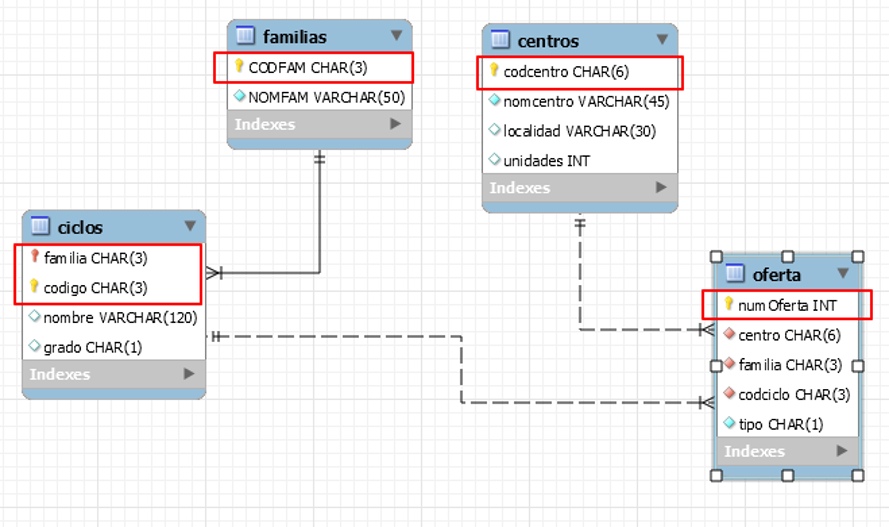

Nota: En este esquema, la línea continua representa una relación identificada. La clave ajena forma parte de la clave primaria de la tabla donde está. La línea discontinua representa una relación no identificada. La clave ajena no forma parte de la clave primaria de la tabla donde está.

La **clave ajena (FOREIGN KEY)** sirve para indicar que uno o más atributos que forman clave ajena en una tabla (tabla secundaria en la relación, referenciante) están relacionados con uno o más atributos de otra tabla (principal en la relación, referenciada) que forman clave primaria o clave alternativa en esa otra tabla. 

Por ejemplo, si tenemos una tabla COUNTRY que contiene datos de todos los países del mundo y una tabla CITY que contiene datos de ciudades del mundo, para controlar el país al que pertenece cada ciudad, podrá haber una relación de clave ajena entre:

- CITY (tabla secundaria) 
- COUNTRY (tabla principal) 

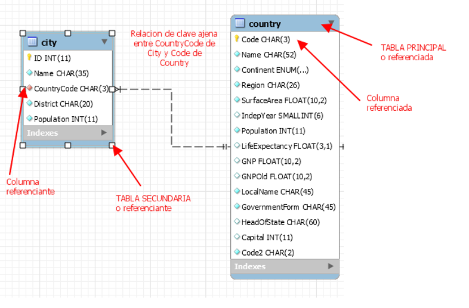

### 5.4.- Integridad referencial

Las restricciones de integridad referencial son las que permiten que el SGBD controle incoherencias entre los datos cargados en la clave ajena y los datos existentes en la clave primaria de la tabla principal. Las restricciones de integridad referencial actúan cuando:

- Se inserta una nueva fila en la tabla secundaria.

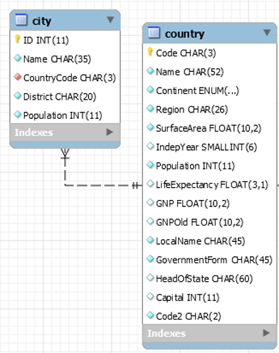

Al insertar una nueva city se comprobaría que el CountryCode de la nueva ciudad esté cargado en Code de algún Country. Si no lo está, se rechaza la inserción.

- Se modifica el valor de la clave ajena en la tabla secundaria.

Al modificar el contenido de una CITY, se comprueba que el nuevo valor cargado en la clave ajena CountryCode exista en la clave primaria Code de tabla principal COUNTRY. Si no existe se rechaza la modificación y queda la fila con el valor anterior

- Se borra una fila en la tabla principal. En este caso, podemos definir diferentes restricciones de integridad referencial.

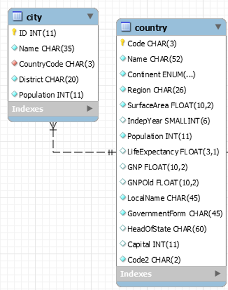

  - **Borrado en cascada**: Si se elimina un país, se eliminan todas las ciudades del país. **BC**
  - **Borrado restringido**: Si se trata de eliminar un país y hay ciudades de ese país en la tabla CITY, no se permite la eliminación. **BR**
    - **Borrado con puesta a nulos**: Si se trata de eliminar un país y hay ciudades de ese país en la tabla CITY, se elimina el país y en la columna clave ajena (countrycode) de CITY de todas las ciudades de ese país, se carga NULL. **BN**
    - **Borrado con puesta a valor por defecto**: Si se trata de eliminar un país y hay ciudades de ese país en la tabla CITY, se elimina el país y en la columna clave ajena (countrycode) de CITY de todas las ciudades de ese país, se carga un valor por defecto. **BD**

- Se modifica la clave primaria en la tabla principal. Al igual que en el caso anterior, también se pueden definir diferentes restricciones de integridad referencial.

  - **Modificación en cascada**: Si se modifica el código de  un país, se modifica countrycode de  todas las ciudades del pais. **MC**
  - **Modificación restringida**: Si se trata de modificar el código de un país y hay ciudades de ese país en la tabla CITY, no se permite la modificación. **MR**
  - **Modificación  con puesta a nulos**: Si se trata de modificar el código de  un país y hay ciudades de ese país en la tabla CITY, se carga NULL en la columna clave ajena (countrycode) de CITY de todas las ciudades de ese país. **MN**

### 5.5.- Representación del modelo Relacional

Existen diversas formas de representar el modelo relacional. Veamos ejemplos de algunas de ellas:

1. Esquema relacional conectado a columnas.

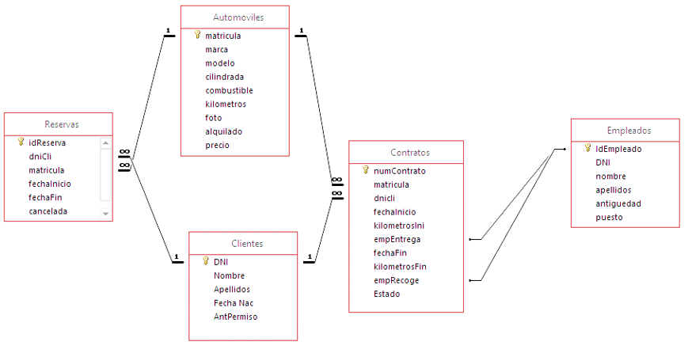

2. Esquema relacional crow´s foot o esquema pata de cuervo. La parte de la pata va en la tabla donde está la clave ajena.

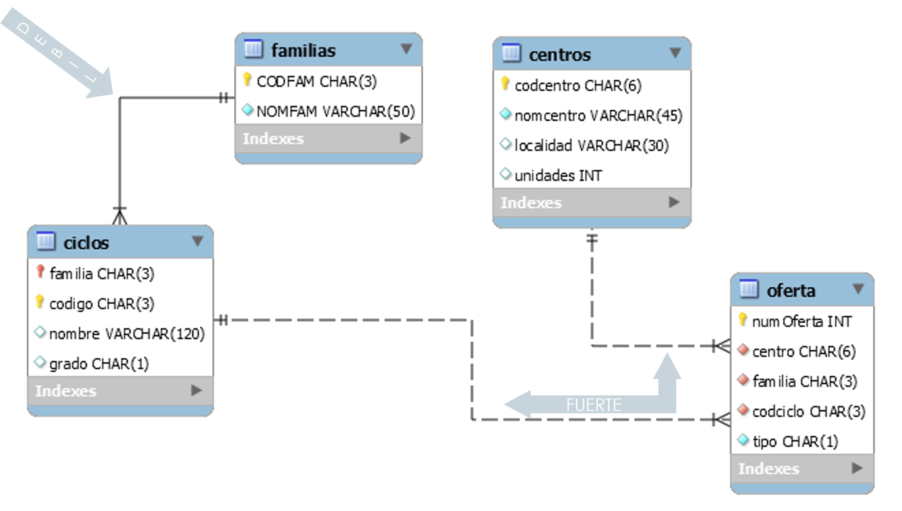

3. Grafo relacional.

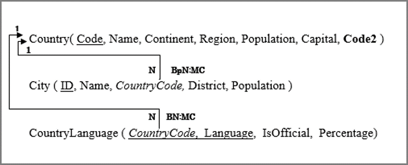

Veamos ahora como se construye un grafo relacional, el tercero de los esquemas que hemos visto:

- Cada nodo o elemento representa una tabla o relación con todos sus atributos.
- Se representan las claves ajenas a través de flechas dirigidas entre la clave ajena y la tabla donde se encuentra la clave primaria relacionada.
- Cada nodo en el grafo (tabla) se representa, si es posible, con una línea de texto. Esta línea contiene en letras mayúsculas el nombre de la tabla y a continuación, entre paréntesis, los nombres de los atributos o columnas de la siguiente forma:
 
    - Si un atributo es clave primaria se representa subrayado.
    - Si un atributo es clave alternativa se representa en negrilla.
    - Si un atributo puede tomar valores nulos, se representa con un asterisco al final del nombre del atributo. 
    - Si un atributo es clave ajena se representa en letra cursiva.

Lo vemos con un ejemplo:

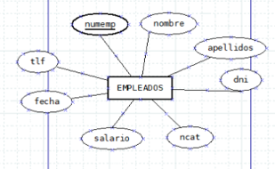

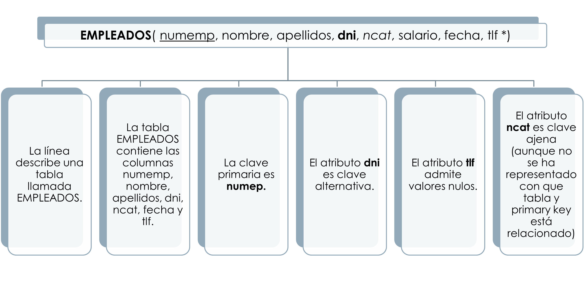

- Si un atributo es clave ajena se representa en letra cursiva. 
- Para representar la clave con la que está relacionada la clave ajena, se traza una flecha dirigida desde el nombre de la clave ajena hasta el nombre de la tabla que contiene la clave relacionada. 
- En el origen de la flecha se deben escribir las restricciones de borrado y modificación, si es que se van a establecer.
- En la relación debe representarse la cardinalidad. Si el tipo es 1:N, se escribirá 1 al final de la flecha, es decir, en la tabla principal y se escribirá N en el origen de la flecha. 
- En el modelo relacional no se permite representar cardinalidades N:M, sólo se permiten 1:1 y 1:N

Lo vemos con un ejemplo:

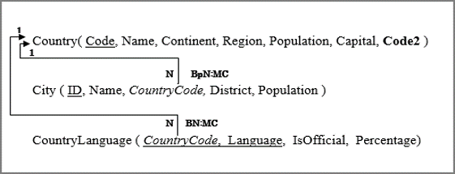

En la tabla CountryLanguage: columna CountryCode es clave ajena y está relacionada con la primary key de la tabla Country. Por cada fila de Country (por cada país) puede haber muchas filas en CountryLanguage. Hay en esa clave ajena restricción de borrado normal, entonces no se puede borrar un país si hay idiomas del país cargados en countrylanguage. Hay en esa clave ajena restricción de modificación en cascada, entonces si se modifica el código de un país se modifica ese código en todos los idiomas del país.

### 5.6.- Paso del modelo E/R al modelo Relacional

Para hacer el cambio a modelo relacional, ya hemos visto todo se reduce a relaciones representadas por tablas. 
En terminos generales se puede decir:

- Para cada conjunto de **entidades fuertes A**, existe una única tabla a la que se le asigna el nombre del conjunto de entidades A, y cuyos atributos son los atributos del conjunto de entidades. 
- Para cada conjunto de **entidades débiles B** existe una única tabla a la que se le asigna el nombre de la entidad débil, y cuyos atributos son los atributos de la entidad débil mas el o los atributos de la clave primaria de la entidad fuerte a la que está subordinada. 
- Para cada conjunto de **relaciones** existe una única tabla a la  que se le asigna el nombre del conjunto de relaciones y cuyos atributos son las claves primarias de todas las entidades que relaciona más los atributos propios de la relación. 

Vamos a ver detalladamente los pasos que hay que dar para transformar el modelo E/R al modelo relacional:

* Toda entidad, sea del tipo que sea, pasa a ser una relación y por lo tanto se transforma en una tabla que contiene los mismos atributos de la entidad, excepto los multivaluados.
  
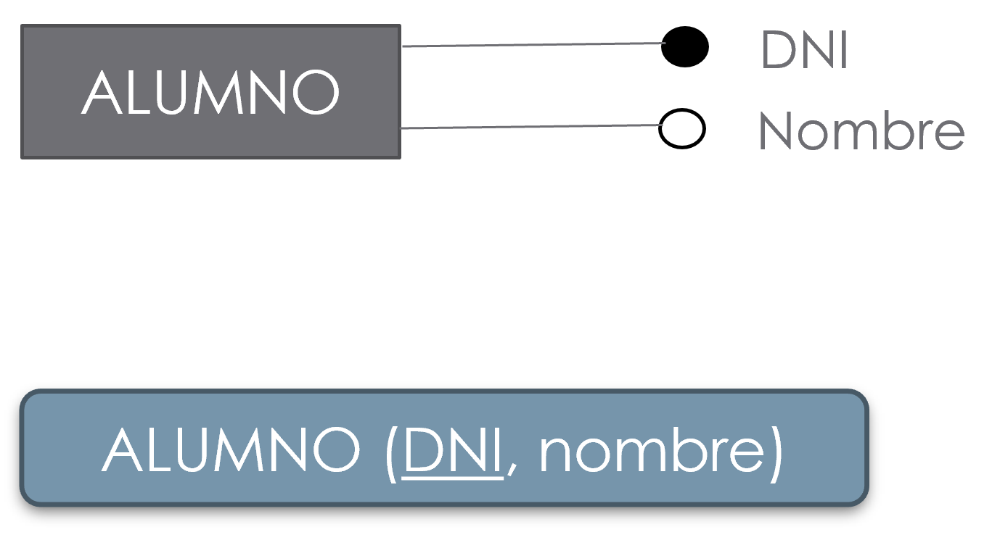

* En una relación con cardinalidad 1:N se debe propagar la clave primaria de la entidad con participación máxima 1 para ser clave ajena en la tabla que tiene participación máxima N.
  
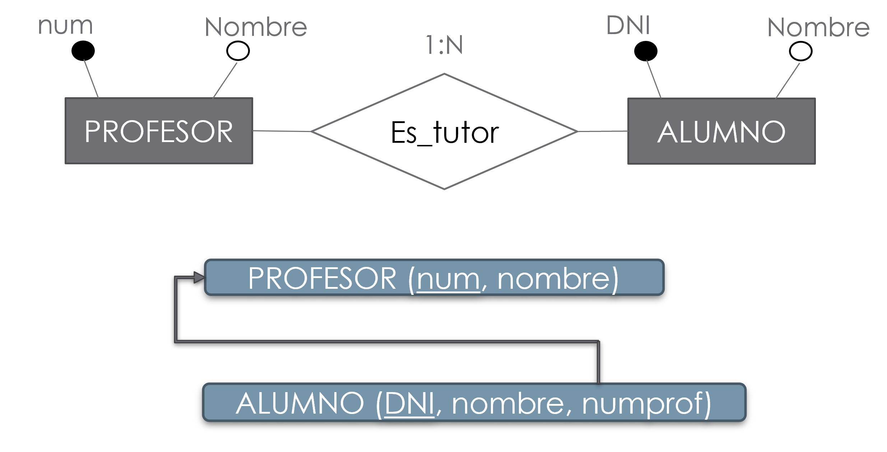

* Las relaciones con tipo de correspondencia N:M entre una entidad A y una entidad B dan origen a una tabla cuya clave primaria está formada por la concatenación de las claves primarias de las tablas A y B. La tabla tendrá, además, los atributos que sean propios de la relación.

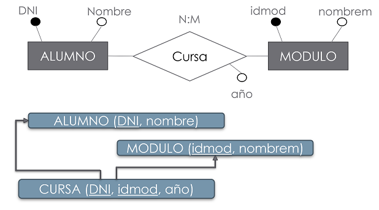

* Una relación con cardinalidad 1:1 entre dos entidades A y B presenta tres casos:

  - Si la participación de A es (0,1) y la de B es (1,1), se propaga la clave primaria de B para ser clave ajena en la tabla A.

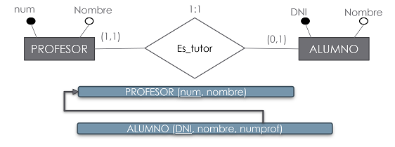

  - Si la participación de A es (1,1) y la de B es (1,1) se propaga la clave primaria de cualquiera de las dos tablas como clave ajena de la otra tabla. 

  - Si la participación de ambas entidades es (0,1), se trata como el caso de las relaciones con tipo de correspondencia N:M.

* Un atributo multivaluado de una entidad da lugar a una tabla formada por dos atributos: 
    - la clave de la entidad de la que forma parte y el atributo correspondiente, no siendo multivaluado en esta nueva tabla. 
    - La clave primaria será la concatenación de los dos atributos o bien un identificador nuevo elegido para esa función. 

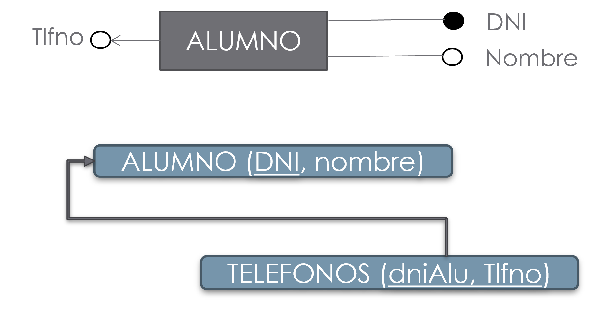

* Una relación con dependencia en existencia hace que se propague la clave primaria de la entidad fuerte como clave ajena en la tabla correspondiente a la entidad débil. La clave primaria en la tabla correspondiente a la entidad débil será la que se haya indicado para dicha entidad en el esquema E-R.

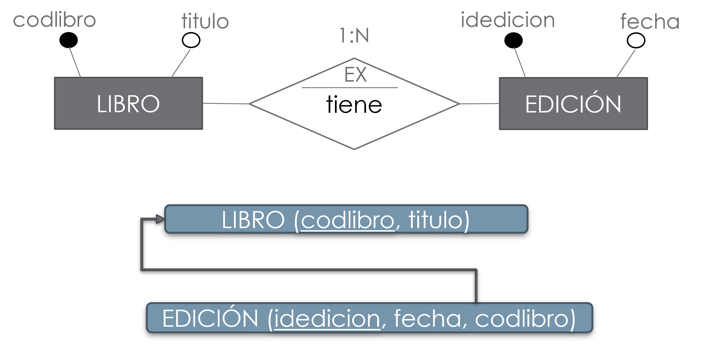

* Una relación con dependencia en identificación hace que se propague la clave primaria de la entidad fuerte como clave ajena en la tabla correspondiente a la entidad débil. La clave primaria en la tabla correspondiente a la entidad débil será la concatenación de la clave ajena propagada y el identificador de la entidad débil indicado en el esquema E-R.

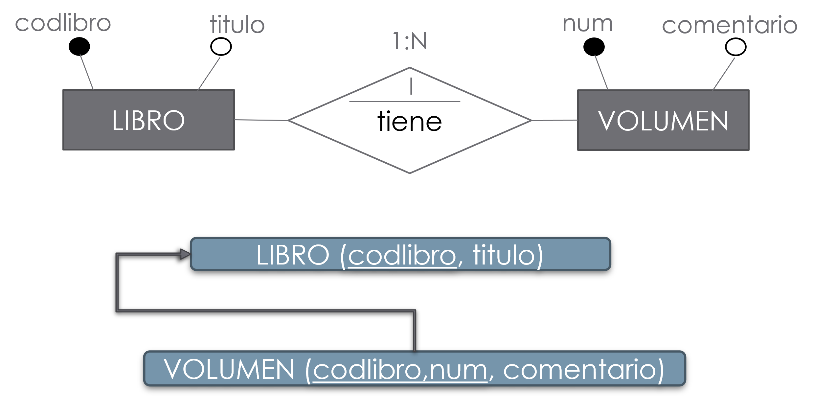

  - MODO 1: Una especialización genera una tabla para la superentidad y una tabla por cada subentidad con referencia a la superentidad. Este modo de hacerlo funciona siempre bien.

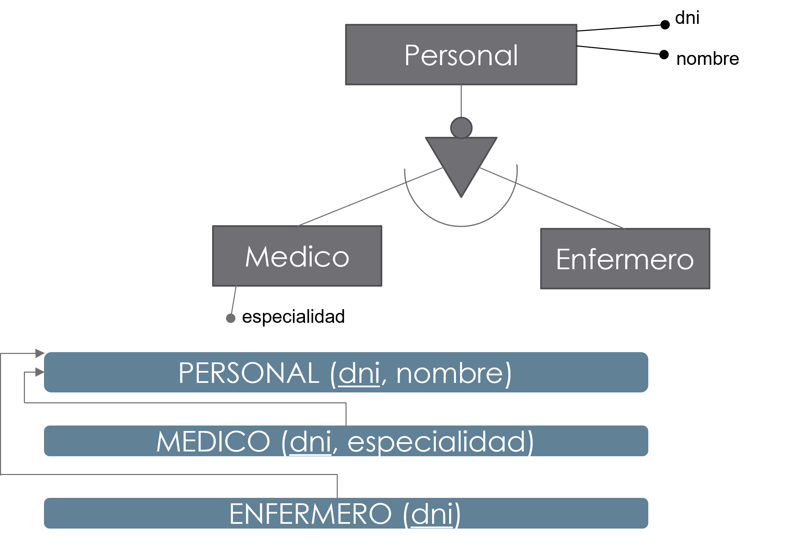

  - MODO 2: Una especialización genera una tabla para cada subentidad con referencia a la superentidad. Este modo de hacerlo funciona bien si es una especialización total.

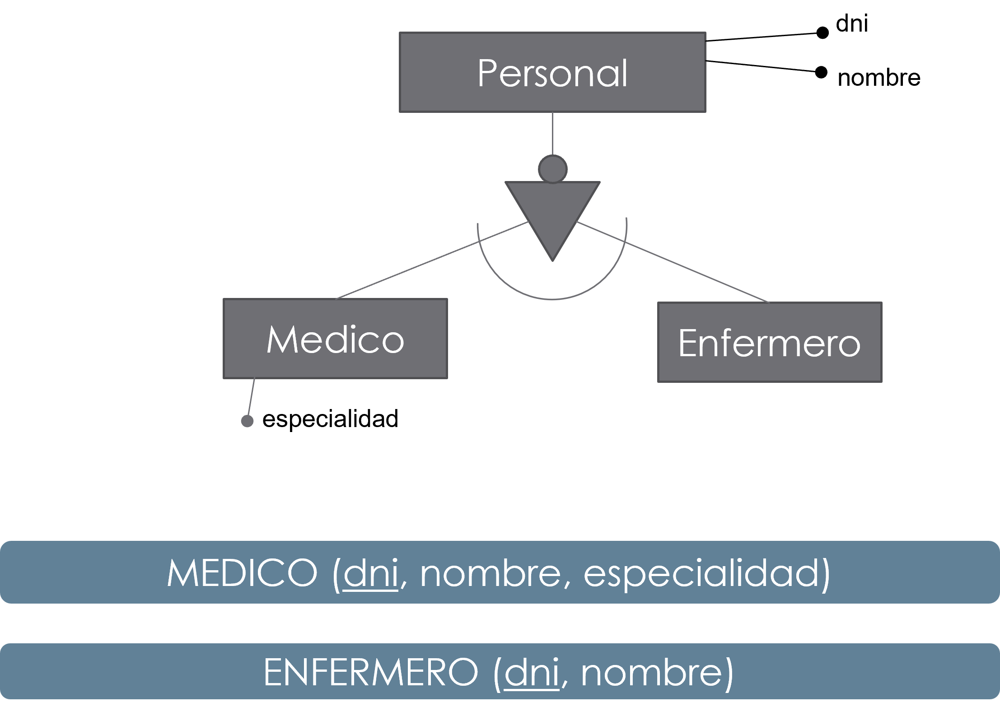

  - MODO 3: Una especialización genera una tabla que engloba todos los atributos de la superentidad y las subentidades más un atributo tipo. Puede generar valores nulos. No recomendada.

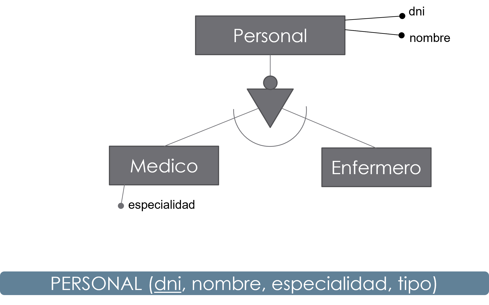

Os dejo un documento resumen de como hacer el paso del modelo E-R al modelo Relacional.

**Realiza el siguiente ejercicio:**

1. Representa el esquema relacional correspondiente a una base de datos sobre la red de albergues del Camino de Santiago del Norte. 
- De cada albergue se registrará su nombre, dirección, localidad y km. que faltan para el destino final (Santiago de Compostela)
- Existen albergues con el mismo nombre genérico (Albergue de peregrino, por ejemplo). 
- Los albergues son de propiedad municipal,  pertenecen a Ayuntamientos. Un determinado Ayuntamiento puede disponer de varios albergues.
- De cada Ayuntamiento debemos conocer su nombre, dirección, teléfono y URL de su web.
- En los albergues pernoctan peregrinos de los que se registra un número de tarjeta (único), su nombre y nacionalidad.
- Se debe registrar la fecha de entrada de cada peregrino en el albergue correspondiente.

## HOJAS DE EJERCICIOS

💻 Hoja de ejercicios 8.

💻 Hoja de ejercicios 9.

💻 Hoja de ejercicios 10.

💻 Hoja de ejercicios 11.

💻 Hoja de ejercicios 12.

💻 Hoja de ejercicios 13.

💻 Hoja de ejercicios 14.

## 6.- NORMALIZACIÓN

Al diseñar una base de datos se ha de evaluar la calidad del diseño. Para poder llevar a cabo dicha evaluación de la calidad, uno de los parámetros que se utiliza son las **formas normales** en las que se encuentra dicho diseño. Se llama **normalización** al proceso de obligar a los atributos incluidos en el diseño a cumplir varias formas normales.

Las formas normalies son unas reglas que, al cumplirse, aseguran que el esquema diseñado tenga un buen comportamiento respecto a:

- Redundancia de información
- Pérdida de información
- Presentación de la información

Vamos a verlo con un ejemplo. Tenemos el siguiente caso, con la tabla Suministros:

| CodProv | CodArticulo | Cantidad | CiudadProv |
| ------------- | ------------- | ------------- |------------- |
| P1  | C1  | 12 | Cantabria |
| P1  | C2  | 25 | Cantabria |
| P1  | C3  | 11 | Cantabria |
| P2  | C1  | 52 | Valencia |
| P2  | C2  | 35 | Valencia |
| P3  | C5  | 22 | Valladolid |

Partimos de la relación suministros. Esta relación representa que artículos suministran diferentes proveedores y en que cantidad. Además, nos indica de que provincia son los proveedores.

> Suministros(<u>codprov, codarticulo </u>, cantidad, ciudad)

Como consecuencia de un mal diseño, podemos tener relaciones que presentan un alto grado de redundancia, es decir, presentan repeticiones que son evitables. Este hecho complica el mantenimiento, dado que producen anomalias. La normalización conseguirá evitar estas anomalías. El tipo de anomalías que nos podemos encontrar son:

1. Anomalías de modificación: En el ejemplo anterior, ¿Qué sucede si un proveedor cambia de ciudad? Es necesario poner la nueva ciudad del proveedor en todas las tuplas que hagan referencia al proveedor en cuestión, si no queremos que la base de datos sea inconsistente.

Por ejemplo, el proveedor P2 se traslada de Valencia a Bilbao. Si el proveedor nos suministra 500 artículos, tendré que cambiar en todas las tuplas en las que aparezca. IMPOSIBLE. Lo ideal, si el diseño es correcto, es que esto se lleve a cabo una sola vez.

| CodProv | CodArticulo | Cantidad | CiudadProv |
| ------------- | ------------- | ------------- |------------- |
| P1  | C1  | 12 | Cantabria |
| P1  | C2  | 25 | Cantabria |
| P1  | C3  | 11 | Cantabria |
| P2  | C1  | 52 | ~~Valencia~~ Bilbao |
| P2  | C2  | 35 | ~~Valencia~~ Bilbao |
| P3  | C5  | 22 | Valladolid |

2. Anomalías de borrado: En el ejemplo anterior, ¿Qué sucede si un proveedor que suministra un solo producto deja de hacerlo? Se habrá de borrar la tupla de la relación Suministros y se perderán sus datos, en este caso, el código de proveedor y la ciudad.

| CodProv | CodArticulo | Cantidad | CiudadProv |
| ------------- | ------------- | ------------- |------------- |
| P1  | C1  | 12 | Cantabria |
| P1  | C2  | 25 | Cantabria |
| P1  | C3  | 11 | Cantabria |
| P2  | C1  | 52 | Valencia |
| P2  | C2  | 35 | Valencia |
| ~~P3~~  | ~~C5~~  | ~~22~~ | ~~Valladolid~~ |

3. Anomalías de inserción: En el ejemplo anterior, ¿Qué sucede si quiero añadir un nuevo proveedor con su ciudad, pero no conozco su información respecto a los artículos suministrados?
Tendré que añadir la tupla, pero en codarticulo y cantidad tengo que poner NULL. Esto es imposible, ya que codarticulo forma parte de la clave primaria y no puede ser NULL  	:arrow_right: ROMPE LA INTEGRIDAD REFERENCIAL.

| CodProv | CodArticulo | Cantidad | CiudadProv |
| ------------- | ------------- | ------------- |------------- |
| P1  | C1  | 12 | Cantabria |
| P1  | C2  | 25 | Cantabria |
| P1  | C3  | 11 | Cantabria |
| P2  | C1  | 52 | Valencia |
| P2  | C2  | 35 | Valencia |
| P3  | C5  | 22 | Valladolid |
| ~~P4~~  | ~~NULL~~  | ~~NULL~~ | ~~Asturias~~ |

El origen de todas estas anomalías subyace en que la relación Suministros, ya que  describe dos hechos elementales del mundo real diferentes: 

- Los artículos que suministra cada proveedor.
- El proveedor en sí mismo.

Además, estos hechos son independientes entre sí, puesto que los artículos que suministra cada proveedor no guardan ninguna relación directa con el hecho de que el proveedor sea, por ejemplo, de una ciudad o de otra, y al revés. 

En todo caso, entre estos dos hechos hay una relación indirecta al afectar a un mismo individuo del mundo real, es decir, al propio proveedor.

En conclusión, toda relación que no representa un concepto (o hecho elemental) único del mundo real está sujeta a presentar redundancias, anomalías de mantenimiento e inconsistencias potenciales, como sucede en la relación Suministros.

En la práctica, si la BD se ha diseñado haciendo uso de modelos semánticos como el modelo E/R no suele ser necesaria la normalización. Por otro lado si nos proporcionan una base de datos creada sin realizar un diseño previo, es muy probable que necesitemos normalizar.

En la teoría de bases de datos relacionales, las formas normales (FN) proporcionan los criterios para determinar el grado de vulnerabilidad de una tabla a inconsistencias y anomalías lógicas. Cuanto más alta sea la forma normal aplicable a una tabla, menos vulnerable será a inconsistencias y anomalías. Cada forma normal incluye a las anteriores.

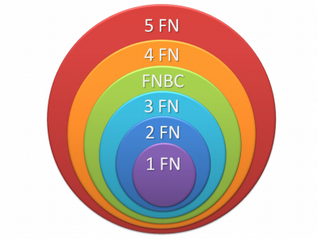

Antes de dar los conceptos de formas normales veamos unas definiciones previas:

- Dependencia funcional: A → B, representa que B es funcionalmente dependiente de A. Para un valor de A siempre aparece un valor de B. Ejemplo: Si A es el D.N.I., y B el Nombre, está claro que para un número de D.N.I, siempre aparece el mismo nombre de titular
- Dependencia funcional completa: A → B, si B depende de A en su totalidad. Ejemplo: Tiene sentido plantearse este tipo de dependencia cuando A está compuesto por más de un atributo. Por ejemplo, supongamos que A corresponde al atributo compuesto: D.N.I._Empleado + Cod._Dpto. y B es Nombre_Dpto. En este caso B depende del Cod_Dpto., pero no del D.N.I._Empleado. Por tanto no habría dependencia funcional completa.
- Dependencia transitiva: A→B→C. Si A→B y B→C, Entonces decimos que C depende de forma transitiva de A. Ejemplo: Sea A el D.N.I. de un alumno, B la localidad en la que vive y C la provincia. Es un caso de dependencia transitiva A→ B → C.
- Determinante funcional: todo atributo, o conjunto de ellos, de los que depende algún otro atributo. Ejemplo: El D.N.I. es un determinante funcional pues atributos como nombre, dirección, localidad, etc, dependen de él.
- Dependencia multivaluada: A→→B. Son un tipo de dependencias en las que un determinante funcional no implica un único valor, sino un conjunto de ellos. Un valor de A siempre implica varios valores de B. Ejemplo: CursoBachillerato →→ Modalidad. Para primer curso siempre va a aparecer en el campo Modalidad uno de los siguientes valores: Ciencias, Humanidades/Ciencias Sociales o Artes. Igual para segundo curso.

### 6.1.- Primera forma normal (1FN)

Una Relación está en 1FN si y sólo si cada atributo es atómico.

Ejemplo: Supongamos que tenemos la siguiente tabla con datos de alumnado de un centro de enseñanza secundaria.

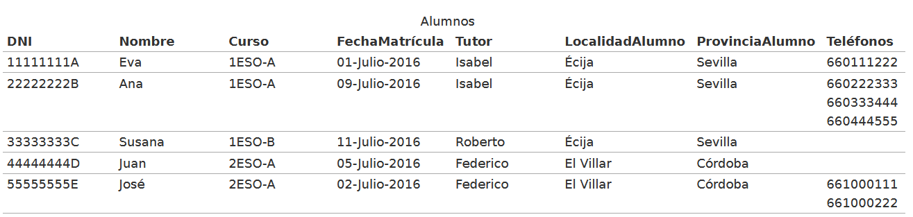

Como se puede observar, esta tabla no está en 1FN puesto que el campo Teléfonos contiene varios datos dentro de una misma celda y por tanto no es un campo cuyos valores sean atómicos. La solución sería la siguiente:

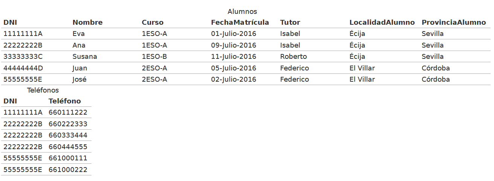

### 6.2.- Segunda forma normal (2FN)

Una Relación esta en 2FN si y sólo si está en 1FN y todos los atributos que no forman parte de la Clave Principal tienen dependencia funcional completa de ella.

Ejemplo: Seguimos con el ejemplo anterior. Trabajaremos con la siguiente tabla:

Vamos a examinar las dependencias funcionales. El gráfico que las representa es el siguiente:

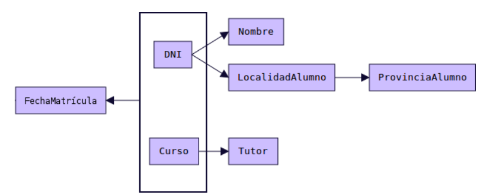

- Siempre que aparece un DNI aparecerá el Nombre correspondiente y la LocalidadAlumno correspondiente. Por tanto  DNI → Nombre  y  DNI → LocalidadAlumno. Por otro lado siempre que aparece un Curso aparecerá el Tutor correspondiente. Por tanto Curso → Tutor. Los atributos Nombre y LocalidadAlumno no dependen funcionalmente de Curso, y el atributo Tutor no depende funcionalmente de DNI. 
- El único atributo que sí depende de forma completa de la clave compuesta DNI y Curso es FechaMatrícula: (DNI,Curso) → FechaMatrícula.

A la hora de establecer la Clave Primaria de una tabla debemos escoger un atributo o conjunto de ellos de los que dependan funcionalmente el resto de atributos. Además debe ser una dependencia funcional completa. 

Si escogemos DNI como clave primaria, tenemos un atributo (Tutor) que no depende funcionalmente de él. Si escogemos Curso como clave primaria, tenemos otros atributos que no dependen de él. 

Si escogemos la combinación (DNI, Curso) como clave primaria, entonces sí tenemos todo el resto de atributos con dependencia funcional respecto a esta clave. Pero es una dependencia parcial, no total (salvo FechaMatrícula, donde sí existe dependencia completa).  Por tanto esta tabla no está en 2FN. La solución sería la siguiente:

### 6.3.- Tercera forma normal (3FN)

Una Relación esta en 3FN si y sólo si está en 2FN y no existen dependencias transitivas. Todas las dependencias funcionales deben ser respecto a la clave principal.

Ejemplo: Seguimos con el ejemplo anterior. Trabajaremos con la siguiente tabla:

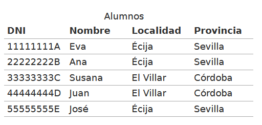

Las dependencias funcionales existentes son las siguientes. Como podemos observar existe una dependencia funcional transitiva: DNI → Localidad → Provincia

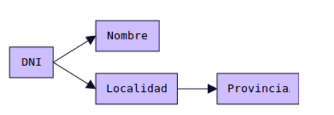

Para que la tabla esté en 3FN, no pueden existir dependencias funcionales transitivas. Para solucionar el problema deberemos crear una nueva tabla. El resultado es:

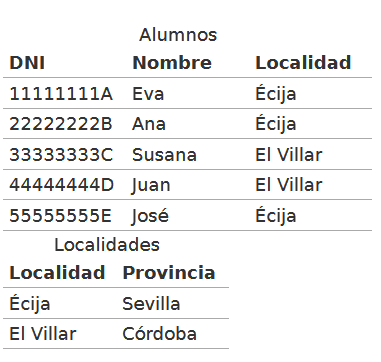

**RESULTADO FINAL**

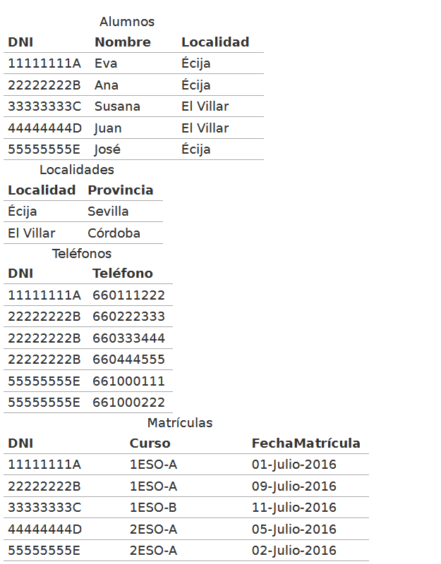

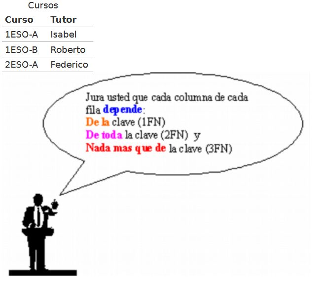

Nosotros en clase solo vamos a trabajar hasta la 3FN. Si quieres saber más sobre la 4FN y la 5FN, te dejo el siguiente enlace para que investigues por tu cuenta:

[Enlace a la wikipedia](https://es.wikipedia.org/wiki/Normalizaci%C3%B3n_de_bases_de_datos)

## HOJAS DE EJERCICIOS

💻 Hoja de ejercicios 15.

💻 Hoja de ejercicios 16.

💻 Hoja de ejercicios 17.

💻 Hoja de ejercicios 18.