# UNIDAD 2. DISEÑO LÓGICO DE LA BASE DE DATOS.

# INDICE

## 1.- MODELO DE DATOS

Un modelo pretende crear una simplificación de la realidad para poder comprenderla mejor. Para realizar un modelo se realiza una abstracción más simple de la realidad. Se usan modelos en diferentes áreas de la informática, como por ejemplo UML en Ingeniería del software o el modelo Entidad/Relación para BD.

Un **modelo de datos** es un conjunto de herramientas y reglas para representar los datos, las relaciones entre éstos y las restricciones de una base de datos.

Fundamentalmente se han utilizado los siguientes modelos de datos:

- Entidad-Relación
- Relacional
- Jerárquico
- En red
- Orientado a Objetos
- Relacional orientado a objetos

### 1.1.- Clasificación de los modelos de datos

Una opción bastante usada a la hora de clasificar los modelos de datos es hacerlo de acuerdo al nivel de abstracción que presentan:

- Modelos de Datos Conceptuales: Describe las estructuras de datos y restricciones de integridad. Se usan en la fase de Análisis y representan los datos y las relaciones entre ellos. El esquema más típico es el *Modelo Entidad-Relación*.
- Modelos de Datos Lógicos: Describe la estructura que tendrá la base de datos en función del tipo de SGBD que hayamos elegido. El ejemplo más típico es el *Modelo Relacional*.
- Modelos de Datos Físicos: Describe exactamente como se implementan los datos dentro del SGBD elegido. Puede ser en Access, MySQL, PostgreSQL, Oracle...

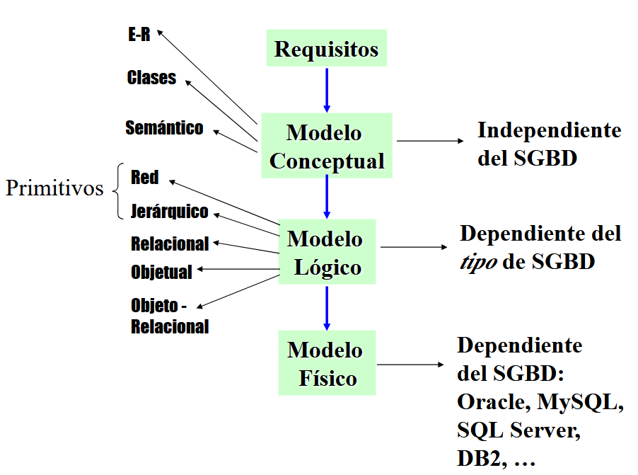

En este tema vamos a trabajar el modelo conceptual, más concretamente el modelo Entidad-Relación, o modelo E-R.

## 2.- LOS DIAGRAMAS E/R

El modelo Entidad-Relación es un modelo puramente conceptual. Representa el funcionamiento de un sistema de información mediante un diagrama Entidad Relación (E/R).
Facilita enormemente el diseño de una base de datos. Es muy representativo del funcionamiento del sistema de información y es independiente del SGBD. Toma como referencia la percepción que tenemos del funcionamiento del mundo real:

- Esa percepción se basa en entidades que actúan sobre otras entidades haciendo procesos.
- Consta de una colección de objetos básicos llamados **entidades** y de unas **relaciones** establecidas entre dichas entidades.  

Se han desarrollado varios modelos E/R y diagramas de representación para el modelo. En este curso vamos a usar el modelo de Chen. Vemos en la siguiente imagen un ejemplo de Diagrama E-R siguiendo el modelo de Chen:

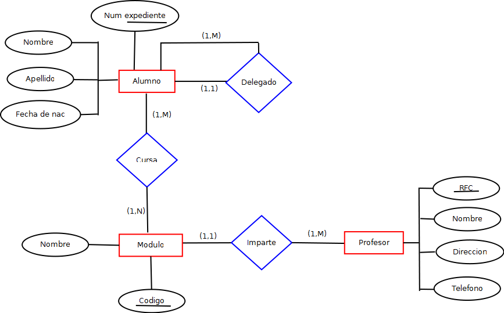

En los siguientes apartados vamos a ir desgranando los elementos que componen un diagrama E-R y como se construye.

### 2.1.- Entidades

Las entidades son uno de los elementos usados en los diagramas E/R. Una entidad es un objeto, sujeto o concepto sobre el que se recoge información básica en el sistema para poder realizar los procesos que se requieran. En un sistema de información que permite gestionar el funcionamiento de un centro de estudios.

En el esquema anterior, serían entidades:

- ALUMNO
- MODULO
- PROFESOR

Una entidad se representa en un diagrama E/R mediante un rectángulo.

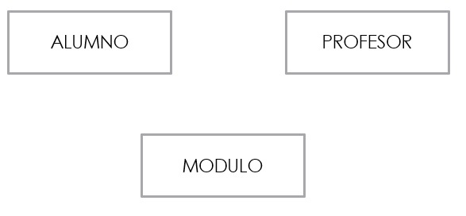

### 2.2.- Atributos y tipos

Un atributo es una propiedad o una característica de una entidad. Como veremos más adelante, las relaciones también pueden tener atributos.Por ejemplo, la entidad ALUMNO puede tener los atributos:

- Numero
- Nombre
- Apellidos
- Fecha Nac.
- Poblacion

Los atributos de una entidad, se representan mediante pequeños círculos unidos a la entidad por una línea. Al lado de cada círculo se escribe el nombre del atributo. 

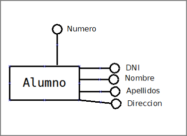

El dominio de un atributo es todo el conjunto de valores que se pueden asignar a ese atributo. Ejemplos de atributos y dominios de una entidad EMPLEADO:

| Atributo | Dominio |
| ------------- | ------------- |
| DNI  | Cadena de caracteres de longitud 9  | 
| Nombre  | Cadena de caracteres de longitud 20  | 
| Apellidos  | Cadena de caracteres de longitud 30  | 
| Antigüedad  | Fecha  | 
| Salario  | Numero real con dos decimales  |
| Categoría  | Enumerado de categorías  |
| JornadaCompleta  | Verdadero o Falso  |

**Realiza el siguiente ejercicio:**

1. Indica cual sería el dominio de cada uno de los siguientes atributos de la entidad PERSONA:

- Fecha de nacimiento
- Localidad de nacimiento
- Edad
- EsMayorDeEdad
- DNI
- Teléfonos
- Nombre
- Apellidos

#### Tipos de atributos.

1. *Atributos simples y atributos compuestos*: 
    - Un atributo es simple si su contenido no se considera dividido en partes, por ejemplo NOMBRE. 
    - Es compuesto si admite dividirse en partes. Por ejemplo, FECHA podría ser compuesto si se considera que de FECHA se puede usar aisladamente DIA, MES y AÑO.

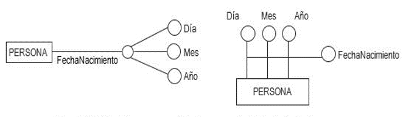

2. *Atributos monovaluados y atributos multivaluados*: 
    - Un atributo es monovaluado si admite para cada elemento de la entidad un solo valor, por ejemplo nombre de una persona sería monovaluado. 
    - Si un atributo admite una lista de valores para cada elemento, sería multivaluado, por ejemplo si un atributo de la entidad CLIENTE fuese teléfono_cliente, éste podría ser  atributo multivaluado. 

3. *Atributos obligatorios y atributos opcionales*: 
    - Un atributo es obligatorio si para todo elemento debe contener algún valor y es opcional si puede haber elementos que no tengan asignado ningún valor para ese atributo. Por ejemplo, el atributo Aficiones podría ser opcional para una entidad CLIENTE.
    - Un atributo opcional se representa:

4. *Atributos derivados y no derivados*: 
    - Un atributo es derivado si se puede obtener a partir de los datos contenidos en otros atributos. Un atributo derivado podría ser IMPORTE DE VENTA si los valores para ese atributo se obtuviesen a través de los atributos UNIDADES VENDIDAS y PRECIO UNIDAD. No es recomendable usar atributos derivados.
    - Un atributo es no derivado si su valor no depende de ningún otro atributo. 

5. *Clave* : Una clave sirve para identificar de forma única a cada elemento de una entidad. Una clave puede estar formada por un solo atributo o por varios. En una clave no se pueden repetir valores, es decir, no puede haber dos elementos de la misma entidad con la misma clave. En una entidad puede haber dos tipos de clave:
    - Clave primaria o principal: Dentro de los conjuntos de atributos que pueden permitir identificar a los elementos de una entidad, debería ser la que se considera más adecuada en base a una serie de requisitos: simplicidad, longitud, representatividad, estabilidad.
    - Clave secundaria o alternativa. Puede haber varias en una entidad pero no se debe abusar de estas claves. Serán todas aquellas que decidamos, aparte de la primaria.

Representación de los atributos: 

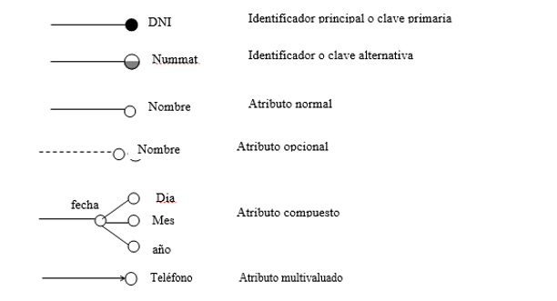

**Observa y analiza el siguiente ejemplo:**

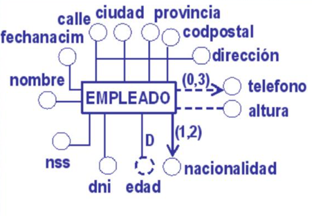

**Realiza el siguiente ejercicio:**

1. Justifica si los siguientes atributos sería obligatorios-opcionales, compuestos-simples,  derivado-no derivado, monovaluado-multivaluado.

- Fecha de nacimiento
- Localidad de nacimiento
- Edad
- EsMayorDeEdad
- DNI
- Teléfonos
- Nombre
- Apellidos

### 2.3.- Relaciones

Una relación es una asociación entre varias entidades a través de una acción realizable entre esas entidades. Suelen ser verbos o formas verbales. Por ejemplo:

- COMPRAR (entre CLIENTE y PRODUCTO)
- CURSAR (entre ALUMNO y MODULO)
- SER_HIJO (entre ALUMNO y PADRE).
- SER_JEFE (EMPLEADO consigo misma)
- COMPRAR (entre las entidades CLIENTE, PRODUCTO, VENDEDOR)

Vamos a ver que tipos de relaciones nos podemos encontrar.

1. *Relación binaria o de grado dos*: Cuando se da entre dos entidades.

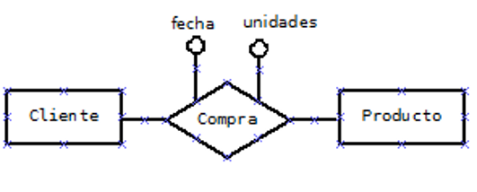

En este ejemplo vemos que las relaciones también pueden tener atributos.

2. *Relación unaria, reflexiva o de grado uno*: Cuando se da entre elementos de la misma entidad, es decir, un elemento de una entidad se relaciona con uno o más elementos de la misma entidad.

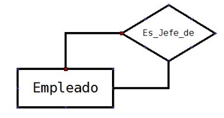

3. *Relación ternaria o de grado tres*: Cuando se da entre tres entidades.

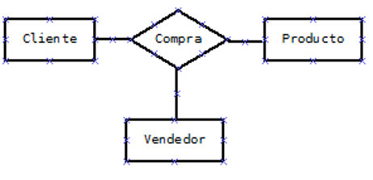

### 2.4.- Cardinalidad

En este apartado vemos una serie de definiciones para seguir entendiendo como construir un diagrama E-R.

- **Ocurrencia**: Es una unidad del conjunto de elementos que representa una entidad. Para la entidad ALUMNO, una ocurrencia de ALUMNO es un alumno concreto. 
- **Cardinalidad** de una entidad A respecto de otra B en una relación: indica el número mínimo y máximo de ocurrencias de la entidad A que pueden estar relacionadas con una ocurrencia de la entidad B. (A veces aparece como participación y no cardinalidad).

La cardinalidad se indica mediante una pareja números encerrados entre paréntesis. El primer número indica el mínimo número de ocurrencias relacionadas (será siempre un valor 0 o 1). El segundo número indica el máximo número de ocurrencias relacionadas (será siempre un valor 1 o N para muchos).

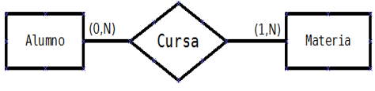

Vamos a ver ahora que preguntas debemos hacernos para obtener mínimo y máximo de una entidad con la otra. Lo haremos pensando en la imagen anterior.

- ¿Cada alumno como mínimo cuantas materias puede cursar?
    - Al menos 1, ya que si no este no estaría matriculado.
- ¿Cada alumno como máximo cuantas materias puede cursar?
    - N, ya que puede cursar más de una
- ¿Cada materia puede ser cursada como mínimo por cuantos alumnos?
    - 0, ya que podría haber una materia sin alumnos. Convalidada.
- ¿Cada materia puede ser cursada como máximo por cuantos alumnos?
    - N, ya que puede haber varios alumnos matriculados en ella.
    
 
 
 
 
NOTA: Fíjate que lo obtenido de las 2 primeras preguntas lo ponemos al otro lado de la relación en Materia. Y las dos últimas en Alumno

Las cardinalidades que se pueden dar en las relaciones son:

| Cardinalidad | Significado |
| ------------- | ------------- |
| (0,1)  | Mínimo cero, máximo uno  | 
| (1,1)  | Minimo uno, máximo uno  | 
| (0,N)  | Mínimo cero, máximo muchos  | 
| (1,N)  | Mínimo uno, máximo muchos  | 

### 2.5.- Tipo de Correspondencia

El tipo de correspondencia o relación de cardinalidad expresa el número máximo de elementos u ocurrencias que se pueden llegar a relacionar entre las entidades de una relación.

- Uno a uno (1:1): Sería el caso de la relación CASADO entre las entidades PERSONA y PERSONA. Un persona podrá estar casada con otra persona pero no con muchas.
- Uno a muchos (1:N): Sería el caso de la relación PERTENECE entre las entidades MUNICIPIO y PROVINCIA. Un municipio sólo puede pertenecer a una provincia, mientras que a una provincia pertenecen muchos municipios.
- Muchos a muchos (N:M): Sería el caso de la relación COMPRA entre las entidades PRODUCTOS y CLIENTES. Un cliente puede comprar varios productos y un mismo tipo de producto será comprado por varios clientes. 

Representación de cardinalidad y tipo de correspondencia

 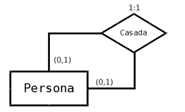

 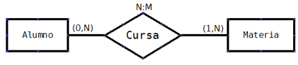

**Realiza el siguiente ejercicio:**

1. En un supermercado hay productos organizados en categorías. Cada producto pertenece a una única categoría. Están previstas categorías que aún pueden no tener productos. Calcula las cardinalidades de cada entidad y el tipo de correspondencia y represéntalos en el esquema E/R.

## HOJAS DE EJERCICIOS

💻 Hoja de ejercicios 1. Los tres primeros ejercicios.

Vamos a ver ahora que tipos de correspondencia nos podemos encontrar en una relación ternaria y como se puede obtener.

Tomamos en cuenta una de la entidades y es necesario ver que relación o participación presenta esta con la agrupación de las otras dos. Los casos posibles que se pueden dar son estos:

- 1:1:1
- 1:1:M
- 1:N:M
- M:N:P

Vamos a ver con un ejemplo como obtener las cardinalidades en una relación ternaria. Partamos del siguiente caso:

 

1.- Elegimos dos entidades y las ponemos cardinalidad a 1, y preguntamos que relación tiene la tercera entidad con las dos que hemos puesto a uno. Puede ser una relación "a uno" o "a muchos".

En el ejemplo, fijamos 1 asignatura en 1 semestre y nos preguntamos: ¿Cuantos alumnos puede haber matriculados en 1 asignatura para 1 semestre? 

La respuesta sería qué puede haber muchos estudiantes matriculados dado que varios estudiantes pueden matricularse de una misma asignatura en el mismo semestre. Por lo tanto el tipo de entidad estudiante participa con grado n en la relación de matrícula.

2.- En segundo lugar, nos preguntaremos, por ejemplo, sí fijados un estudiante y una asignatura concretos puede estar matriculado en 1 o muchos semestres. 

La respuesta es que puede estar matriculado en muchos semestres dado que un estudiante se puede matricular más de una vez en diferentes semestres hasta que apruebe la asignatura. 

Por lo tanto el tipo de entidad semestre participa con grado en la relación matriculado. 

3.- En Tercer lugar no preguntamos sí fijados un estudiante y un semestre en concreto pueden estar matriculados de una o muchas asignaturas. 

La respuesta es que se pueden tener muchas asignaturas en las cuales el alumno está matriculado puesto que un alumno se puede matricular de varias asignaturas dentro de un mismo semestre.

Por lo tanto la entidad asignatura también participa con N en la relación matriculada. 

Por lo tanto nos queda el diagrama así:

Este es un ejemplo de una relación ternaria 1:1:1.

En este caso suponemos la relación de defensa de un proyecto por parte de un alumno en el tribunal en 2º curso. ALUMNO-PROYECTO: un alumno que hace un proyecto 

**Realiza el siguiente ejercicio:**

1. Obtén la cardinalidad de cada una de las entidades en la siguiente relación: (Resuelto)
    - Cardinalidad de autores: ¿Cuántos autores pueden tener un determinado libro publicado en una determinada editorial?
    - Cardinalidad de Libro: ¿Cuántos libros Puedes tener un determinado autor publicado en una determinada editorial.
    - Cardinalidad de editorial: ¿En cuantas  editoriales puede un determinado autor publicar un mismo libro? 

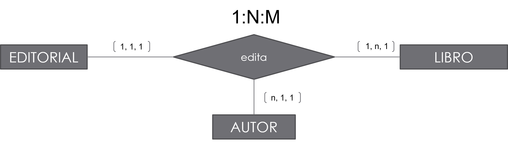

2. Calcula los tipos de correspondencia de las siguientes relaciones:

    - Persona casada con persona (en España)
    - Persona casada con persona (en Arabia Saudí)
    - Jugador juega en equipo (datos registrados actuales)
    - Producto contiene pieza

## HOJAS DE EJERCICIOS

💻 Hoja de ejercicios 1. Ejercicios 4 y 5.

### 2.6.- Debilidad

Una entidad es débil frente a otra que es fuerte cuando para existir un elemento de la débil es necesario que exista un elemento de la fuerte.

Por ejemplo, en la gestión de pedidos y ventas de un comercio, un pedido consta de varias líneas de pedido (una por cada producto). Si PEDIDO es una entidad y LINEA_PEDIDO es otra entidad, PEDIDO sería entidad fuerte y LINEA_PEDIDO una entidad débil respecto de la anterior.

Una entidad débil solo se da en una relación de 1:N.

En el ejemplo expuesto, para identificar la línea de pedido además de su campo id_línea, necesito el id_pedido.

Las entidades débiles se representan en los diagramas E/R rodeadas por una línea doble:

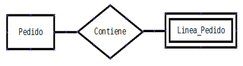

Hay dos tipos de dependencias en relaciones de debilidad:

1.- **Dependencia en existencia**: Las ocurrencias de una entidad débil no tienen ningún sentido en la base de datos sin una ocurrencia de la entidad fuerte con la que están relacionadas.

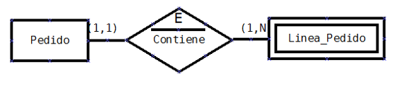

2.- **Dependencia en identificación**: Además de la dependencia en existencia, la entidad débil necesita a la fuerte para poder crear una clave a partir de la clave que tiene la entidad fuerte. Es decir, en el ejemplo, cada línea de pedido se identificaría con numPed y numLinea.

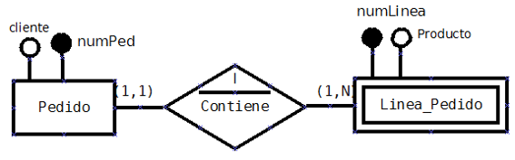

## 3.- EL MODELO E/R AMPLIADO

El **Modelo E/R ampliado** recoge todos los conceptos y especificaciones del modelo E/R y añade otros para mejorar el diseño de las bases de datos. Se definen los siguientes conceptos dentro de este modelo:

- **Superclase**: Es una entidad genérica de la que derivan otras entidades. La superclase tiene unos atributos que van a tener también las entidades que derivan de ellas. 

- **Subclase**: Es una entidad que deriva de una entidad genérica o superclase. La subclase va a tener los atributos de la superclase más unos atributos específicos. Los elementos que hay en la subclase también estarán en la superclase, aunque esta contendrá normalmente muchos más elementos. 

Por ejemplo, EMPLEADO sería una superclase y OPERARIO y ENCARGADO serían subclases de ésta. 

Otro ejemplo, en un centro de estudios PERSONA podría ser una superclase mientras ALUMNO y PROFESOR serían subclases.

- **Generalización** es el proceso de construir una superclase a partir de las características comunes o que comparten varias subclases del sistema de información. 

Una generalización se representa mediante un triángulo invertido 
que une la superclase y las subclases.

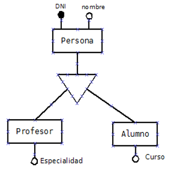

- **Especialización** es el proceso inverso a la generalización. En la especialización se trata de buscar los atributos específicos de las subclases y las restricciones de existencia de elementos de las entidades.

Conforme a las restricciones de existencia de elementos de las entidades, nos podemos encontrar con los siguientes tipos de especialización o generalización:

1. **Especialización exclusiva total**: Por ser exclusiva, un elemento de la superclase sólo puede estar en una subclase. Por ser total, todos los elementos de la superclase están en alguna de las subclases.
   
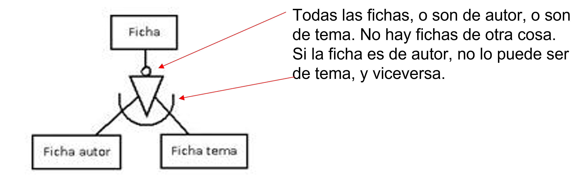

2. **Especialización exclusiva parcial**: Por ser exclusiva, un elemento de la superclase sólo puede estar en una subclase. Por ser parcial, no tienen porque estar todos los elementos de la superclase en alguna de las subclases.
 
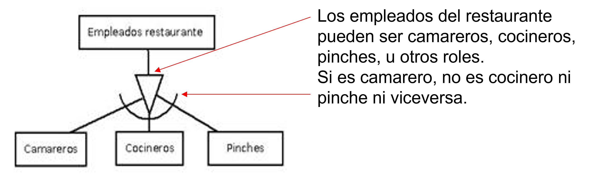

3. **Especialización solapada total**: Por ser solapada, un elemento de la superclase podría pertenecer a varias subclases. Por ser total, todos los elementos de la superclase están en alguna de las subclases.

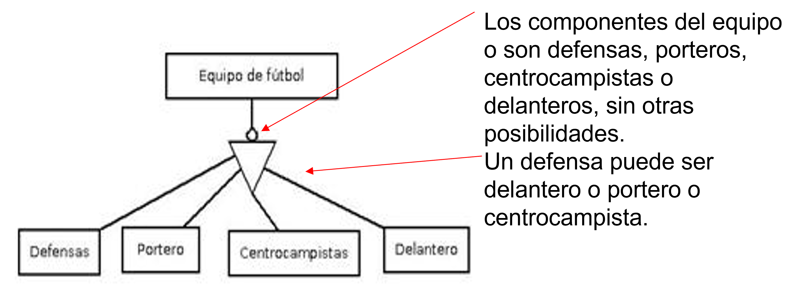

4. **Especialización solapada parcial**: Por ser solapada, un elemento de la superclase podría pertenecer a varias subclases. Por ser parcial, no tienen porque estar todos los elementos de la superclase están en alguna de las subclases.
   

Las cardinalidades de la especialización para los cuatro casos que hemos visto son de la siguiente manera:

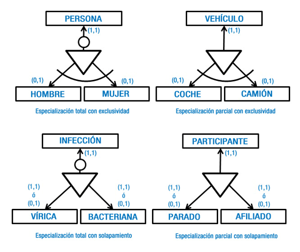

## 4.- CONSTRUCCIÓN DE UN DIAGRAMA E/R

Los pasos a seguir serán:
1. Leer el documento varias veces hasta entender bien el problema y tener clara toda la información de que disponemos.
2. Obtener una lista de candidatos a entidades, relaciones y atributos:
    - Identificar las entidades. Los sujetos básicos en el sistema. 
    - Buscar los atributos de cada entidad. Proponer la clave principal de cada uno. Establecer los tipos de atributos (compuestos, multivaluados, opcionales, derivados). Establecer sus dominios (Fecha, numero real con dos decimales, cadena de caracteres de longitud 9, V/F…) 
    - Identificar las generalizaciones y especializaciones (tipos de especializaciones exclusiva total, solapada parcial…)
    - Identificar las relaciones de debilidad, entidades fuertes y débiles. Dependencias de existencia o de identificación.
3. Averiguar las cardinalidades y los tipos de correspondencia en cada relación.
4. Revisar lo obtenido para:
    - Eliminar entidades derivadas.
    - Ver si es necesario añadir entidades a alguna relación.
    - Ver si algunos atributos de una entidad se deben agrupar como atributos de una nueva entidad.
5. Realizar una distribución de las entidades y representar sus relaciones en el diagrama así como los atributos.
6. Volver a leer el problema para ver si nos hemos dejado algo. Revisar que toda la información está representada en el esquema y refinarlo si es necesario.

## HOJAS DE EJERCICIOS

💻 Hoja de ejercicios 1.

💻 Hoja de ejercicios 2.

💻 Hoja de ejercicios 3.

💻 Hoja de ejercicios 4.

💻 Hoja de ejercicios 5.

💻 Hoja de ejercicios 6.

💻 Hoja de ejercicios 7.

## 5.- MODELO RELACIONAL

El modelo relacional es el más apropiado en la actualidad para representar la estructura de una base de datos. Ellos es debido a:

- Es un modelo sencillo, potente y flexible para el diseño de una base de datos.
- Tiene una base matemática en el álgebra relacional. Cualquier operación sobre elementos del modelo relacional deriva en una operación del álgebra relacional.
- A partir de este álgebra relacional se ha podido realizar la construcción del lenguajes SQL para manipular los datos.
- La mayoría de los SGBD relacionales se basan en este modelo.

### 5.1.- Elementos de una relación

El elemento principal del modelo relacional es la **RELACION**. Una relación es una tabla. Cada elemento de la relación es una fila y se le denomina tupla de la relación. Cada propiedad, atributo o característica de los elementos es una columna.

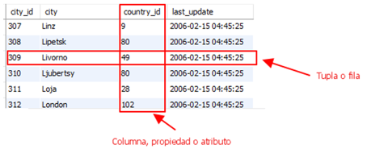

No debes confundir el concepto de relación en el modelo relacional con el concepto de relación en el modelo E/R
