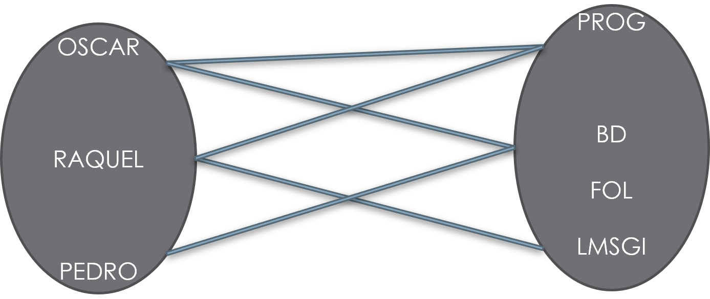

# UNIDAD 2. DISEÑO LÓGICO DE LA BASE DE DATOS.

## 1.- MODELO DE DATOS

Un modelo pretende crear una simplificación de la realidad para poder comprenderla mejor. Para realizar un modelo se realiza una abstracción más simple de la realidad. Se usan modelos en diferentes áreas de la informática, como por ejemplo UML en Ingeniería del software o el modelo Entidad/Relación para BD.

Un **modelo de datos** es un conjunto de herramientas y reglas para representar los datos, las relaciones entre éstos y las restricciones de una base de datos.

Fundamentalmente se han utilizado los siguientes modelos de datos:

- Entidad-Relación
- Relacional
- Jerárquico
- En red
- Orientado a Objetos
- Relacional orientado a objetos

### 1.1.- Clasificación de los modelos de datos

Una opción bastante usada a la hora de clasificar los modelos de datos es hacerlo de acuerdo al nivel de abstracción que presentan:

- Modelos de Datos Conceptuales: Describe las estructuras de datos y restricciones de integridad. Se usan en la fase de Análisis y representan los datos y las relaciones entre ellos. El esquema más típico es el *Modelo Entidad-Relación*.
- Modelos de Datos Lógicos: Describe la estructura que tendrá la base de datos en función del tipo de SGBD que hayamos elegido. El ejemplo más típico es el *Modelo Relacional*.
- Modelos de Datos Físicos: Describe exactamente como se implementan los datos dentro del SGBD elegido. Puede ser en Access, MySQL, PostgreSQL, Oracle...

En este tema vamos a trabajar el modelo conceptual, más concretamente el modelo Entidad-Relación, o modelo E-R.

## 2.- LOS DIAGRAMAS E/R

El modelo Entidad-Relación es un modelo puramente conceptual. Representa el funcionamiento de un sistema de información mediante un diagrama Entidad Relación (E/R).
Facilita enormemente el diseño de una base de datos. Es muy representativo del funcionamiento del sistema de información y es independiente del SGBD. Toma como referencia la percepción que tenemos del funcionamiento del mundo real:

- Esa percepción se basa en entidades que actúan sobre otras entidades haciendo procesos.
- Consta de una colección de objetos básicos llamados **entidades** y de unas **relaciones** establecidas entre dichas entidades.  

Se han desarrollado varios modelos E/R y diagramas de representación para el modelo. En este curso vamos a usar el modelo de Chen. Vemos en la siguiente imagen un ejemplo de Diagrama E-R siguiendo el modelo de Chen:

En los siguientes apartados vamos a ir desgranando los elementos que componen un diagrama E-R y como se construye.

### 2.1.- Entidades

Las entidades son uno de los elementos usados en los diagramas E/R. Una entidad es un objeto, sujeto o concepto sobre el que se recoge información básica en el sistema para poder realizar los procesos que se requieran. En un sistema de información que permite gestionar el funcionamiento de un centro de estudios.

En el esquema anterior, serían entidades:

- ALUMNO
- MODULO
- PROFESOR

Una entidad se representa en un diagrama E/R mediante un rectángulo.

### 2.2.- Atributos y tipos

Un atributo es una propiedad o una característica de una entidad. Como veremos más adelante, las relaciones también pueden tener atributos.Por ejemplo, la entidad ALUMNO puede tener los atributos:

- Numero
- Nombre
- Apellidos
- Fecha Nac.
- Poblacion

Los atributos de una entidad, se representan mediante pequeños círculos unidos a la entidad por una línea. Al lado de cada círculo se escribe el nombre del atributo. 

El dominio de un atributo es todo el conjunto de valores que se pueden asignar a ese atributo. Ejemplos de atributos y dominios de una entidad EMPLEADO:

| Atributo | Dominio |
| ------------- | ------------- |
| DNI  | Cadena de caracteres de longitud 9  | 
| Nombre  | Cadena de caracteres de longitud 20  | 
| Apellidos  | Cadena de caracteres de longitud 30  | 
| Antigüedad  | Fecha  | 
| Salario  | Numero real con dos decimales  |
| Categoría  | Enumerado de categorías  |
| JornadaCompleta  | Verdadero o Falso  |

**Realiza el siguiente ejercicio:**

1. Indica cual sería el dominio de cada uno de los siguientes atributos de la entidad PERSONA:

- Fecha de nacimiento
- Localidad de nacimiento
- Edad
- EsMayorDeEdad
- DNI
- Teléfonos
- Nombre
- Apellidos

#### Tipos de atributos.

1. *Atributos simples y atributos compuestos*: 
    - Un atributo es simple si su contenido no se considera dividido en partes, por ejemplo NOMBRE. 
    - Es compuesto si admite dividirse en partes. Por ejemplo, FECHA podría ser compuesto si se considera que de FECHA se puede usar aisladamente DIA, MES y AÑO.

2. *Atributos monovaluados y atributos multivaluados*: 
    - Un atributo es monovaluado si admite para cada elemento de la entidad un solo valor, por ejemplo nombre de una persona sería monovaluado. 
    - Si un atributo admite una lista de valores para cada elemento, sería multivaluado, por ejemplo si un atributo de la entidad CLIENTE fuese teléfono_cliente, éste podría ser  atributo multivaluado. 

3. *Atributos obligatorios y atributos opcionales*: 
    - Un atributo es obligatorio si para todo elemento debe contener algún valor y es opcional si puede haber elementos que no tengan asignado ningún valor para ese atributo. Por ejemplo, el atributo Aficiones podría ser opcional para una entidad CLIENTE.
    - Un atributo opcional se representa:

4. *Atributos derivados y no derivados*: 
    - Un atributo es derivado si se puede obtener a partir de los datos contenidos en otros atributos. Un atributo derivado podría ser IMPORTE DE VENTA si los valores para ese atributo se obtuviesen a través de los atributos UNIDADES VENDIDAS y PRECIO UNIDAD. No es recomendable usar atributos derivados.
    - Un atributo es no derivado si su valor no depende de ningún otro atributo. 

5. *Clave* : Una clave sirve para identificar de forma única a cada elemento de una entidad. Una clave puede estar formada por un solo atributo o por varios. En una clave no se pueden repetir valores, es decir, no puede haber dos elementos de la misma entidad con la misma clave. En una entidad puede haber dos tipos de clave:
    - Clave primaria o principal: Dentro de los conjuntos de atributos que pueden permitir identificar a los elementos de una entidad, debería ser la que se considera más adecuada en base a una serie de requisitos: simplicidad, longitud, representatividad, estabilidad.
    - Clave secundaria o alternativa. Puede haber varias en una entidad pero no se debe abusar de estas claves. Serán todas aquellas que decidamos, aparte de la primaria.

Representación de los atributos: 

**Observa y analiza el siguiente ejemplo:**

**Realiza el siguiente ejercicio:**

1. Justifica si los siguientes atributos sería obligatorios-opcionales, compuestos-simples,  derivado-no derivado, monovaluado-multivaluado.

- Fecha de nacimiento
- Localidad de nacimiento
- Edad
- EsMayorDeEdad
- DNI
- Teléfonos
- Nombre
- Apellidos

### 2.3.- Relaciones

Una relación es una asociación entre varias entidades a través de una acción realizable entre esas entidades. Suelen ser verbos o formas verbales. Por ejemplo:

- COMPRAR (entre CLIENTE y PRODUCTO)
- CURSAR (entre ALUMNO y MODULO)
- SER_HIJO (entre ALUMNO y PADRE).
- SER_JEFE (EMPLEADO consigo misma)
- COMPRAR (entre las entidades CLIENTE, PRODUCTO, VENDEDOR)

Vamos a ver que tipos de relaciones nos podemos encontrar.

1. *Relación binaria o de grado dos*: Cuando se da entre dos entidades.

En este ejemplo vemos que las relaciones también pueden tener atributos.

2. *Relación unaria, reflexiva o de grado uno*: Cuando se da entre elementos de la misma entidad, es decir, un elemento de una entidad se relaciona con uno o más elementos de la misma entidad.

3. *Relación ternaria o de grado tres*: Cuando se da entre tres entidades.

### 2.4.- Cardinalidad

En este apartado vemos una serie de definiciones para seguir entendiendo como construir un diagrama E-R.

- **Ocurrencia**: Es una unidad del conjunto de elementos que representa una entidad. Para la entidad ALUMNO, una ocurrencia de ALUMNO es un alumno concreto. 
- **Cardinalidad** de una entidad A respecto de otra B en una relación: indica el número mínimo y máximo de ocurrencias de la entidad A que pueden estar relacionadas con una ocurrencia de la entidad B. (A veces aparece como participación y no cardinalidad).

La cardinalidad se indica mediante una pareja números encerrados entre paréntesis. El primer número indica el mínimo número de ocurrencias relacionadas (será siempre un valor 0 o 1). El segundo número indica el máximo número de ocurrencias relacionadas (será siempre un valor 1 o N para muchos).

Vamos a ver ahora que preguntas debemos hacernos para obtener mínimo y máximo de una entidad con la otra. Lo haremos pensando en la imagen anterior.

- ¿Cada alumno como mínimo cuantas materias puede cursar?
    - Al menos 1, ya que si no este no estaría matriculado.
- ¿Cada alumno como máximo cuantas materias puede cursar?
    - N, ya que puede cursar más de una
- ¿Cada materia puede ser cursada como mínimo por cuantos alumnos?
    - 0, ya que podría haber una materia sin alumnos. Convalidada.
- ¿Cada materia puede ser cursada como máximo por cuantos alumnos?
    - N, ya que puede haber varios alumnos matriculados en ella.
    
 
 
 
 
NOTA: Fíjate que lo obtenido de las 2 primeras preguntas lo ponemos al otro lado de la relación en Materia. Y las dos últimas en Alumno

Las cardinalidades que se pueden dar en las relaciones son:

| Cardinalidad | Significado |
| ------------- | ------------- |
| (0,1)  | Mínimo cero, máximo uno  | 
| (1,1)  | Minimo uno, máximo uno  | 
| (0,N)  | Mínimo cero, máximo muchos  | 
| (1,N)  | Mínimo uno, máximo muchos  | 

Tipo de correspondencia o relación de cardinalidad: Expresa el número máximo de elementos u ocurrencias que se pueden llegar a relacionar entre las entidades de una relación.
Uno a uno (1:1): Sería el caso de la relación CASADO entre las entidades PERSONA y PERSONA. Un persona podrá estar casada con otra persona pero no con muchas.
 Uno a muchos (1:N): Sería el caso de la relación PERTENECE entre las entidades MUNICIPIO y PROVINCIA. Un municipio sólo puede pertenecer a una provincia, mientras que a una provincia pertenecen muchos municipios.
Muchos a muchos (N:M): Sería el caso de la relación COMPRA entre las entidades PRODUCTOS y CLIENTES. Un cliente puede comprar varios productos y un mismo tipo de producto será comprado por varios clientes. 
Representación de cardinalidad y tipo de correspondencia
Ejercicio 

En un supermercado hay productos organizados en categorías. Cada producto pertenece a una única categoría. Están previstas categorías que aún pueden no tener productos. Calcula las cardinalidades de cada entidad y el tipo de correspondencia y represéntalos en el esquema E/R.

