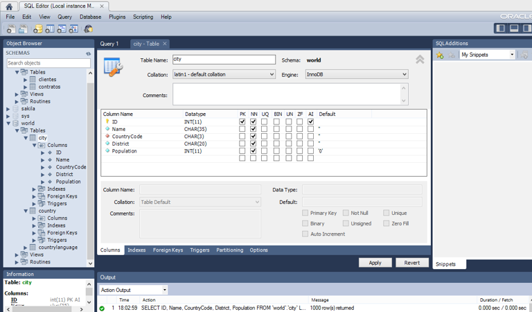
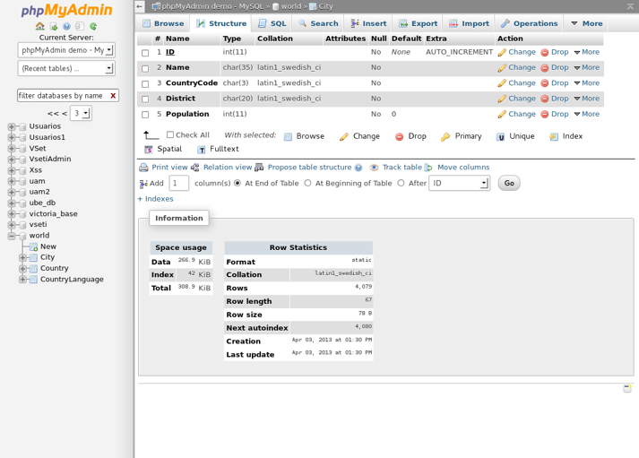
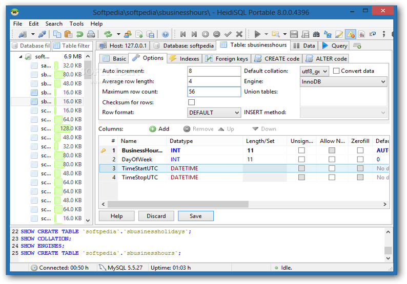
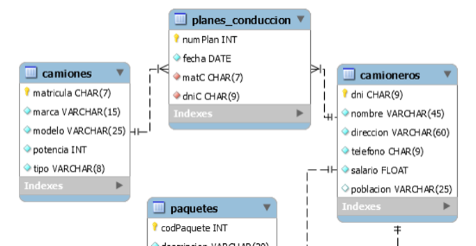

<!-- language-all: lang-sql -->
# UNIDAD 3. DISEÑO FÍSICO DE LA BASE DE DATOS.

## INDICE

- [UNIDAD 3. DISEÑO FÍSICO DE LA BASE DE DATOS.](#unidad-3-diseño-físico-de-la-base-de-datos)
  - [INDICE](#indice)
- [1.- CARACTERÍSTICAS DEL DISEÑO FÍSICO](#1--características-del-diseño-físico)
- [2.- HERREMIENTAS GRÁFICAS PARA LA IMPLEMENTACIÓN DE LA BASE DE DATOS.](#2--herremientas-gráficas-para-la-implementación-de-la-base-de-datos)
- [3.- EL LENGUAJE DE DEFINICIÓN DE DATOS (DDL)](#3--el-lenguaje-de-definición-de-datos-ddl)
    - [Interpretación de la sintaxis de una instrucción SQL.](#interpretación-de-la-sintaxis-de-una-instrucción-sql)
    - [Subconjuntos del lenguaje SQL](#subconjuntos-del-lenguaje-sql)
- [4.- CREACIÓN, MODIFICACIÓN Y ELIMINACIÓN DE BASES DE DATOS](#4--creación-modificación-y-eliminación-de-bases-de-datos)
- [5.- TIPOS DE DATOS. VALORES Y OPERADORES](#5--tipos-de-datos-valores-y-operadores)
    - [Tipos de datos numéricos](#tipos-de-datos-numéricos)
    - [Tipos de datos cadena de caracteres](#tipos-de-datos-cadena-de-caracteres)
    - [Tipos de datos cadena de bytes o binarias](#tipos-de-datos-cadena-de-bytes-o-binarias)
    - [Tipos de datos para fecha y hora](#tipos-de-datos-para-fecha-y-hora)
    - [Tipos de datos booleanos](#tipos-de-datos-booleanos)
    - [Tipos de datos enumerados](#tipos-de-datos-enumerados)
    - [Tipos de datos conjuntos](#tipos-de-datos-conjuntos)
    - [Representación de valores literales](#representación-de-valores-literales)
    - [Operadores](#operadores)
- [6.- ADMINISTRACIÓN DE TABLAS](#6--administración-de-tablas)
  - [6.1.- Sintaxis de la instrucción CREATE TABLE](#61--sintaxis-de-la-instrucción-create-table)
    - [6.6.1.- Tipos de índices](#661--tipos-de-índices)
  - [6.2.- Opciones de tabla](#62--opciones-de-tabla)
  - [HOJAS DE EJERCICIOS](#hojas-de-ejercicios)
  - [6.3.- Modificación de tablas](#63--modificación-de-tablas)
    - [6.3.1.- Alter table](#631--alter-table)
      - [Ejemplos de uso de Alter Table.](#ejemplos-de-uso-de-alter-table)
    - [6.3.2.- Create Index](#632--create-index)
    - [6.3.3.- Drop Index](#633--drop-index)
  - [6.3.4.- Rename table](#634--rename-table)
  - [6.4.- Eliminación de tablas](#64--eliminación-de-tablas)
  - [HOJAS DE EJERCICIOS](#hojas-de-ejercicios-1)
- [7.- VISTAS](#7--vistas)
  - [HOJAS DE EJERCICIOS](#hojas-de-ejercicios-2)
    - [SOLUCIONES A LOS EJERCICIOS DEL TEMA](#soluciones-a-los-ejercicios-del-tema)

# 1.- CARACTERÍSTICAS DEL DISEÑO FÍSICO

El diseño físico se realiza a partir del diseño lógico (grafo relacional). Consta de todas las instrucciones SQL necesarias para implementar la base de datos en el DBMS.

1. Hay que crear las tablas eligiendo un nombre adecuado. Se establecen los tipos de tabla y restricciones de tabla. Para cada tabla se definen las columnas, sus nombres y los tipos de datos que contienen.
2. Se establecen las restricciones necesarias sobre las columnas de las tablas (PRIMARY KEY, NOT NULL, UNIQUE, FOREIGN KEY, etc.)
3. Se crean vistas. (Tablas virtuales que permiten simplificar búsquedas complejas)
4. Se crean procedimientos (conjuntos de queries), funciones y triggers (objetos que se activan cuando sucede una acción).
5. Se establecen propiedades sobre las tablas (motor de almacenamiento, carpeta de almacenamiento, valor autoincrement, particiones, etc.)

# 2.- HERREMIENTAS GRÁFICAS PARA LA IMPLEMENTACIÓN DE LA BASE DE DATOS.


Vemos algunas de las herramientas gráficas gratuitas que podemos encontrar:

MySQL Workbench



phpMyAdmin (Requiere servicio Apache con motor PHP)



HeidiSQL



**Realiza el siguiente ejercicio:**

1. Crea una base de datos EmpTransportes.

    - ¿Cuál es la instrucción SQL para crear la base de datos?
    - Selecciona la nueva base de datos e identifica los botones de la barra de herramientas para añadir tablas, vistas y rutinas.

2. Crea gráficamente en la base de datos EmpTransportes, la tabla camiones y __copia la instrucción__ SQL de creación de la tabla.



3.  Abre una ventana para editar y ejecutar instrucciones SQL. Edita la instrucción copiada para crear la tabla camioneros.

# 3.- EL LENGUAJE DE DEFINICIÓN DE DATOS (DDL)

Desde este momento comenzamos a usar el lenguaje SQL (Structured Query Language).Se trata de un lenguaje estandarizado para interactuar mediante consultas sobre sistemas de bases de datos relacionales. Se entiende por consulta cualquier petición que se hace al SGBD.

Los SGBD relacionales incluyen siempre alguna herramienta para ejecutar instrucciones SQL.Desde el primer estándar ANSI-SQL de 1986, se han ido desarrollando varios estándares o versiones del SQL. El último es SQL-2016.

Un estándar establece reglas de sintaxis y funcionamiento del repertorio de instrucciones SQL. SQL consta de un repertorio de instrucciones. En general, los SGBD incluyen prácticamente todo el repertorio de instrucciones del estándar SQL y con la misma sintaxis. Pero puede ocurrir que:

- No incluyan alguna instrucción.
- Incluyan alguna instrucción propia no perteneciente al estándar.
- En algunas instrucciones la sintaxis pueda variar ligeramente por no incluir alguna funcionalidad o por incluir alguna funcionalidad propia.

### Interpretación de la sintaxis de una instrucción SQL.

Cuando nos dan la sintaxis completa de una instrucción SQL, por ejemplo, en la documentación oficial de MySQL, tenemos algo como esto:

```sql
CREATE {DATABASE | SCHEMA} [IF NOT EXISTS] db_name [create_specification]  

Create_specification: [DEFAULT] CHARACTER SET [=] charset_name | [DEFAULT] COLLATE [=] collation_name
```

Esto tenemos que saber interpretarlo para construir correctamente las instrucciones. Hay que tener en cuenta:

- Las palabras en mayúsculas son palabras reservadas SQL.

- Las palabras en minúsculas y cursiva son parámetros sustituibles y cuyo valor decide el usuario. Así, por ejemplo db_name indica que tenemos que escribir el nombre de la base de datos.

- Algo entre corchetes indica que es opcional, es decir, que podemos escribir la instrucción sin esa parte. Si se escribe lo opcional, no hay que escribir los corchetes.

- Algo entre llaves indica que tenemos que elegir entre uno de los elementos (separados por |) que hay dentro de las llaves.

- Puntos suspensivos indica que podemos introducir una lista de valores de lo anterior que hay.

### Subconjuntos del lenguaje SQL

En función del tipo de operaciones realizadas, el conjunto de instrucciones SQL se puede considerar dividido en tres subconjuntos de instrucciones.

1. DDL (Data Definition Language): Son todas las instrucciones que permiten establecer las estructura de los datos en las bases de datos. En definitiva, son las instrucciones para realizar el diseño físico de las bases de datos.
2. DML (Data Manipulation Language): Son las instrucciones que sirven para manipular los datos que se almacenan en las bases de datos (consultar, insertar, modificar, eliminar).
3. DCL (Data Control Language): Son las instrucciones de control de acceso a los datos (gestionar usuarios y privilegios, realizar transacciones, bloquear, etc.).

Las principales instrucciones del lenguaje DDL son las siguientes:

- CREATE DATABASE
- CREATE TABLE
- CREATE INDEX
- CREATE VIEW
- CREATE PROCEDURE
- CREATE FUNCTION
- CREATE TRIGGER
- ALTER (DATABASE, TABLE, VIEW, …)
- DROP (DATABASE, TABLE, VIEW, ….)

# 4.- CREACIÓN, MODIFICACIÓN Y ELIMINACIÓN DE BASES DE DATOS

La sintaxis de la instrucción para **crear una base de datos** es la siguiente:

```sql
CREATE {DATABASE | SCHEMA} [IF NOT EXISTS] db_name [create_specification]  

Create_specification: [DEFAULT] CHARACTER SET [=] charset_name | [DEFAULT] COLLATE [=] collation_name
```

En MySql es lo mismo usar DATABASE o SCHEMA.

La cláusula IF NOT EXISTS hace que no se intente crear la base de datos si es que existe. Así  no se produce un error de ejecución.

CHARACTER SET permite especificar el conjunto de caracteres o, lo que es lo mismo, como se codifican internamente los caracteres (utf8, latin1, etc.)

COLLATE establece los criterios para ordenar y comparar datos alfabéticamente (por ejemplo, spanish_ci).

**Realiza el siguiente ejercicio:**

4. Crea la base de datos EmpTransportes.
5. Si queremos que la instrucción  no de error en caso de existir EmpTransportes.

[Solución](#Soluciones)

Si queremos que la base de datos se cree para usar el conjunto de caracteres latin1 (en lugar de utf8 usado por defecto) y con ordenación alfabética para el español (por defecto, se usa general_ci):

```sql
    CREATE DATABASE IF NOT EXISTS EmpTransportes CHARSET latin1 COLLATE latin1_spanish_ci;
```

La instrucción para **mostrar las bases de datos** montadas en el servidor es la siguiente:

```sql
    SHOW databases;
```

La sintáxis de la instrucción para **modificar una base de datos** es la siguiente:

```sql
    ALTER {DATABASE | SCHEMA} [db_name] alter_specification;
    alter_specification: [DEFAULT] CHARACTER SET [=] charset_name | [DEFAULT] COLLATE [=] collation_name 
```

 La síntáxis de la instrucción para **eliminar una base de datos** es la siguiente:

```sql
     DROP {DATABASE | SCHEMA} [IF EXISTS] db_name;
```

 Para que podamos ejecutar instrucciones sobre una base de datos existente, es necesario tenerla en uso o abrirla:

```sql
	 USE  db_name;
```
**Realiza el siguiente ejercicio:**

6. Probamos las siguientes instrucciones en MySql Command Line Client:
    - Entramos con la contraseña de root
    - Mostramos las bases de datos existentes:
```sql
    SHOW databases;
```
   - Utilizamos la BD emptransportes:
```sql
    USE emptransportes;
```
   - Mostramos las tablas de dicha base de datos:
```sql
    SHOW tables;
```

# 5.- TIPOS DE DATOS. VALORES Y OPERADORES

Vamos a ver de forma resumida los tipos de datos que podemos usar en MySQL para las columnas de las tabla. Estos se pueden clasificar en:

- Numéricos
- Cadenas de caracteres
- Cadenas de bytes o binarias
- Fecha y hora
- Booleanos
- Enumerados
- Conjuntos

### Tipos de datos numéricos

| Tipo de dato | Rango de representación |
| ------------- | ------------- |
| TINYINT  | Enteros entre -128 y +127. Sin signo entre 0 y 255. Ocupan 1 byte  | 
| SMALLINT  | Enteros entre -32768 y +32767. Sin signo entre 0 y 65535. Ocupan 2 bytes  | 
| MEDIUMINT  | Enteros entre aproximadamente -8 millones y + 8 millones. Sin signo aproximadamente entre 0 y 16 millones. Ocupan 3 bytes.  | 
| INT, INTEGER | Enteros entre aproximadamente -2 mil millones y +2 mil millones. Sin signo aproximadamente entre 0 y 4 mil millones. Ocupan 4 bytes. | 
| BIGINT  | Enteros entre aproximadamente -1019 y  +1019. Sin signo aproximadamente entre 0 y 2x1019 |
| FLOAT  | Reales en coma flotante de precisión simple (6dígitos). Admite negativos entre -3.4x1038 y  -1.2x10-38  , 0  y positivos entre 1.2x10-38 y  3.4x10+38 |
| DOUBLE, REAL | Reales en coma flotante de precisión doble (12dígitos).Permite números negativos entre -1.8x10308 y  -2.2x10-308  , 0 y positivos entre 2.2x10-308 y  1.8x10+308 |
| DECIMAL, NUMERIC | Número en coma fija (con una posición fija de la coma decimal. Por defecto sirve para números de hasta 10 cifras en la parte entera sin cifras decimales. La variante DECIMAL(M,D) permite especificar en M el número total de dígitos y en D el número de decimales |

Todos los enteros se pueden definir en la forma TIPO(N) donde N indicará el número de cifras con que se presenta o edita el número.

Todos los reales se pueden definir en la forma TIPO(N,D) donde N indicará el número total de cifras con que se presenta o edita el número (de 0 a 24) y D es el número de decimales.

Todos los tipos numéricos admiten los modificadores UNSIGNED y ZEROFILL. UNSIGNED especifica que el entero es sin signo y ZEROFILL que un número que ocupa N cifras se muestra en pantalla rellenando con ceros las cifras no significativas del número. 

Ejemplos de definición de columnas:

```sql
numPrimitiva TINYINT UNSIGNED;
numLoteria INT(5) UNSIGNED ZEROFILL;
pesoAtomico DOUBLE;
tempMedia DECIMAL(4,2);
precioUnidad FLOAT;
```

### Tipos de datos cadena de caracteres

| Tipo de dato | Rango de representación |
| ------------- | ------------- |
| CHAR(N)  | Cadena de longitud fija de N caracteres. Cualquier valor que se almacene ocupará lo correspondiente a N caracteres. Si se cargan menos caracteres se rellena con espacios por la derecha. Admite hasta 255 caracteres | 
| VARCHAR(N)  | Cadena de longitud variable hasta un máximo de N caracteres. Si se carga una cadena con menos de N caracteres, ocupará tanto espacio como necesiten los caracteres cargados (no se rellena con espacios). Admite hasta 65535 caracteres. | 
| TINYTEXT  | Igual que VARCHAR para cadenas de hasta 255 caracteres. | 
| TEXT | En lo descrito es igual a VARCHAR. Tiene algunas pequeñas diferencias. En general es más conveniente usar VARCHAR por compatibilidad con otros SGBD. Hasta 65535 caracteres. | 
| MEDIUMTEXT  | Igual que VARCHAR para cadenas de hasta 16 millones de caracteres. |
| LONGTEXT  | Igual que VARCHAR para cadenas de hasta 4 mil millones de caracteres. |

Ejemplos de definición de columnas de tipos cadenas de carcateres:

```sql
nombreCiclo VARCHAR(80),
dniProfesor CHAR(9);
codPostal CHAR(5);
signoQuiniela CHAR;  -- Equivalente a usar CHAR(1)
codPais CHAR(2);
argPelicula TEXT(500);   -- Se puede y es más recomendable usar VARCHAR(500)
```

### Tipos de datos cadena de bytes o binarias

Permiten almacenar secuencias de bytes, por ejemplo el contenido de ficheros. También permiten almacenar cadenas de texto, en cuyo caso, al comparar se diferencia entre mayúsculas y minúsculas. No es adecuado definir una columna para cargar en ella el contenido de un fichero. Para ese caso es mejor definirla para que contenga un texto con el nombre y ubicación del fichero en el disco.

| Tipo de dato | Rango de representación |
| ------------- | ------------- |
| BYNARY(N)  | Cadena de longitud fija de N bytes. Cualquier valor que se almacene ocupará lo correspondiente a N bytes. Si se cargan menos caracteres se rellena con espacios por la derecha. Admite hasta 255 caracteres | 
| VARBINARY(N)  | Similar a VARCHAR para cadenas binarias. | 
| TINYBLOB(N)  | Similar a TINYTEXT para cadenas binarias. | 
| BLOB(N) | Similar a TEXT para cadenas binarias. | 
| MEDIUMBLOB(N)  | Similar a MEDIUMTEXT para cadenas binarias. |
| LONGBLOB(N)  | Similar a LONGTEXT para cadena binarias. |

### Tipos de datos para fecha y hora

Los tipos de datos para fecha y hora son los siguientes:

| Tipo de dato | Rango de representación |
| ------------- | ------------- |
| DATE  | Permite almacenar fechas en el formato 'aaaa-mm-dd'. Se pueden usar otros separadores. El rango soportado es desde 1000-1-1 hasta 9999-12-31 | 
| TIME | Permite almacenar datos de tipo hora con el formato 'hh:mm:ss'. Se pueden usar otros separadores. El rango soportado es desde -838:59:59 hasta +838:59:59. | 
| DATETIME | Permite almacenar datos con fecha y hora con el formato: 'aaaa-mm-dd  hh:mm:ss' | 
| TIMESTAMP | Permite almacenar datos con fecha y hora con el formato: 'aaa-mm-dd  hh:mm:ss'. El rango de representación es entre 1970-01-01  00:00:00 y 2037-12-31   23:59:59. Es útil para registrar cuando se producen operaciones de inserción y modificación sobre columnas de este tipo. Reciben por defecto la fecha y hora actuales cuando no se carga en ellas ningún valor. | 

### Tipos de datos booleanos

En MySQL se tiene el tipo BOOLEAN para representar valores booleanos (veradadero o falso). 
La realidad es que el dato que se almacena en un BOOLEAN es un tipo TINYINT(1). El valor 0 almacenado representa false y el valor 1 representa true. 

Para hacer referencia a los valores que tiene un BOOLEAN podemos usar indistintamente 0 o false y 1 o true, aunque es mejor usar false y true.

### Tipos de datos enumerados

Es un tipo de dato que puede contener uno de entre un conjunto de textos definidos en la declaración del dato. Un dato de tipo enumerado se define como ENUM('cad1', 'cad2', ……, 'cadN')

Para definir una columna dia para contener los días de la semana, haremos:

```sql
	Dia ENUM('lunes','martes','miercoles','jueves','viernes','sabado','domingo')
```

Realmente en una columna ENUM se almacenan los valores índice del dato guardado comprendidos entre 1 y el número de elementos de la enumeración. Un dato ENUM se puede manejar indistintamente con los valores definidos en la enumeración o con los índices.
Los datos enumerados se ordenan por el índice.

### Tipos de datos conjuntos

Es un tipo de datos que puede contener varios valores o ninguno de entre un conjunto de textos definidos en la declaración del dato. Un dato de tipo conjunto se define como SET('cad1', 'cad2', ……, 'cadN').

Para definir una columna Formato para contener el formato de letra fuente haremos:

```sql
	formato SET('negrilla','subrayado','cursiva')
```

Al insertar valores en una columna del tipo anterior podemos insertar:

```sql
		'negrilla'
		'cursiva'
		'negrilla,cursiva'
```

Si se insertan dos o más valores del conjunto, los valores se han de escribir respetando el orden en que se definieron en el conjunto. Sería inválida la inserción de 'cursiva,negrilla'.
Los valores no válidos que se traten de insertar se ignoran.

Para comprobar si un dato SET contiene un determinado grupo de valores se usa la función FIND_IN_SET. También se puede usar el operador LIKE adecuadamente.

### Representación de valores literales

Las cadenas de caracteres se representan entre comillas dobles o entre comillas simples. Para representar comillas dentro de un literal cadena de caracteres se tienen que preceder de \. Los caracteres especiales también se tienen que preceder de \.

En los datos numéricos se representa como separador de parte entera y decimal el carácter punto. Los valores correspondientes a numéricos como flotante se pueden representar en notación exponencial (por ejemplo, 2.7562e+12). Y se pueden representar valores hexadecimales (precedidos de 0x, por ejemplo, 0x3A24FF).

Los datos booleanos se representan con true o false.

Los valores nulos (sin valor asignado) se representan con NULL.

### Operadores

En las instrucciones SQL podemos usar un amplio número de operadores. De ellos, los más importantes son:

Operadores de comparación y pertenencia

- De igualdad, desigualdad:    =	!=
- Mayor que, mayor o igual que:   >		>=
- Menor que, menor o igual que:  <		<=
- Es nulo, no es nulo:		IS NULL		IS NOT NULL
- Pertenencia a un rango:    BETWEEN 1 AND 100
- Pertenencia a un conjunto:	 IN(1,2,4,8)


Operadores lógicos
Y Lógico:  AND
```sql
	nota >=5 AND nota <=10
```
O lógico: OR
```sql
	nota>10 OR nota <0
```
Negación: NOT
```sql
	NOT(x>=5)
```

# 6.- ADMINISTRACIÓN DE TABLAS

Las instrucciones DDL para administrar tablas permiten:

- Crear un tabla con un nombre, definiendo, además, las columnas que contiene, sus tipos y las restricciones.
- Establecer propiedades de una tabla.
- Modificar la estructura de una tabla (añadir una columna, eliminar una columna, modificar las columnas PRIMARY KEY, añadir una FOREIGN  KEY, etc.)
- Eliminar una tabla.
- Crear un índice.
- Eliminar un índice.
- Renombrar una tabla.

## 6.1.- Sintaxis de la instrucción CREATE TABLE

La instrucción SQL para crear una tabla es CREATE TABLE. La sintaxis completa de esta instrucción es bastante compleja. La puedes ver dentro de la documentación oficial de MySQL.

https://dev.mysql.com/doc/refman/8.0/en/create-table.html

Vamos a explicar la sintaxis de una forma más simple:

```sql
CREATE  [TEMPORARY] TABLE  [IF NOT EXISTS] nombre_tabla
(
	nombre_columna1   tipo   [restricciones_tipo_1],
	nombre_columna2	   tipo   [restricciones_tipo_1],
	………………………….
	[restricción_tipo_2	],
	[restricción_tipo_2	],
	……………………………………….
)  [opciones_tabla];
```

Interpretación de la sintaxis:

1. La cláusula TEMPORARY hace que la tabla creada es temporal para la sesión cliente en ejecución. Al salir de la sesión la tabla se elimina automáticamente.

2. La cláusula IF NOT EXISTS hace que el servidor no devuelva un error cuando se intenta crear una tabla y ya existe.

3. Se abre y cierra un paréntesis. Entre el paréntesis se escriben separadas por comas todas las definiciones de columnas. Después de las definiciones de las columnas se escriben separadas por comas, si las hay,  las definiciones de restricciones en la tabla.
4. Al finalizar la definición de columnas se escriben todas las opciones o propiedades de la tabla. Si no se escribe ninguna se establecen las propiedades por defecto.

5. En la definición de cada columna se indica su nombre, su tipo (con los modificadores) y restricciones que se le aplican:
    - PRIMARY KEY      no es recomendable usarla en la definición de columnas
    - UNIQUE
    - NOT NULL
    - DEFAULT valor
    - AUTO_INCREMENT
    - GENERATED ALWAYS AS (expresión)

6. Restricciones tipo 2. Se pueden definir las siguientes restricciones que se aplican a una sola columna o a varias columnas de la tabla:

    a. [CONSTRAINT [simbolo]] PRIMARY KEY (columna1,...)

    b. INDEX [nom_indice] (columna 1,...)

    c. [CONSTRAINT [simbolo]] UNIQUE [nom_indice] (columna 1,...)

    d. FULLTEXT[nom_indice] (columna 1,...)

    e. [CONSTRAINT [simbolo]] FOREIGN KEY (colAjena1,...) REFERENCES tblReferenciada (colReferenciada 1,...) [ON DELETE opcion_integridad][ON UPDATE opcion_integridad]

7. Restricciones de comportamiento de FOREIGN KEY para modificación (ON UPDATE).

- ON UPDATE RESTRICT : No se puede modificar un valor de la clave primaria en la tabla referenciada si se tienen filas con ese valor en la clave ajena de la tabla hija. Por ejemplo, si en una tabla paises se intenta modificar el identificador de España, no se podría hacer la modificación si en una tabla ciudades hubiera ciudades con ese código de país en su clave ajena.
- ON UPDATE NO ACTION : Comportamiento por defecto, idéntico a RESTRICT.
- ON UPDATE CASCADE : Lo más adecuado normalmente. Si se modifica el valor de la clave primaria en la tabla referenciada, se modifican los valores en la clave ajena de todas las filas de la tabla hija que tuvieran el valor modificado. Por ejemplo, si en la tabla paises se modifica el código de España, en todas las filas de la tabla de ciudades cuyo código de país fuera El de España, se modificaría ese valor.
- ON UPDATE SET NUL : Si se modifica el valor de la clave primaria en la tabla referenciada, se ponen a NULL o valor nulo los valores en la clave ajena de todas las filas de la tabla hija que tuvieran el valor modificado.

8. Restricciones de comportamiento de FOREIGN KEY para borrado (ON DELETE).

- ON DELETE RESTRICT : No se puede eliminar una fila en la tabla referenciada si se tienen filas relacionadas por clave ajena de la tabla hija. Por ejemplo, si en una tabla paises se intenta eliminar la fila de España, no se podría hacer la eliminación si en una tabla ciudades hubiera ciudades de españa (con la clave ajena de pais al valor de España).
- ON DELETE NO ACTION : Comportamiento por defecto, idéntico a RESTRICT.
- ON DELETE CASCADE : Es peligroso usarlo porque puede eliminarnos mucha información. Si se elimina una fila en la tabla referenciada, se eliminan todas las filas relacionadas en la tabla hija. Por ejemplo, si en la tabla paises se elimina la fila de España, se eliminarían en la tabla ciudades todas las ciudades de España.
- ON DELETE SET NUL : Si se elimina una fila en la tabla referenciada, se pone a nulo el valor de la clave ajena de todas las filas relacionadas en la tabla hija. Por ejemplo, si en la tabla paises se elimina la fila de España, se establecerá que el país de todas las ciudades que pertenecían a España es NULL.

**Realiza el siguiente ejercicio:**

7. Crear una tabla familiasprof que almacenará las familias profesionales de FP. La tabla tiene una columna código de la familia que se representa con tres letras y un nombre de la familia profesional. Esas columnas no admiten nulos.

8. Crear la tabla familiasprof para que reciba en nomfamilia el valor “desconocida” cuando no se introduzca el nombre de una familia al insertar una fila.

[Solución](#Soluciones)

### 6.6.1.- Tipos de índices

Los índices son referencias o punteros que apuntan a las filas que contienen un valor en una o varias columnas. Su función es mejorar el rendimiento en tablas muy grandes haciendo que las consultas se hagan más rápido.

Por ejemplo, si tenemos en un tabla los datos de todos los alumnos de Cantabria y tenemos en esa tabla la columna localidad de residencia, ésta columna se podría establecer como índice. De esta forma, una consulta que busca los alumnos de “Santillana del Mar” se haría más rápido que si se hiciera sin ser localidad un índice.

Pero no se debe abusar de los índices ya que:

- Ralentizan las operaciones de inserción y modificación de datos.
- La base de datos ocupa mayor espacio en disco.

Los tipos de índices que podemos tener son los siguientes:

- PRIMARY KEY: clave primaria de la tabla.
- UNIQUE: Índice que no admite valores repetidos. Se pueden declarar varios índices UNIQUE en una tabla y un índice UNIQUE se puede aplicar a una sola columna o a varias columnas.
- INDEX: Es un índice normal que admite valores repetidos. 
- FULLTEXT: Estos índices se emplean para realizar búsquedas sobre texto (CHAR, VARCHAR y TEXT). Estos índices permiten buscar palabras dentro de los contenidos de las columnas. 
- Cuando se crea una clave ajena (FOREIGN KEY) en una columna, se establece que esa columna sea INDEX salvo que ya estuviera declarada con algún tipo de índice.

**Realiza el siguiente ejercicio:**

9. Crear una tabla familiasprof que almacenará las familias profesionales de FP. La tabla tiene una columna código de la familia que se representa con tres letras y es PRIMARY KEY y un nombre de la familia que no se puede repetir.
10. Crear una tabla centros que tiene las columnas código del centro, nombre del centro, localidad y unidades que tiene el centro. El código de centro es un entero sin signo que se genera automáticamente por autoincremento. El código se representa siempre con tres cifras. El nombre de centro no admite valores repetidos en la tabla  En unidades se carga por defecto 1. Ninguna columna admite nulos.
11. Crear una tabla ciclos que tiene información de todos los ciclos formativos de FP. Cada ciclo tiene un código que es clave primaria y que está formado por  el código de la familia a la que pertenece y un número de tres cifras que se rellena con ceros para las no significativas. Además un ciclo tiene un nombre de hasta 100 caracteres y con una letra se indica si es de grado superior, medio o de FP básica. El grado de ciclo admite nulos.

[Solución](#Soluciones)

## 6.2.- Opciones de tabla

Como hemos visto en la sintaxis de CREATE TABLE, después de la definición de columnas y restricciones, podemos establecer las opciones o propiedades de tabla:

Opciones o propiedades de tabla I:

```sql
CREATE  [TEMPORARY] TABLE  [IF NOT EXISTS] nombre_tabla
(
	nombre_columna1	tipo restricciones_tipo_1,
	nombre_columna2	tipo restricciones_tipo_1,
	………………………….
	restricción_tipo_2		columnas_a_las_que_se_aplica,
	restricción_tipo_2		columnas_a_las_que_se_aplica,
	……………………………………….
)  [opciones_tabla];
```
Si se establecen varias opciones, éstas se separan simplemente con espacio.

Opciones o propiedades de tabla II:

- ENGINE = {BDB|HEAP|ISAM|InnoDB|MERGE UNION=|MRG_MYISAM|MYISAM } Sirve para indicar el motor de almacenamiento de la tabla. Si no se indica será de tipo InnoDB.
- Tablas InnoDB: Son tablas de transacción segura, es decir, sobre ellas se pueden usar las sentencias COMMIT o ROLLBACK para confirmar o anular un proceso de transacción que se ha iniciado anteriormente. Admiten control de integridad referencial.
- Tablas MyISAM: Son tablas que usan pocos recursos para el almacenamiento. Los procesos son más rápidos. No admiten  transacciones seguras ni integridad referencial.
- Tablas MERGE: Son tablas que se definen como resultado de una unión entre dos tablas que tienen las mismas columnas con el mismo formato.
- Tablas HEAP: Son tablas temporales que quedan almacenadas en memoria, cuando se crean y que, por tanto, dejan de existir cuando se cierra la sesión. Son muy eficientes cuando se desea acceder de forma muy rápida a los datos que contienen.

Opciones o propiedades de tabla III:

- AUTO_INCREMENT = valor: Indicaría el primer valor que recibiría la columna tipo autoincremento de la tabla.
- COMMENT = 'string': Un comentario que se va a mostrar cuando se muestre la estructura de la tabla.
- MAX_ROWS = num: Indicaría el máximo número de filas que puede llegar a tener la tabla.
- SELECT ...: Indica que la tabla va a recibir inicialmente en sus columnas los datos resultado de la consulta SELECT indicada sobre otras tablas ya creadas y con datos. 
- DATA DIRECTORY = 'path absoluto para tabla de datos':Indica la carpeta donde se almacenará el archivo de contenido de la tabla.
- CHARACTER SET character_set_name [COLLATE collation_name] Indica el sistema de codificación de los datos de tipo carácter en la tabla y la colación o criterios de comparación y ordenación alfabética.

## HOJAS DE EJERCICIOS

💻 Hoja de ejercicios 1.

💻 Hoja de ejercicios 2.

💻 Hoja de ejercicios 3.

💻 Hoja de ejercicios 4.

💻 Hoja de ejercicios 5.

## 6.3.- Modificación de tablas

Para modificar la estructura o el nombre de una tabla, se dispone de las instrucciones:

- ALTER TABLE
- CREATE INDEX
- DROP INDEX
- RENAME TABLE

### 6.3.1.- Alter table

La sintaxis de ALTER TABLE es:

```sql
ALTER  TABLE  tabla     Especificacion_alter [,Especificacion_alter] ...
```

Con las especificaciones ALTER podemos establecer cada una de las modificaciones de estructura en una tabla. A continuación vamos a ver cada una de esas especificaciones.

Especificaciones de ALTER TABLE I:

- ADD  definicion_columna [AFTER col_name|FIRST]: Permite añadir una columna a la tabla. Se indicará el nombre de la columna, el tipo y, si fuera necesario, las restricciones de columna. AFTER indica que la columna se añada después de la columna que se indique. FIRST indica que la columna que se añade será la primera de la tabla. 
- ADD INDEX    [nombre_indice] (columna_indice,...): Permite añadir un índice sobre las columnas indicadas entre paréntesis. Opcionalmente se puede dar un nombre al índice. 
- ADD FULLTEXT [nombre_indice] (columna_indice,...): Permite añadir un índice de tipo búsqueda de texto.
- ADD UNIQUE [nombre_indice] (columna_indice,...): Permite añadir un índice de tipo clave alternativa.
- ADD PRIMARY KEY  (columna1,...): Permite crear una clave primaria, en la tabla, formada por las columnas indicadas. 
- ADD [CONSTRAINT [nombre_constraint]] FOREIGN KEY [nombre_foreign] (col_clave_ajena,...) REFERENCES tabla_origen (col1,..) [condiciones referencia]: Permite añadir una clave ajena. La especificación de clave ajena, como puede verse, es idéntica  a la usada con este mismo objetivo en la creación de una tabla.
- ALTER columna {SET DEFAULT literal|DROP DEFAULT}: Permite hacer que una columna reciba un valor por defecto (SET DEFAULT) o, al contrario, que se elimine la condición de que una columna tome valor por defecto (DROP DEFAULT).
- CHANGE columna   definicion_nueva_columna [FIRST|AFTER col]: Permite modificar el nombre de columna, su tipo y las restricciones mediante lo indicado en definición_nueva_columna. 
- MODIFY  definicion_columna [FIRST|AFTER columna]: Permite modificar el tipo y las restricciones de la columna indicada en definición_columna por lo indicado en esa definición. 
- DROP  columna: Permite eliminar una columna.
- DROP PRIMARY KEY: Permite eliminar una clave primaria (la restricción de clave primaria y no las columnas que forman la clave primaria).
- DROP INDEX nombre_índice: Permite eliminar un índice. Sirve para eliminar los índices INDEX, UNIQUE y FULLTEXT.
- DROP FOREIGN KEY nombre_constraint: Permite eliminar una restricción de clave ajena. Cuando se elimine una clave ajena, puede necesitarse eliminar el índice correspondiente.
- RENAME  nuevo_nombre_tabla: Permite renombrar la tabla.
- AUTO_INCREMENT=valor: Hace que en la columna autoincremental de esa tabla se inserte la próxima vez el valor indicado.
  
ACLARACIÓN: ¿Qué es un INDEX?

Es una estructura de datos que sirve para mejorar la velocidad de las consultas. Se crean con una o varias columnas. Se deben crear con aquellas columnas que se van a utilizar para realizar queries.

Físicamente son tablas con el índice y un puntero al elemento. Estas tablas tienen un orden adecuado para el índice además de ser más pequeñas. Por eso es más rápido realizar las queries.

#### Ejemplos de uso de Alter Table.

* Ejemplo 1: Añadir a una tabla automoviles una columna que indique el concesionario donde se compró el coche. Esta columna no admitirá nulos y será un índice:

```sql
ALTER TABLE automoviles  ADD concesionario VARCHAR(25) NOT NULL INDEX;
```

* Ejemplo 2: Establecer que la columna localidad de la tabla clientes sea un índice con nombre IND_LOC:

```sql
ALTER TABLE clientes  ADD  INDEX IND_LOC (localidad);
```

* Ejemplo 3:  Establecer que la columna matrícula de la tabla contratos es clave ajena  (relacionada con la columna matrícula de la tabla automoviles) con borrado restringido y modificación en cascada. Hay que dar un nombre a la restricción:

```sql
ALTER TABLE contratos ADD  CONSTRAINT fk_matri FOREIGN KEY(matricula) REFERENCES automoviles (matricula) ON DELETE RESTRICT ON UPDATE CASCADE;
```

* Ejemplo 4:  Eliminar la clave ajena establecida antes sobre la matricula en contratos:

```sql
ALTER TABLE contratos DROP FOREIGN KEY  fk_matri;
```

* Ejemplo 5: Eliminar la clave alternativa o índice UNIQUE correspondiente al dni de la tabla ALUMNOS al que se supone que se dio el nombre IND_DNI_ALU.

```sql
ALTER TABLE alumnos DROP INDEX IND_DNI_ALU;
```

### 6.3.2.- Create Index

CREATE INDEX permite crear  o añadir índices. Hemos visto que mediante una especificación de ALTER TABLE también se podían añadir índices.

La sintaxis de CREATE INDEX es:

```sql
CREATE [UNIQUE|FULLTEXT] INDEX nombre_indice       ON nombre_tabla (columna,...)  
```

Si no se especifica UNIQUE o FULLTEXT, el índice es un índice normal.

* Ejemplo 1: Crear un índice sin repeticiones para las columnas apellidos y nombre de la tabla alumnos:
 
```sql
CREATE UNIQUE INDEX  indNomApe ON alumnos (apellidos,nombre);
```
 
* Ejemplo 2: Crear un índice para los 10 primeros caracteres de la columna apellidos de la tabla profesores:
 
```sql
CREATE INDEX  indApe10e ON profesores (apellidos(10));
```
### 6.3.3.- Drop Index

DROP INDEX permite eliminar un índice normal, UNIQUE o FULLTEXT. Su sintaxis es la siguiente:

```sql
DROP INDEX nombre_indice ON nombre_tabla;
```

Para mostrar las características de los índices de una tabla se usa la sentencia:

```sql 
SHOW  INDEX FROM nombre_tabla;
```

## 6.3.4.- Rename table

RENAME TABLE permite renombrar una tabla. Su sintaxis es la siguiente:

```sql
RENAME TABLE nombre_actual TO nombre_nuevo;
```

* Ejemplo: Renombrar la tabla Alumn para que se llame Alumnos.

```sql
RENAME TABLE alumn TO alumnos;
```

Recuerda que esto se podría hacer también con ALTER TABLE

```sql
ALTER TABLE alumn RENAME alumnos;
```

## 6.4.- Eliminación de tablas

La sentencia SQL para eliminar tablas es DROP TABLE y tiene la sintaxis:

```sql 
DROP TABLE [IF EXISTS] tabla1  [, tabla2,…];
```

La cláusula IF EXISTS hace que si la tabla no existe, la sentencia no devuelva un mensaje y código de error (que en un procedimiento o función puede ser muy importante como se verá más adelante). Cuando se realiza un DROP TABLE se produce automáticamente un COMMIT con lo cual la tabla no es recuperable y, además, si estábamos realizando una transacción, dicha transacción habrá quedado confirmada (ya veremos también más delante de que va esto).

Si se va a eliminar una tabla que tiene tablas relacionadas por clave ajena, se tienen en cuenta las restricciones de integridad referencial establecidas. Si hay alguna tabla relacionada por clave ajena  con restricción NO ACTION o sin establecer, se rechaza la eliminación de la tabla.

## HOJAS DE EJERCICIOS

💻 Hoja de ejercicios 6.

💻 Hoja de ejercicios 7.

# 7.- VISTAS

Una vista o View es sinónimo de una consulta almacenada en MySQL como una tabla virtual (no existe en la realidad pero representa información almacenada en otras tablas).

A través de una vista se puede acceder a los datos resultado de una consulta determinada (como si fuera otra tabla). 

Una vez creada una vista, tiene un comportamiento similar al de una tabla ya que se pueden realizar acciones como consultar datos sobre la vista, insertar filas, modificar columnas o eliminar filas. 

El usuario maneja aparentemente datos de la vista pero realmente está manejando datos de las tablas de cuya consulta se ha obtenido la vista. 

Las vistas se suelen usar para poder quitar a determinados usuarios el acceso a todos los datos de ciertas tablas, dándoselo solamente sobre parte de esas tablas a través de las vistas que se deseen.

La sintaxis para crear una vista es la siguiente:

```sql
CREATE  [OR REPLACE] VIEW nombre_vista [(col1,col2 ...)] AS  SELECT ......
```

- Nombre_vista	es el nombre de la vista que se va a crear.
- Col1, col2, ... es el nombre de las que se van a presentar en la vista. Estos nombres no tienen porqué coincidir con los de la consulta que se realice con  SELECT . El número de columnas que se definen en la vista debe ser el mismo que el obtenido en la consulta. Si no se especifica ninguna columna, las columnas creadas para la vista son las mismas que se obtienen en la consulta.

La instrucción SELECT la estudiaremos más adelante. Ahora veremos vistas que contienen datos de consultas simples. Una vista no puede tener el mismo nombre que una tabla existente.

Si usamos OR REPLACE y existe la vista, se reemplaza su contenido con lo que se obtenga en la nueva consulta.

Veamos ahora distintos ejemplos de creación de una vista:

* Ejemplo 1:  En la base de datos World la tabla city contiene las columnas id, name, countrycode, district y population. Vamos a crear una vista resultado de consultar las ciudades de España (las de countrycode=ESP). La consulta debe tener las columnas ciudad, región y habitantes, es decir, en la vista no se ve el id ni el countrycode.

```sql
CREATE VIEW ciudades_de_españa (ciudad,region,habitantes) AS SELECT name,district,population FROM city WHERE countrycode='ESP';
```

* Ejemplo 2:   Crear una vista ciudades_grandes que contiene los nombres de todas las ciudades de más de un millón de habitantes, junto con su población y el país al que pertenece cada una.

```sql
CREATE VIEW ciudades_grandes  (pais,ciudad, habitantes) AS SELECT country.Name, city.Name, city.Population FROM city inner join country on country.Code=city.CountryCode WHERE city.Population>1000000;
```

* Ejemplo 3:  Como ya tenemos la vista  ciudades_de_España, podemos consultar datos de esa vista (aunque lo estaremos haciendo de la tabla city). También se podría eliminar filas, insertar filas, modificar datos a través de la vista. Obtengamos las ciudades de España con más de 200 mil habitantes ordenadas descendentemente por población.

```sql
SELECT ciudad, habitantes FROM ciudades_de_España WHERE habitantes>200000 ORDER BY habitantes DESC;
```


* Ejemplo 4:  Usando la vista  ciudades_de_España, dado que la región a la que pertenece Barcelona figura como Katalonia, vamos a intentar modificar el nombre de esa región para Barcelona (para que la región sea Cataluña).

```sql
update ciudades_de_españa set Region='Cataluña' WHERE ciudad='Barcelona';
```

Realmente la modificación se habrá hecho en la tabla city. Podemos comprobarlo de esta forma:

```sql
SELECT * FROM city WHERE name='Barcelona';
```


## HOJAS DE EJERCICIOS

💻 Hoja de ejercicios 8.


<a name="Soluciones"></a>

### SOLUCIONES A LOS EJERCICIOS DEL TEMA

4.Crea la base de datos EmpTransportes.

Solución: 

```sql
    CREATE DATABASE EmpTransportes;
```

5.Si queremos que la instrucción  no de error en caso de existir EmpTransportes:

```sql
    CREATE DATABASE IF NOT EXISTS EmpTransportes;
```

7.Crear una tabla familiasprof que almacenará las familias profesionales de FP. La tabla tiene una columna código de la familia que se representa con tres letras y un nombre de la familia profesional. Esas columnas no admiten nulos.

```sql
CREATE TABLE familiasprof (
   codfamilia CHAR(3) NOT NULL,
   nomfamilia VARCHAR(50) NOT NULL);
```

8.Crear la tabla familiasprof para que reciba en nomfamilia el valor “desconocida” cuando no se introduzca el nombre de una familia al insertar una fila.

```sql
CREATE TABLE familiasprof (
   codfamilia CHAR(3) NOT NULL,
   nomfamilia VARCHAR(50) NOT NULL DEFAULT 'desconocida');
```
9.Crear una tabla familiasprof que almacenará las familias profesionales de FP. La tabla tiene una columna código de la familia que se representa con tres letras y es PRIMARY KEY y un nombre de la familia que no se puede repetir.

```sql
CREATE TABLE familiasprof (
   codfamilia CHAR(3) NOT NULL,
   nomfamilia VARCHAR(50) NOT NULL,
   PRIMARY KEY(codfamilia),
   UNIQUE(nomfamilia));
```

10.Crear una tabla centros que tiene las columnas código del centro, nombre del centro, localidad y unidades que tiene el centro. El código de centro es un entero sin signo que se genera automáticamente por autoincremento. El código se representa siempre con tres cifras. El nombre de centro no admite valores repetidos en la tabla  En unidades se carga por defecto 1. Ninguna columna admite nulos.

```sql
CREATE TABLE centros (
   codcentro INT(3) UNSIGNED ZEROFILL NOT NULL AUTO_INCREMENT,
   nomcentro VARCHAR(45) NOT NULL,
   localidad VARCHAR(30) NOT NULL,
   unidades TINYINT NOT NULL DEFAULT 1,
   PRIMARY KEY (codcentro),
   UNIQUE uk_nomcentro (nomcentro)
 ) ;
```

11.Crear una tabla ciclos que tiene información de todos los ciclos formativos de FP. Cada ciclo tiene un código que es clave primaria y que está formado por  el código de la familia a la que pertenece y un número de tres cifras que se rellena con ceros para las no significativas. Además un ciclo tiene un nombre de hasta 100 caracteres y con una letra se indica si es de grado superior, medio o de FP básica. El grado de ciclo admite nulos.

```sql
CREATE TABLE ciclos (
   familia char(3) NOT NULL,
   numero int(3) unsigned zerofill NOT NULL,
   nombreciclo varchar(100) NOT NULL,
   grado char(1),
  PRIMARY KEY (familia,numero),
   CONSTRAINT fk_ciclos_familias FOREIGN KEY (familia) REFERENCES familiasprof (codfamilia) ON DELETE NO ACTION ON UPDATE CASCADE
 ) ;
```