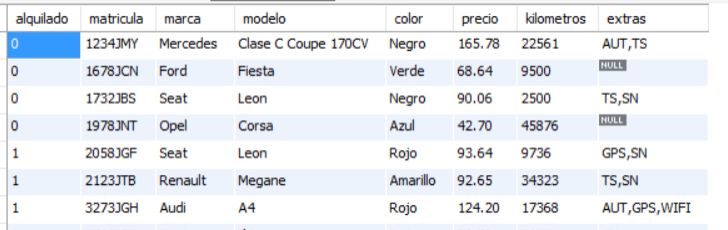
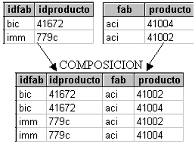
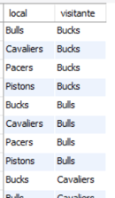

# UNIDAD 4. REALIZACIÓN DE CONSULTAS.

- [UNIDAD 4. REALIZACIÓN DE CONSULTAS.](#unidad-4-realización-de-consultas)
  - [1.- LA INSTRUCCIÓN SELECT](#1--la-instrucción-select)
    - [1.1.-Operadores en consultas SELECT](#11-operadores-en-consultas-select)
    - [1.2.- Consultar todas las filas de una tabla](#12--consultar-todas-las-filas-de-una-tabla)
    - [1.3.- Ordenar resultados](#13--ordenar-resultados)
    - [1.4.- No repetir filas y limitar resultados.](#14--no-repetir-filas-y-limitar-resultados)
    - [1.5.- Consultar algunas filas de una tabla](#15--consultar-algunas-filas-de-una-tabla)
  - [HOJAS DE EJERCICIOS](#hojas-de-ejercicios)
    - [1.6.-Seleccionar con IN, LIKE, BETWEEN y campos NULL](#16-seleccionar-con-in-like-between-y-campos-null)
    - [1.7.- Operadores Lógicos](#17--operadores-lógicos)
  - [HOJAS DE EJERCICIOS](#hojas-de-ejercicios-1)
  - [2.- CONSULTAS SOBRE TABLAS COMBINADAS](#2--consultas-sobre-tablas-combinadas)
    - [2.1.- La reunión interna. INNER JOIN](#21--la-reunión-interna-inner-join)
  - [HOJAS DE EJERCICIOS](#hojas-de-ejercicios-2)
    - [2.2.- El producto cartesiano](#22--el-producto-cartesiano)
  - [HOJAS DE EJERCICIOS](#hojas-de-ejercicios-3)
    - [2.3.- Las reuniones externas. LEFT JOIN. RIGHT JOIN.](#23--las-reuniones-externas-left-join-right-join)
      - [La reunión externa por la izquierda. LEFT JOIN.](#la-reunión-externa-por-la-izquierda-left-join)
      - [La reunión externa por la derecha. RIGHT JOIN.](#la-reunión-externa-por-la-derecha-right-join)
      - [Otro tipo de reuniones. NATURAL JOIN. STRAIGHT.](#otro-tipo-de-reuniones-natural-join-straight)
  - [HOJAS DE EJERCICIOS](#hojas-de-ejercicios-4)
    - [2.4.- Las consultas de resumen y el agrupamiento de registros.](#24--las-consultas-de-resumen-y-el-agrupamiento-de-registros)
  - [HOJAS DE EJERCICIOS](#hojas-de-ejercicios-5)
    - [2.5.- Subconsultas.](#25--subconsultas)
  - [HOJAS DE EJERCICIOS](#hojas-de-ejercicios-6)
  - [3.- FUNCIONES EN MYSQL 8.0](#3--funciones-en-mysql-80)
    - [3.1.- Funciones matemáticas o numéricas.](#31--funciones-matemáticas-o-numéricas)
    - [3.2.- Funciones de cadena de caracteres](#32--funciones-de-cadena-de-caracteres)
  - [HOJAS DE EJERCICIOS](#hojas-de-ejercicios-7)
    - [3.3.- Funciones de fecha y hora](#33--funciones-de-fecha-y-hora)
    - [3.4.- Funciones de control de flujo](#34--funciones-de-control-de-flujo)
    - [3.5.- Otras funciones](#35--otras-funciones)
  - [HOJAS DE EJERCICIOS](#hojas-de-ejercicios-8)
  - [ACTIVIDAD GRUPAL](#actividad-grupal)

## 1.- LA INSTRUCCIÓN SELECT

La instrucción SQL para consultar los datos almacenados en las tablas de una base de datos es **SELECT**. Normalmente es la instrucción más utilizada por los usuarios de una base de datos.

Cuando se ejecuta SELECT, si no tiene errores la instrucción, el SGBD devuelve una hoja de resultados que se muestra en forma de tabla en el cliente que estemos usando.


Sintaxis completa de SELECT:


Sintaxis principal de SELECT:


Descripción de la sintaxis principal de SELECT:

- Entre SELECT y FROM se escriben separadas por comas las columnas o expresiones que se quieren consultar. Pueden consultarse datos que no pertenecen a tablas, como lo devuelto por una función.
- DISTINCT permite que no se repitan filas de resultados iguales.
- FROM permite indicar la tabla o las tablas de las que se extraen los datos.
- WHERE permite seleccionar las filas de las que se extraen datos, poner condiciones sobre lo que se quiere consultar.
- GROUP BY permite agrupar filas que tengan valores iguales en una o varias columnas para que salgan en una sola fila.
- HAVING permite establecer condiciones sobre datos obtenidos de agrupamientos.
- ORDER BY permite ordenar la hoja de resultados por una columna, por varias columnas o por una expresión.
- LIMIT permite indicar que de las filas devueltas por una SELECT solo se muestre un número máximo de ellas.

**Ejemplos de consultas SELECT sin FROM.**

Obtener la fecha y hora actuales.

```sql
SELECT curdate(), curtime();
```

Obtener el resultado de la división entre 7 y 2 y el resultado del cociente y resto de su división.

```sql
SELECT 7/2, 7 div 2, 7 mod 2;
```

Obtener el usuario actual y la versión de MySQL Server.

```sql
SELECT  current_user(),version();
```

### 1.1.-Operadores en consultas SELECT

Como hemos visto anteriormente, en las expresiones que se escriben en SELECT se pueden usar operadores. También se pueden usar en otras instrucciones.

**Operadores aritméticos**:

- operador +, se utiliza para sumar dos números y, como operador unario, para simbolizar signo positivo de un número. 
- operador -, se utiliza para hallar la diferencia entre dos números y, como operador unario, para simbolizar signo negativo de un número. 
- operador *, se utiliza para multiplicar dos números.
- operador / , se utiliza para dividir dos números y obtener un resultado de tipo coma  flotante.
- operador div, se utiliza para dividir dos números y el resultado cociente en forma de entero (división entera) entero. 
- operadores % o mod, dividen dos números y devuelven el resto entero de la división.

**Operadores de comparación o relacionales**:

- operador  = , compara	si igual
- operador  > , compara	si mayor
- operador  < , compara	si menor
- operador  <= , compara si menor o igual
- operador  >= , compara si mayor o igual
- operador  <>  , compara si distinto
 

**Modelo relacional de la Base de datos ALQUILERES, que vamos a usar en todos los ejemplos de esta unidad.**


### 1.2.- Consultar todas las filas de una tabla

Cuando se ejecuta SELECT **sin la cláusula WHERE**, se consultan todas las filas de la tabla. 

Para obtener todos los datos de la tabla (todas las columnas) se puede usar el comodín *, salvo que queramos que las columnas se obtengan en orden diferente al de diseño de la tabla.

**Ejemplo:** Obtener todos los datos de la tabla automóviles.

```sql
SELECT * FROM automoviles;
```


Cuando queramos obtener algunas columnas y/o expresiones habrá que escribirlas separadas por comas.

**Ejemplo:** Obtener todos los datos de la tabla automóviles representando como primera columna, la columna alquilado.

```sql
SELECT alquilado, matricula, marca, modelo, color, precio, kilometros, extras FROM automoviles;
```



Cuando queramos obtener algunas columnas y/o expresiones habrá que escribirlas separadas por comas.

**Ejemplo:** Obtener las matriculas, marcas y modelos de todos los coches junto con el precio y el precio incrementado en un 10%.

```sql
SELECT matricula, marca, modelo, precio, precio*1.1 FROM automoviles;
```


### 1.3.- Ordenar resultados

Para ordenar la hoja de resultados por una o varias expresiones, se usa la cláusula **ORDER BY expr1, … [ASC|DESC]**.

**Ejemplo:** Obtener matricula, marca, modelo y precio de alquiler de todos los automóviles ordenados ascendentemente por marca y como segundo criterio por modelo.

```sql
SELECT matricula, marca, modelo, precio FROM automoviles ORDER BY marca, modelo;
```


**Ejemplo:** Obtener matricula, marca, modelo y precio de todos los automóviles ordenados por precio de alquiler de mayor a menor.

```sql
SELECT matricula, marca, modelo, precio FROM automoviles ORDER BY precio DESC;
```


**Ejemplo:** Obtener matricula, marca, modelo y precio de todos los automóviles ordenados por marca ascendentemente y después por precio de alquiler de mayor a menor.

```sql
SELECT matricula, marca, modelo, precio FROM automoviles ORDER BY marca, precio DESC;
```


### 1.4.- No repetir filas y limitar resultados.

Para que no se repitan en la hoja de resultados filas exactamente iguales se usa la cláusula **DISTINCT**.

**Ejemplo:** Mostrar los colores de todos los coches (pueden mostrarse repetidos).

```sql
SELECT color FROM automoviles;
```

**Ejemplo:** Mostrar los colores disponibles de coches.

```sql
SELECT DISTINCT color FROM automoviles;
```


**Ejemplo:** Obtener las marcas y modelos disponibles ordenados por marca y después por modelo.

```sql
SELECT DISTINCT marca,modelo FROM automoviles ORDER BY marca,modelo;
```


La cláusula **LIMIT** de la instrucción SELECT permite limitar el número de filas de la hoja de resultados. La sintaxis de la cláusula LIMIT dentro de SELECT es:

```sql
LIMIT [inicio,] numfilas
```

**Ejemplo:** Obtener la matrícula, marca y modelo de los 5 primeros coches que hay registrados en la tabla automóviles.

```sql
SELECT matricula,marca,modelo FROM automoviles LIMIT 5;
```


**Ejemplo:** Obtener la matrícula, marca, modelo y precio de los 5 coches de precio de alquiler más alto.

```sql
SELECT matricula,marca,modelo,precio FROM automoviles ORDER BY precio DESC LIMIT 5;
```


**Ejemplo:** Obtener la matrícula, marca, modelo y precio de los 5 coches de precio de alquiler más alto.

```sql
SELECT matricula,marca,modelo,precio FROM automoviles ORDER BY precio DESC LIMIT 5;
```


**Ejemplo:**  Obtener la matrícula, marca, modelo y precio de los 5 coches de precio de alquiler más alto exceptuando al más caro.

```sql
SELECT matricula,marca,modelo,precio FROM automoviles ORDER BY precio DESC LIMIT 1,5;
```


**Ejemplo:** Obtener el nombre, apellidos y fecha de nacimiento del cliente más joven.

```sql
SELECT nombre, apellidos FROM clientes ORDER BY fnac DESC LIMIT 1;
```


### 1.5.- Consultar algunas filas de una tabla

Cuando hablamos de seleccionar filas dentro de una consulta nos referimos a obtener las filas que cumplen con una condición determinada. Para seleccionar filas en una consulta SELECT, se usa la cláusula **WHERE**.

Dentro de la cláusula WHERE se usará una expresión que devuelve un valor booleano. Se seleccionan las filas que devuelven en esa expresión el valor true.

**Ejemplo:** Obtener la matrícula, modelo y precio de todos los automóviles disponibles de la marca SEAT.

```sql
SELECT matricula,modelo,precio FROM automoviles WHERE marca='seat';
```


**Ejemplo:** Obtener la marca, modelo y precio de alquiler de todos los automóviles de precio de alquiler por día superior o igual a 100€, ordenados por precio ascendentemente.

```sql
SELECT marca,modelo,precio FROM automoviles WHERE precio>=100 ORDER BY precio;
```


**Ejemplo:** Obtener todos los datos de los contratos efectuados en el año 2017.

```sql
SELECT * FROM contratos WHERE fini>'2016-12-31' and fini<'2018-01-01';

SELECT * FROM contratos WHERE year(fini)=2017;
```


**Ejemplo:** Obtener la matrícula, marca y modelo de todos los automóviles que figuran como disponibles para alquilar (no alquilados).

```sql
SELECT matricula,marca,modelo FROM automoviles WHERE alquilado!=true; 

SELECT matricula,marca,modelo FROM automoviles WHERE alquilado=false; 
```


**Ejemplo:** Obtener el nombre y apellidos de todas las clientes de nombre Alicia.

```sql
SELECT nombre,apellidos FROM clientes WHERE nombre='alicia';
```


## HOJAS DE EJERCICIOS

💻 Hoja de ejercicios 1.

💻 Hoja de ejercicios 2.


### 1.6.-Seleccionar con IN, LIKE, BETWEEN y campos NULL

La cláusula **BETWEEN** es un operador que permite comprobar si un valor está dentro de un intervalo. Se usa con la sintaxis:

```sql
valor BETWEEN menor AND mayor
```

**Ejemplo:** Obtener los datos de todos los contratos efectuados entre el día 24 de diciembre de 2016 y el 6 de enero de 2017 (ambos incluidos).

```sql
SELECT * FROM contratos WHERE fini BETWEEN '2016-12-24' AND'2017-01-06';
```


**Ejemplo:** Obtener los nombres y apellidos de todos los clientes cuyo primer apellido comienza por la letra ‘D’.

```sql
SELECT nombre,apellidos FROM clientes WHERE apellidos BETWEEN 'D' AND 'E’;
```

(Saca también los del apellido que empiece con E)


La cláusula **IN** es un operador que permite comprobar si el valor de una expresión coincide o no con alguno de un conjunto de valores. El conjunto de valores se expresa entre paréntesis separando los valores con coma. La sintaxis para usar IN es:

```sql
expresión IN (valor1, valor2, valor3, ….,valorN)
```

**Ejemplo:** Obtener todos los datos de los automóviles de las marcas SEAT, AUDI, HYUNDAI o TOYOTA.

```sql
SELECT * FROM automoviles WHERE marca IN ('seat','audi','hyundai','toyota');
```


La cláusula **LIKE** es un operador que permite comprobar si una cadena de caracteres coincide con un patrón. 

La sintaxis para usar LIKE es:

```sql
expresión LIKE 'patron'
```

En patrón se escriben los caracteres que queremos que coincidan y, para representar a cualquier conjunto de caracteres, se usa el comodín % y para representar que se sustituye por un solo carácter se usa el comodín _.

**Ejemplo:** Obtener el nombre y apellidos de todos los clientes cuyo primer apellido comience por la letra D.

```sql
SELECT nombre, apellidos FROM clientes WHERE apellidos LIKE 'D%';
```


**Ejemplo:** Obtener la matricula, marca y modelo de todos los automóviles cuya matrícula termina con las letras NT.

```sql
SELECT matricula,marca,modelo FROM automoviles WHERE matricula LIKE '%NT';
```


**Ejemplo:** Obtener el nombre, apellidos y fecha de nacimiento de todos los clientes nacidos en enero. 

```sql
SELECT nombre, apellidos,fnac FROM clientes WHERE fnac LIKE '%-01-%';
```


**Ejemplo:** Obtener el nombre, apellidos y fecha de nacimiento de todos los clientes nacidos en los años 80.

```sql
SELECT nombre, apellidos,fnac FROM clientes WHERE fnac LIKE '198%';
```


**Ejemplo:** Obtener la matrícula, marca y modelo de todos los automóviles cuyo segundo dígito en la matrícula sea un dos y cuya primera letra en la matrícula sea J.

```sql
SELECT matricula,marca,modelo FROM automoviles WHERE matricula LIKE '_2__J__';
```


Cuando un campo de un registro o fila de una tabla está vacío se dice que está a valor nulo. 

Para comprobar si una expresión (normalmente una columna) es nula, se usa a sintaxis:

```sql
expresión IS NULL
```

Para comprobar si una expresión no es nula, es decir, contiene algo, se usa a sintaxis:

```sql
expresión IS NOT NULL
```

**Ejemplo:** Dado que en los contratos se tiene la fecha final a nulo cuando los contratos no han finalizado, obtener la matrícula de los automóviles que están actualmente contratados y la fecha de inicio del contrato.

```sql
SELECT matricula,fini FROM contratos WHERE ffin IS NULL;
```


**Ejemplo:** Obtener el número de contrato, la matrícula del automóvil y los kilómetros recorridos de todos los contratos de alquiler finalizados.

```sql
SELECT numcontrato,matricula,kfin-kini FROM contratos WHERE ffin IS NOT NULL;
```


### 1.7.- Operadores Lógicos

Podemos realizar expresiones compuestas de varias condiciones mediante los operadores lógicos.

| Operador | Función|
| ------------- | ------------- |
| AND  | Devuelve el valor TRUE cuando las condiciones son verdaderas  |
| OR | Devuelve el valor FALSE cuando todas las condiciones son falsas  |
| NOT  | Devuelve lo opuesto a la condición que sigue a NOT  |

Prevalencia de los operadores lógicos y de comparación:

1. operadores de comparación
2. operador NOT
3. operador AND
4. operador OR

**Ejemplo:** Obtener la matrícula, marca, modelo  y precio de todos los automóviles de precio de alquiler comprendido entre 80 y 90 €.

```SQL
SELECT matricula,marca,modelo,precio FROM automoviles WHERE precio>=80 AND precio <=90;
```


**Ejemplo:** Obtener la matrícula, marca, modelo y precio de todos los automóviles de precio de alquiler comprendido entre 80 y 90 € o entre 100 y 120€.

```sql
SELECT matricula,marca,modelo,precio FROM automoviles WHERE (precio>=80 AND precio <=90) OR (precio>=100 AND precio <=120);
```


**Ejemplo:** Obtener la matricula, marca y modelo de todos los automóviles de las marcas SEAT, AUDI, HYUNDAI, TOYOTA.

```sql
SELECT matricula,marca,modelo FROM automoviles WHERE marca='seat' OR marca='audi' OR marca='hyundai' OR marca='toyota';
```


**Ejemplo:** Obtener todos los datos de los contratos iniciados en el año 2017 y que ya hayan finalizado.

```sql
SELECT * FROM contratos WHERE ffin IS NOT NULL AND fini LIKE '2017%';
```


**Ejemplo:** Obtener todos los datos de los automóviles que no son de las marcas SEAT o AUDI.

```sql
SELECT matricula,marca,modelo FROM automoviles WHERE marca!='seat' AND marca!='audi';

SELECT matricula,marca,modelo FROM automoviles WHERE NOT (marca='seat' OR marca='audi');
```


## HOJAS DE EJERCICIOS

💻 Hoja de ejercicios 3.

💻 Hoja de ejercicios 4.

💻 Hoja de ejercicios 5.

💻 Hoja de ejercicios 6.(opcional)

## 2.- CONSULTAS SOBRE TABLAS COMBINADAS

Hasta ahora únicamente hemos visto consultas realizadas sobre una única tabla. 

Es muy frecuente y necesario tener que realizar consultas sobre combinaciones de tablas dado que necesitamos obtener datos en la consulta de varias tablas y/o tener condiciones aplicadas a datos de varias tablas. 

Por ejemplo, en la base de datos de alquileres, para obtener el nombre y apellidos de los clientes que han alquilado coches en enero, necesitamos usar o combinar dos tablas en la consulta: clientes y contratos.

En MySQL podemos usar las siguientes operaciones de combinación de tablas:

- Producto cartesiano o CROSS JOIN
- Combinación INNER JOIN
- Combinación LEFT JOIN
- Combinación RIGHT JOIN

### 2.1.- La reunión interna. INNER JOIN

Permite emparejar filas de dos tablas a través de una relación entre una columna de una tabla y otra columna de otra tabla. 

Lo normal es que sean la clave principal de una tabla y la correspondiente clave ajena relacionada en la otra tabla, aunque pueden ser columnas que no tienen relación de clave ajena establecida. 

En una consulta de este tipo, para cada fila de una de las tablas se busca en la otra tabla la fila o filas que cumplen la condición de relación que se quiera entre las dos columnas (normalmente se busca igualdad entre clave principal y clave ajena). 


Permite emparejar filas de dos tablas a través de una relación entre una columna de una tabla y otra columna de otra tabla. 

Lo normal es que sean la clave principal de una tabla y la correspondiente clave ajena relacionada en la otra tabla, aunque pueden ser columnas que no tienen relación de clave ajena establecida. 

En una consulta de este tipo, para cada fila de una de las tablas se busca en la otra tabla la fila o filas que cumplen la condición de relación que se quiera entre las dos columnas (normalmente se busca igualdad entre clave principal y clave ajena). 

La sintaxis de esta operación dentro de una SELECT es:

```sql
SELECT   ......  FROM   tabla1  INNER JOIN  tabla2  ON   columna1 condicion_relacion columna2
```

Tabla 1 y tabla 2 podrían ser incluso la misma tabla si hay alguna relación entre una columna de la tabla y la clave principal de la misma tabla. En este caso, al menos uno de los nombres de tabla tendría que ser un alias.
 
Columna1 y columna2 son las columnas que se emparejan o relacionan y deben tener el mismo tipo de datos o datos compatibles. 
 
Condicion_relacion representa cualquier operación relacional, aunque normalmente se usa la igualdad. Se pueden combinar más de dos tablas usando varios INNER JOIN.  

Cuando coincida el nombre de las dos columnas relacionadas, tendremos que escribir nombres cualificados, escribiendo el nombre de la tabla a la que pertenecen, un punto y el nombre de la columna. En ese caso, también se puede usar y es más adecuada esta sintaxis:

```sql
SELECT   ......  FROM   tabla1  INNER JOIN  tabla2  USING (columna);
```


Vamos a hacer pruebas en la BD empresa:

```sql
select * from empleados 
inner join departamentos 
on empleados.numde=departamentos.numde;
```

Salen los datos de las dos tablas, el campo numde sale dos veces.

```sql
select * from empleados 
inner join departamentos using(numde);
```

Sacamos los datos que nos interesan de ambas tablas, vemos que si el nombre de la columna es igual en ambas tablas, tenemos que indicar de que tabla queremos sacarlo.

```sql
select empleados.numde,numem, nomem,nomde 
from empleados 
inner join departamentos 
using(numde);
```

Comprobamos que el número de registros de las consultas es el mismo.

**Ejemplo:** Obtener el número de contrato y la matrícula, marca y modelo de todos los automóviles que están contratados actualmente por algún cliente.

```sql
SELECT numcontrato,automoviles.matricula,marca,modelo FROM contratos INNER JOIN automoviles ON contratos.matricula=automoviles.matricula WHERE ffin IS NULL;
```


**Ejemplo:** Obtener el número de contrato y el nombre y apellidos de todos los clientes que tienen actualmente contrato algún automóvil.

```sql
SELECT numcontrato,nombre,apellidos FROM clientes INNER JOIN contratos ON dnicliente=dni WHERE ffin IS NULL;
```


**Ejemplo:** De todos los contratos finalizados, obtener la matricula, marca y modelo de cada coche contratado, el nombre y apellidos del cliente que hizo cada contrato y los kilómetros recorridos por el coche en el contrato.

```sql
SELECT numcontrato,automoviles.matricula,marca,modelo,nombre,apellidos, kfin-kini FROM (contratos INNER JOIN automoviles ON contratos.matricula = automoviles.matricula) INNER JOIN clientes ON dnicliente=dni WHERE ffin IS NOT NULL;
```


**Ejemplo:** Obtener el nombre y apellidos de los clientes que han contratado automóviles de la marca Seat.

```sql
SELECT DISTINCT nombre,apellidos FROM (contratos INNER JOIN automoviles ON contratos.matricula = automoviles.matricula) INNER JOIN clientes ON dnicliente=dni WHERE marca='seat';
```


**Ejemplo:** En una base de datos nba tenemos una tabla equipos. En la tabla equipos, entre otros datos, se tiene el nombre del equipo y la división en la que participa. Obtener todos los enfrentamientos o partidos posibles entre equipos de la división central sin usar la tabla partidos, buscando los distintos cruces.

```sql
SELECT a.nombre AS local,b.nombre AS visitante FROM equipos AS a INNER JOIN equipos AS b ON a.nombre <> b.nombre WHERE a.division='central' AND b.division='central';
```


Explicación: Tenemos una INNER JOIN entre dos tablas que son la misma. A la primera la renombramos como tabla a y la segunda como tabla b, pero las dos son equipos. 

## HOJAS DE EJERCICIOS

💻 Hoja de ejercicios 7.

### 2.2.- El producto cartesiano

El producto cartesiano de dos tablas permite obtener una tabla con las columnas de la primera tabla y las columnas de la segunda tabla (aunque tengan nombres iguales). 
Las filas de la hoja de resultados resultante son todas las posibles combinaciones entre filas de la primera tabla y filas de la segunda tabla. Así, si una tabla tiene 6 filas y la otra tiene 8, el resultado del producto cartesiano es una tabla de 48 filas.  Pero si una tabla tiene 6000 filas y otras 8000, se crea en memoria una tabla de 48 millones de filas, cada una de las cuales contiene varios bytes. Eso supone crear mucho espacio en memoria y puede ser un GRAVE PROBLEMA.



Para obtener el producto cartesiano total entre dos tablas se escribe * (todas las columnas) después de SELECT y los nombres de las dos tablas separadas con coma después de FROM. No es muy normal tener que obtener el producto cartesiano total entre dos o más tablas.  Lo normal es que sobre el resultado de un producto cartesiano apliquemos condiciones para extraer los datos combinados que queremos.

Por ejemplo, si ejecutamos:

```sql
SELECT * FROM automoviles,contratos;
```


Vemos que en el resultado vemos múltiples filas para el contrato 1. Vemos que ese contrato corresponde a la matrícula 12434JMY. Pero ese contrato se ha combinado con cada uno de los automóviles, es decir, se ha combinado con automóviles de matrículas distintas a las del contrato. Lo lógico es que, para cada contrato, relacionemos el contrato con los datos del automóvil que corresponda. Eso hay que hacerlo con una condición WHERE.

```sql
SELECT * FROM automoviles,contratos WHERE automoviles.matricula = contratos.matricula;
```

Aunque ahora veamos en el resultado una fila por cada contrato, realmente se ha creado en memoria una tabla intermedia con el producto cartesiano completo.

Vamos a ver varios ejemplos en los que se realizan consultas en las que se puede usar el producto cartesiano. Se aplica la combinación producto cartesiano y se establecen condiciones de selección WHERE y se indican las columnas o expresiones que se quieren consultar.

**Ejemplo 1:** Obtener la matricula, marca, modelo, fecha inicial y fecha final del contrato número 1 (habrá que establecer la condición WHERE para que el contrato sea el número 1 y para que la matrícula del automóvil coincida con la del contrato).

```sql
SELECT contratos.matricula,marca,modelo,fini,ffin FROM automoviles,contratos WHERE numcontrato=1 AND contratos.matricula=automoviles.matricula;
```


Vemos que en la instrucción se deben usar cualificadores de tabla en columnas que tienen el mismo nombre en las dos tablas.

Cuando se combinan tablas puede ser útil a veces renombrarlas. Por ejemplo, la instrucción usada en la anterior diapositiva:

```sql
SELECT contratos.matricula,marca,modelo,fini,ffin FROM automoviles,contratos WHERE numcontrato=1 AND contratos.matricula=automoviles.matricula;
```

Sería equivalente a esta que usa renombrado de tablas:

```sql
SELECT c.matricula,marca,modelo,fini,ffin FROM automoviles AS a,contratos AS c WHERE numcontrato=1 AND c.matricula=a.matricula;
```

**Ejemplo 2:** Suponiendo que tenemos en una base de datos una tabla con los módulos de un curso y otra tabla con los alumnos del curso, realizar una consulta que obtiene todas las posibles combinaciones de códigos o números de alumnos con todos los códigos de módulos del curso DAM1.


```sql
SELECT numalumn,codmodulo FROM alumnos,modulos ORDER BY codmodulo;
```


**Ejemplo 3:** En la base de datos alquileres obtener la marca y modelo (sin repetir) de todos los automóviles contratados alguna vez en diciembre de 2017.

```sql
SELECT DISTINCT marca,modelo FROM automoviles,contratos WHERE automoviles.matricula=contratos.matricula AND fini LIKE '2017-12%';
```


**Ejemplo 4:** Del contrato de alquiler de coches número 10, obtener el cliente que hizo el contrato, la matrícula, marca y modelo del coche y la duración del contrato.

```sql
SELECT apellidos, nombre, contratos.matricula, marca, modelo, fini, ffin FROM automoviles, contratos,clientes WHERE automoviles.matricula = contratos.matricula AND contratos.dnicliente=clientes.dni AND numcontrato=10;
```


**Ejemplo 5:** En una base de datos nba tenemos una tabla equipos. En la tabla equipos, entre otros datos, se tiene el nombre del equipo y la división en la que participa. Obtener todos los enfrentamientos o partidos posibles entre equipos de la división central. Habrá que combinar la tabla equipos consigo misma evitando que el equipo local y el visitante sea el mismo.

```sql
SELECT a.nombre AS local,b.nombre AS visitante FROM equipos AS a, equipos AS b WHERE a.division='central' AND b.division='central' AND a.nombre <> b.nombre;
```



**IMPORTANTE:** 

El producto cartesiano debe evitarse, siempre y cuando la consulta se pueda realizar con otra operación de combinación, cuando las tablas que se combinan tienen muchas filas.
La combinación produce el producto del número de filas combinadas y eso pueden ser muchísimas filas (y muchas columnas también). Todo eso se almacena temporalmente en RAM y ocupa mucho espacio.

Las consultas de los ejemplos 2 y 5 son casos de una buena utilización del producto cartesiano ya que ahí si que queremos combinar todas las filas de una tabla con todas las de la otra.

Sin embargo, los otros ejemplos de este apartado se podrían realizar más óptimamente con otras operaciones de combinación. 

## HOJAS DE EJERCICIOS

💻 Hoja de ejercicios 8.

💻 Hoja de ejercicios 9.

💻 Hoja de ejercicios 10.

### 2.3.- Las reuniones externas. LEFT JOIN. RIGHT JOIN.

#### La reunión externa por la izquierda. LEFT JOIN.

Permite emparejar filas de dos tablas a través de una relación entre una columna de una tabla y otra columna de otra tabla. Hasta aquí todo igual que INNER JOIN.

Además añade combinaciones de filas de la tabla de la izquierda con columnas vacías de la tabla de la derecha o a valores nulos para aquellas filas de la tabla de la izquierda que no tienen correspondencia con filas de la tabla de la derecha.

Por ejemplo, si se hace un: 

```sql
AUTOMOVILES LEFT JOIN CONTRATOS ON automoviles.matricula = contratos.matricula
```

Para los automóviles que nunca han sido contratados, se generaría una fila con los datos del automóvil y todos los datos de contrato a valor NULL.

La sintaxis es la misma que para INNER JOIN. Se pueden usar las cláusulas ON y USING.


La sentencia LEFT JOIN retorna la pareja de todos los valores de la tabla izquierda con los valores de la tabla de la derecha correspondientes, si los hay, o retorna un valor nulo NULL en los campos de la tabla derecha cuando no haya correspondencia

**Ejemplo:** Obtener la matrícula, marca y modelo de todos los automóviles junto con los datos de todos los contratos que se han realizado sobre esos automóviles. Para los automóviles nunca contratados se debe obtener también una fila que no está relacionada con ningún contrato.

```sql
SELECT automoviles.matricula,marca,modelo,contratos.* FROM automoviles LEFT JOIN contratos USING (matricula);
```


**Ejemplo:** Obtener los datos de todos los automóviles que nunca han sido contratados.

```sql
SELECT automoviles.* FROM automoviles LEFT JOIN contratos USING (matricula) WHERE numcontrato IS NULL;
```


#### La reunión externa por la derecha. RIGHT JOIN.

Esta operación es una imagen refleja de la anterior; el resultado de esta operación siempre contiene todos los registros de la tabla de la derecha (la segunda tabla que se menciona en la consulta), independientemente de si existe o no un registro correspondiente en la tabla de la izquierda. 


**Ejemplo:** Obtener el DNI, nombre y apellidos de todos los clientes registrados junto con los datos de los contratos que han realizado. En la hoja de resultados se deben mostrar también los clientes que no han realizado ningún contrato. 

```sql
SELECT clientes.dni,nombre,apellidos,contratos.* FROM contratos RIGHT JOIN clientes ON dni=dnicliente;
```


**Ejemplo:** Obtener los datos de todos los clientes que nunca han hecho contratos.

```sql
SELECT clientes.* FROM contratos RIGHT JOIN clientes ON dni=dnicliente WHERE numcontrato IS NULL;
```


#### Otro tipo de reuniones. NATURAL JOIN. STRAIGHT.

NATURAL JOIN

Permite combinar filas de dos tablas relacionadas por igualdad entre una clave ajena y una clave primaria relacionada.

**Ejemplo:** Obtener los datos de los clientes que han realizado los cinco primeros contratos.

```SQL
SELECT clientes.* FROM contratos NATURAL JOIN clientes LIMIT 5;
```


STRAIGHT JOIN
Puede usarse con las cláusulas ON y USING para realizar lo mismo que INNER JOIN. Sin esas cláusulas realiza lo mismo que NATURAL JOIN.

Enlaces de ampliación de los tipos de reuniones.

[Enlace a la wikipedia](https://es.wikipedia.org/wiki/Sentencia_JOIN_en_SQL)

[Enlace a programación y más](https://programacionymas.com/blog/como-funciona-inner-left-right-full-join)

## HOJAS DE EJERCICIOS

💻 Hoja de ejercicios 11.

### 2.4.- Las consultas de resumen y el agrupamiento de registros.

Las **consultas de resumen o de agregado** permiten realizar cálculos de resumen o de grupo sobre las filas que tienen un valor igual en una o varias columnas.

Para realizar estos cálculos se usan las funciones de agregado. 

- Count(expresión o columna): Cuenta cuantas filas hay con la expresión o columna que no estén a valor nulo. Si en el argumento de la función escribimos *, se cuentan cuantas filas hay en la consulta. Si la expresión o columna vale null, no se cuenta.
- Sum(expresión o columna): Calcula la suma de los valores numéricos indicados en el argumento. Si en la expresión o columna hay null, no se tiene en cuenta para la suma.
- Min(expresión o columna): Obtiene el valor mínimo del argumento indicado.
- Max(expresión o columna): Obtiene el valor máximo del argumento indicado.
- Avg(expresión o columna): Obtiene la media aritmética del argumento indicado. No considera los valores nulos para el cálculo de la media.
- Group_concat(expresión o columna): Obtiene la concatenación de todos los valores que se obtendrían en la consulta. No considera los valores nulos para la concatenación.

**Ejemplo:** Obtener cuantos contratos se han realizado:

```sql
SELECT count(*) FROM contratos;
```

**Ejemplo:** Obtener cuantos contratos realizados han finalizado.

```sql
SELECT count(ffin) FROM contratos;
```

**Ejemplo:** Obtener cuantos automóviles hay.

```sql
SELECT count(*) FROM automoviles;
```

**Ejemplo:** Obtener de cuantas marcas hay coches.

```sql
SELECT count(DISTINCT marca) FROM automoviles;
```

Sin DISTINCT saldría cuantos automóviles hay en la tabla AUTOMOVILES (cuantas filas tienen la columna marca a valores no nulos). Con DISTINCT no se cuentan filas repetidas de una misma marca. Por cada marca se cuenta uno más.

**Ejemplo:** Obtener la media de kilómetros realizados en los contratos finalizados, el máximo kilometraje realizado y el mínimo.

```sql
SELECT avg(kfin-kini), max(kfin-kini),min(kfin-kini) FROM contratos;
```


**Ejemplo:** Obtener una cadena de caracteres concatenación de los nombres de todos los clientes de Toledo.

```sql
SELECT group_concat(nombre) FROM clientes WHERE localidad='toledo';
```


**Ejemplo:** Obtener la suma total de kilómetros realizados en contratos finalizados por clientes de Madrid.

```sql
SELECT sum(kfin-kini) FROM contratos INNER JOIN clientes ON dnicliente=dni WHERE localidad='madrid';
```


Para hacer el **agrupamiento de registros** se utiliza la cláusula GROUP BY, que permite agrupar varias filas de una consulta por una o varias expresiones. Todos los valores repetidos de las expresiones agrupadas, se mostrarán en una sola fila.

**Ejemplo:** Obtener la marca y modelo (sin repetir) de todos los automóviles que fueron contratados y cuya fecha de finalización de contrato está dentro del año 2018.

```sql
SELECT marca,modelo FROM automoviles INNER JOIN contratos ON contratos.matricula = automoviles.matricula WHERE year(ffin)=2018 GROUP BY marca,modelo;
```


**Ejemplo:** Obtener las localidades en las que se tienen clientes.

```sql
SELECT localidad FROM clientes GROUP BY localidad;
```


**Ejemplo:** Obtener el nombre y apellidos de los clientes que han realizado contratos a partir del 24 de diciembre de 2017. Los resultados deben estar ordenados ascendentemente por apellidos, nombre.

```sql
SELECT nombre,apellidos FROM clientes INNER JOIN contratos ON dnicliente=dni WHERE fini >=‘2017-12-24' GROUP BY dnicliente ORDER BY apellidos,nombre;
```


**Obtener cálculos sobre grupos de registros o filas**

Cuando se realizan agrupamientos en una SELECT, podemos obtener cálculos sobre cada grupo con las funciones de resumen o agregado que hemos visto. 

**Ejemplo:** Obtener cuantos automóviles hay de cada marca usando la función count. Hay que agrupar por marca en una consulta sobre la tabla automoviles.

```sql
SELECT marca,count(*) FROM automoviles GROUP BY marca;
```


**Ejemplo:** Obtener el nombre y apellidos de los clientes que han realizado contratos a partir del 24 de diciembre de 2017 y cuantos contratos han realizado desde esa fecha. Los resultados deben estar ordenados ascendentemente por apellidos, nombre.

```sql
SELECT nombre,apellidos,count(*) FROM clientes INNER JOIN contratos ON dnicliente=dni WHERE fini >='2016-12-27' GROUP BY dnicliente ORDER BY apellidos,nombre;
```


**Ejemplo:** Obtener el precio medio, precio máximo y precio mínimo de los coches de cada marca ordenados por precio medio descendentemente.

```sql
SELECT marca,avg(precio)AS medio ,max(precio),min(precio) FROM automoviles GROUP BY marca ORDER BY medio DESC;
```


**Ejemplo:** Obtener el precio medio, precio máximo y precio mínimo de los coches de la marca SEAT.

```sql
SELECT avg(precio),max(precio),min(precio) FROM automoviles WHERE marca='SEAT';
```


Poner condiciones sobre resultados de funciones de  agrupamiento. **Cláusula HAVING**:
 
En una consulta se pueden seleccionar filas que cumplan condiciones relativas al resultado de una función de agrupamiento. 

Detrás de HAVING se ha de escribir una condición de selección. 

En la condición de selección sólo se pueden usar funciones de agrupamiento o resumen, columnas de agrupación (las que se utilicen con GROUP BY) o cualquier expresión basada en estas columnas o en las funciones de agrupamiento.

**Ejemplo:** Obtener el número de clientes de cada localidad siempre que en la localidad haya más de tres clientes.

```sql
SELECT localidad,count(*) FROM clientes GROUP BY localidad HAVING count(*)>3;
```

**Ejemplo:** Obtener las marcas de coches cuyo precio medio de alquiler sea inferior a 105 Euros.

```sql
SELECT marca FROM automoviles GROUP BY marca HAVING avg(precio)<105;
```


**Ejemplo:** Obtener las marcas de coches y su precio medio de alquiler siempre que se cumpla que ese precio medio está comprendido entre 75 y 100 euros. 

```sql
SELECT marca,avg(precio) AS media FROM automoviles GROUP BY marca HAVING media >=75 AND media<=100;
```


## HOJAS DE EJERCICIOS

💻 Hoja de ejercicios 12.

### 2.5.- Subconsultas.

Una subconsulta es una consulta SELECT que se hace dentro de otra consulta SELECT. Los datos que se obtienen de la subconsulta se usan en la consulta en la que se incluye.

También se pueden usar subconsultas dentro de las instrucciones INSERT, UPDATE y DELETE.

Si no existieran las subconsultas, para obtener las matrículas, marcas, modelos y precios de alquiler de los automóviles que tienen un precio de alquiler superior al automóvil de matrícula 5031JHL, posiblemente plantearamos esto con dos instrucciones:

1.-	Obtener el precio de alquiler del automóvil de matrícula 5031JHL

```sql
SELECT precio FROM automoviles WHERE matricula='5031JHL';
```

2.-	Obtener ahora las matrículas, marcas, modelos y precios de los automóviles con precio de alquiler superior a 116,45 Euros. 

```sql
SELECT matricula, marca, modelo, precio FROM automoviles WHERE precio > 116.45;
```

En el anterior ejemplo, lo que hemos hecho realmente es esto:


Podemos modificar la instrucción segunda para que, en lugar del precio, use una subconsulta para obtener el precio del automóvil de la matrícula indicada.

```sql
SELECT matricula, marca, modelo FROM automoviles WHERE precio>(SELECT precio FROM automoviles WHERE matricula = '5031JHL');
```

**Ejemplo:** Obtener las matrículas, marcas, modelos y precios de alquiler de los automóviles que tienen un precio de alquiler superior al automóvil de matrícula 5031JHL.

```sql
SELECT matricula, marca, modelo FROM automoviles WHERE precio>(SELECT precio FROM automoviles WHERE matricula = '5031JHL') ;
```


MUY IMPORTANTE: En subconsultas como esta anterior, que se usan para comparar con un valor, las subconsultas deben devolver únicamente un valor.

**Ejemplo:** Obtener las matrículas, marcas, modelos y precios de alquiler de los automóviles de color rojo que tienen un precio de alquiler superior al automóvil de matrícula 5031JHL.

```sql
SELECT matricula, marca, modelo FROM automoviles WHERE precio>(SELECT precio FROM automoviles WHERE matricula = '5031JHL') AND color='rojo';
```


**Ejemplo:** Obtener las marcas y sus precios medios de alquiler siempre que se cumpla que ese precio medio es inferior al precio de alquiler del automóvil de matrícula 5031JHL.

```sql
SELECT marca, avg(precio) FROM automoviles GROUP BY marca HAVING avg(precio) < (SELECT precio FROM automoviles WHERE matricula = '5031JHL');
```


**Ejemplo:** Obtener la marca y modelo del coche de precio de alquiler más alto.

```sql
SELECT marca,modelo,precio FROM automoviles WHERE precio = (SELECT max(precio) FROM automoviles);
```


**Ejemplo:** Obtener la marca y modelo del coche correspondiente al contrato número 10.

```sql
SELECT marca,modelo FROM automoviles WHERE matricula = (SELECT matricula FROM contratos WHERE numcontrato=10);
```

Pero esto se puede hacer de la siguiente forma, y es más adecuado, ya que la consulta consume menos tiempo. En general las instrucciones que usan  subconsultas llevan más tiempo que las que no las usan, aunque esto no siempre es así.

```sql
SELECT marca,modelo FROM automoviles INNER JOIN contratos USING (matricula) WHERE numcontrato=10;
```


**UNION:**

UNION se usa para combinar los resultados de varias sentencias en un único conjunto de resultados. Las columnas del resultado de ambas consultas deben ser del mismo tipo. El resultado final tendrá el nombre de columnas de la primera consulta. Por defecto solo muestra las filas que son distintas (como si pusiéramos la cláusula DISTINCT). Podemos evitar esto con la cláusula ALL.

**Ejemplo:** Obtener el DNI de los clientes de la tabla contratos y de la tabla contratos2.

```sql
SELECT DISTINCT dnicliente FROM contratos UNION ALL SELECT DISTINCT dnicliente FROM contratos2;
```

El resultado será una tabla con los DNI de los clientes de ambas tablas. Si hay clientes con contratos en las dos tablas saldrán dos veces.

**Ejemplo:**  Obtener la matrícula de los coches actualmente alquilados (ffin=NULL) y de los coches de marca Renault sin repetir matrículas.

```sql
SELECT matricula FROM contratos WHERE ffin IS NULL UNION SELECT matricula FROM automoviles WHERE marca="Renault";
```

Hasta ahora hemos usado las subconsultas dentro de las cláusulas WHERE y HAVING. También se pueden usar en la cláusula FROM para obtener una hoja de resultados a partir de la que construimos una consulta. 

**Ejemplo:** Obtener los datos de los clientes que tienen contratos en las dos tablas de contratos (contratos y contratos 2).

```sql
SELECT * FROM clientes INNER JOIN (SELECT DISTINCT dnicliente FROM contratos UNION ALL SELECT DISTINCT dnicliente FROM contratos2) AS t ON t.dnicliente=clientes.dni GROUP BY dni HAVING count(*)=2;
```


**Ejemplo:** En la base de datos ligatercera, obtener cuantos equipos han metido goles en la jornada 1.

Lo que vamos a hacer es una subconsulta con la unión de contar cuantos equipos locales han metido goles y cuantos equipos visitantes han metido goles. Esa unión la renombramos para tratarla como si fuera una tabla. De ese tabla, sumamos los valores que contiene, es decir, los equipos locales que han marcado goles y los visitantes que han marcado goles.

```sql
SELECT sum(marcaron) FROM (SELECT count(*) AS marcaron FROM partidos WHERE golesloc>0 AND numjornada=1 UNION ALL  SELECT count(*) AS marcaron FROM partidos WHERE golesvis>0 AND numjornada=1) AS t;
```


Para comprobar si un dato está incluido en varios valores devueltos por una subconsulta no se pueden usar el operador de igualdad (=) ni otros operadores relacionales para comparar con subconsultas que devuelven más de un valor. Si queremos comprobar que un valor está incluido dentro del conjunto de valores devueltos por la subconsulta, usaremos el **operador IN**.

**Ejemplo:** Obtener las matrículas, marcas y modelos de los coches alquilados desde el 1 de enero de 2018.

```sql
SELECT matricula,marca,modelo FROM automoviles WHERE matricula IN (SELECT matricula FROM contratos WHERE fini>=‘2018-01-01');
```


**Ejemplo:** Obtener la marca y modelo de todos los coches que ha alquilado Ismael Poza Rincón.

```sql
SELECT marca,modelo FROM automoviles WHERE matricula IN (SELECT matricula FROM contratos WHERE dnicliente =  (SELECT dni FROM clientes WHERE nombre='Ismael' AND apellidos='Poza Rincón'));
```


**Ejemplo:** Obtener los datos de los clientes que no han realizado ningún contrato.

```sql
SELECT * FROM clientes WHERE dni NOT IN (SELECT DISTINCT dnicliente FROM contratos);
```


En subconsultas que devuelven varios valores, el **cuantificador ALL** permite seleccionar las filas que cumplan con una determinada condición respecto de todos los valores devueltos por la subconsulta.
 
**Ejemplo:** Obtener las marcas de coches de las que no se ha alquilado ningún coche en 2018.

```sql
SELECT marca FROM automoviles where marca <> ALL (SELECT DISTINCT marca FROM contratos INNER JOIN automoviles USING (matricula) WHERE year(fini)=2018);
```


En subconsultas que devuelven varios valores, el **cuantificador ANY** permite seleccionar las filas que cumplan con una determinada condición para al menos uno de los valores devueltos por la subconsulta.
 
**Ejemplo:** Obtener los datos de los coches con precio de alquiler menor que el de alguno de los coches SEAT.

```sql
SELECT * FROM automoviles WHERE precio < ANY (SELECT precio FROM automoviles WHERE marca='seat');
```


## HOJAS DE EJERCICIOS

💻 Hoja de ejercicios 13.

💻 Hoja de ejercicios 14.

💻 Hoja de ejercicios 15.

## 3.- FUNCIONES EN MYSQL 8.0

Todos los SGBD incluyen un conjunto de funciones que pueden ser usadas para obtener fácilmente determinados resultados.

Cada SGBD incluye un conjunto propio de funciones. Las funciones no forman parte del lenguaje SQL.

La llamada a una función puede realizarse en las sentencias SELECT, INSERT, UPDATE y DELETE.

Toda función devuelve un valor y opera con unos datos recibidos o parámetros.

Para llamar a una función siempre se usa la sintáxis:

```
Nombre_funcion(param1, param1,…)
```

Como parámetros pueden darse valores constantes, nombres de columnas, llamadas a otras funciones y operaciones entre los anteriores.

Las funciones MySQL pueden clasificarse en función de los tipos de datos con los que trabajan o del tipo de operación que realizan en:

- Funciones matemáticas o numéricas
- Funciones de cadena de caracteres
- Funciones de fecha y hora
- Funciones de busqueda de texto
- Funciones de control de flujo
- Funciones de conversión
- Funciones de agregado o agrupación
- Otras funciones

### 3.1.- Funciones matemáticas o numéricas.

- pow(X,Y) : Devuelve el resultado X elevado a Y
- sqrt(X) : Devuelve la raiz cuadrada de X
- ceil(X) : Redondea al entero más cercano por arriba
- floor(X): Redondea al entero más cercano por abajo
- round(X) : Redondea al entero más cercano. 
- round(X,D) : Redondea al número más cercano usando D decimales
- truncate(X,D): Obtiene el número X truncado a D decimales
- rand() : Devuelve un número coma flotante aleatorio mayor o igual que cero y menor que 1.0.

### 3.2.- Funciones de cadena de caracteres

- char_length(cadena) : Devuelve el número de caracteres que tiene el contenido de la cadena.
- concat(cad1, cad2,…) : Devuelve la cadena resultado de concatenar todas las cadenas pasadas. Se pueden pasar otros tipos de datos en cuyo caso los trata como cadenas de caracteres.
- left(cad, N) : Devuelve los N primeros caracteres de cad
- right(cad, N) : Devuelve los N últimos caracteres de cad
- insert(cadena, posicion, longitud, nueva_cadena): Devuelve el resultado de sustituir con la nueva cadena los caracteres de cadena expresados en longitud desde la posición indicada.

**Ejemplo:** Obtener los nombres y apellidos de todos los clientes en una sola columna con el formato apellidos, nombre.

```sql
SELECT concat(apellidos,", ",nombre) AS nombrecompleto FROM clientes;
```

**Ejemplo:** Suponiendo que la columna localidad de CLIENTES contiene erróneamente SANTRDER para todos los alumnos de Santander, hacer lo necesario para modificar el valor de esa columna usando la función insert.

```sql
UPDATE clientes SET localidad= insert(localidad, 5, 1, 'AN')   WHERE localidad='SANTANDER'
```
Aunque, por lógica, esto cualquiera lo haría así:

```sql
UPDATE clientes SET localidad= 'SANTANDER’ WHERE localidad='SANTRDER’;
```

- locate(subcadena,cadena): Devuelve la posición a partir de la cual se encuentra subcadena en cadena, cero si no la encuentra.
- locate(subcadena, cadena, pos): igual que la anterior buscando a partir de la posición pos.
- lcase(cadena): Devuelve la cadena en minúsculas
- ucase(cadena): Devuelve cadena en mayúsculas.
- lpad(cadena,N,subcadena): Devuelve cadena ocupando N caracteres, rellenando por la izquierda con subcadena si fuese necesario.
- rpad(cadena,N,subcadena): igual que la anterior por la derecha
- ltrim(cadena): Devuelve cadena tras eliminarle los espacios por la izquierda si los tuviera.
- rtrim(cadena): igual que la anterior por la derecha.
- trim(subcadena FROM  cadena): Devuelve la cadena tras eliminarle las apariciones de subcadena por la izquierda y por la derecha. Esta función admite otras sintaxis.

**Ejemplo:** Obtener la calle en la que vive cada cliente. No hay que escribir otros datos de la dirección.

```sql
SELECT LEFT(direccion,LOCATE(',',direccion)-1) FROM clientes;
```

**Ejemplo:** Obtener las matrículas y precios de los automóviles de forma que los precios ocupen 20 posiciones rellenando las sobrantes con ‘+.’

```sql
SELECT matricula, LPAD(precio, 20, '+.') FROM automoviles;
```

## HOJAS DE EJERCICIOS

💻 Hoja de ejercicios 16.

### 3.3.- Funciones de fecha y hora

- adddate(fecha, INTERVAL  N tipo_intervalo):  Devuelve la fecha incrementada en N el tipo de intervalo indicado.
El tipo de intervalo para fechas puede ser DAY, WEEK, MONTH, QUARTER, YEAR

**Ejemplo:** Suponiendo que todas las fechas de los contratos tienen como año el 2007, modificarlas para que tengan como año el 2017.

```sql
UPDATE contratos SET finicial=adddate(finicial,INTERVAL 10 YEAR), ffinal=adddate(ffinal,INTERVAL 10 YEAR);
```

- addtime(tiempo1, tiempo2):  Devuelve el resultado de sumar los dos tiempos.
- subtime(tiempo1, tiempo2): Devuelve el resultado de tiempo1-tiempo2.
- curtime(): Devuelve la hora actual.

**Ejemplo:** Obtener la hora que será dentro de 1 hora y 20 minutos y la que era hace 3 horas y 15 minutos.

```sql
SELECT addtime(curtime(),'1:20:0'), subtime(curtime(),'3:15:0');
```

- datediff(fecha1, fecha2):  Devuelve los días transcurridos entre fecha2 y fecha1.
- subdate(fecha, INTERVAL  N tipo_periodo): Devuelve la fecha resultado de restarle a fecha el tipo de periodo Nveces.
- curdate(): Devuelve la fecha actual.

**Ejemplo:** Obtener la fecha que era hace dos trimestres y cuantos días han transcurrido desde esa fecha.

```sql
SELECT subdate(curdate(), INTERVAL 2 QUARTER), datediff( curdate(), subdate(curdate(), INTERVAL 2 QUARTER));
```
- date(fechahora):  Devuelve la fecha de una dato DATETIME.
- time(fechahora):  Devuelve la parte TIME de una dato DATETIME.
- year(fecha): Devuelve el año de una fecha.
- quarter(fecha): Devuelve el trimestre de una fecha.
- month(fecha): Devuelve el mes numérico de una fecha.
- monthname(fecha): Devuelve el nombre del mes de una fecha.
- day(fecha): Devuelve el día del mes de una fecha.
- dayname(fecha): Devuelve el nombre del día de la semana de una fecha.
- dayofweek(fecha): Devuelve el número de día de la semana de una fecha. Semana comienza en Domingo con número 1.
- dayofyear(fecha): Devuelve el número de día del año de una fecha.
- weekofyear(fecha): Devuelve el número de semana del año de la fecha dada. Las semanas comienzan en domingo y la primera del año es la primera con comienzo en domingo.
- now():  Devuelve la fecha y hora actuales.
- hour(tiempo):  Devuelve la parte horas de tiempo.
- minute(tiempo): Devuelve la parte minutos de tiempo.
- second(tiempo): Devuelve la parte segundos de tiempo.
- sec_to_time(segundos): Convierte los segundos pasados a dato TIME
- time_to_sec(tiempo): Opuesta a la anterior

**Ejemplo:** Obtener la hora actual y cuantos minutos faltan para la siguiente hora en punto.

```sql
SELECT curtime();
SELECT 60-minute(curtime());
```

### 3.4.- Funciones de control de flujo

- CASE valor WHEN [valor1] THEN resultado1 [WHEN [valor2] THEN resultado2 ...] [ELSE resultado] END: devuelve el resultado correspondiente al primer valorN que coincida con valor. Si ningún valorN coincide con valor se devuelve el resultado que hay tras la cláusula ELSE, y si no tuviera esta cláusula se devuelve NULL. 

**Ejemplo:** Obtener el día de la semana que es hoy en español.

```sql
SELECT case dayofweek(curdate()) when 1 then 'domingo' when 2 then 'lunes' when 3 then 'martes' when 4 then 'miercoles' when 5 then 'jueves' when 6 then 'viernes' when 7 then 'sabado' end;	
```

- CASE WHEN [condicion1] THEN resultado1 [WHEN [condicion2] THEN resultado2 ...] [ELSE resultado] END: devuelve el resultado correspondiente a la primera condición que se cumpla.

**Ejemplo:** Obtener la calificación de los alumnos en formato alfanumérico. Debe preverse una calificación incorrecta.

```sql
SELECT nombre, apellidos, case when nota>=0 and nota<5 then 'suspenso'  when nota<6 then 'aprobado' when nota<7 then 'bien' when nota<9 then 'notable' when nota<10 then 'sobresaliente' else 'calificacion incorrecta' end FROM alumnos;	
```

- IF(expr1,expr2,expr3): Si expr1 es verdadera (expr1 <> 0 and expr1 <> NULL), devuelve  expr2, si no devuelve expr3.

**Ejemplo:** Obtener la matrícula marca y modelo de los automóviles junto con su estado (escribiendo alquilado o disponible).

```sql
SELECT matricula, marca, modelo, if(alquilado, 'alquilado', 'disponible') FROM automoviles;	
```

### 3.5.- Otras funciones

- aes_encrypt(texto,clave):Permite encriptar información usando una clave de encriptación. Utiliza la técnica AES
- aes_decrypt(texto,clave): Para desencriptar.
- md5(texto): Para encriptar con algoritmo MD5. NO es reversible , es decir, no hay una función para desencriptar.
- connection_id(): Devuelve el número de identificador de la conexión cliente MySQL al servidor.
- current_user(): Devuelve el nombre del usuario y del equipo donde éste ha sido autenticado.
- last_insert_id(): Devuelve el último valor insertado en una columna AUTO_INCREMENT.
- row_count(): Devuelve el número de filas que se vieron afectadas por la operación precedente de borrado, inserción o modificación.
- version(): Devuelve la versión del servidor MySQL

## HOJAS DE EJERCICIOS

💻 Hoja de ejercicios 17.

💻 Hoja de ejercicios 18. (Repaso)

💻 Hoja de ejercicios 19. (Repaso)

## ACTIVIDAD GRUPAL

💻 The SQL Murder Mystery. (https://mystery.knightlab.com/#experienced)