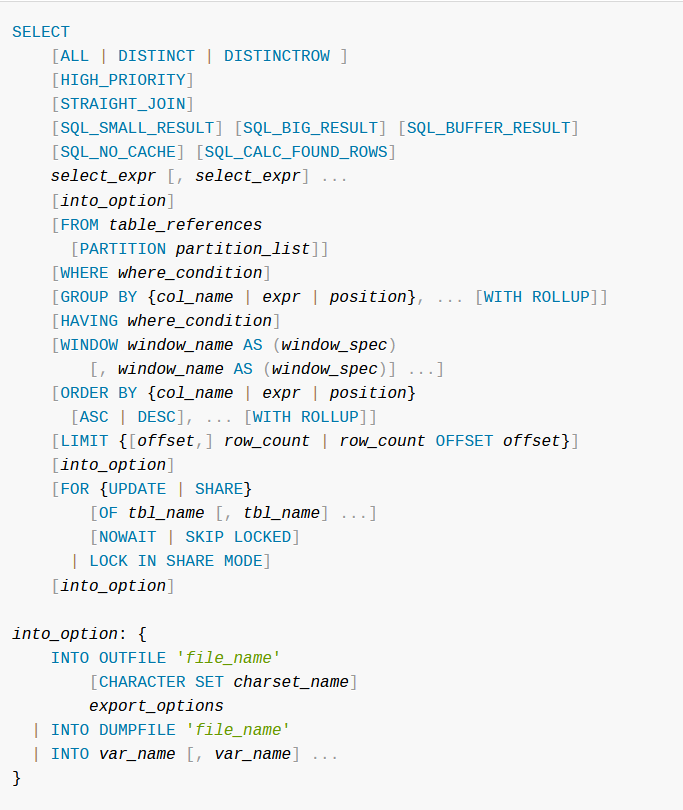
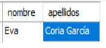
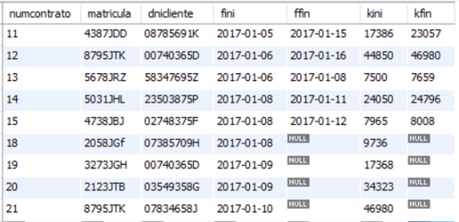
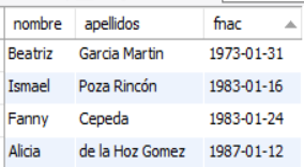
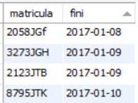

# UNIDAD 3. REALIZACIÓN DE CONSULTAS.

# 1.- LA INSTRUCCIÓN SELECT

La instrucción SQL para consultar los datos almacenados en las tablas de una base de datos es SELECT. Normalmente es la instrucción más utilizada por los usuarios de una base de datos.

Cuando se ejecuta SELECT, si no tiene errores la instrucción, el SGBD devuelve una hoja de resultados que se muestra en forma de tabla en el cliente que estemos usando.


Sintaxis completa de SELECT:



Sintaxis principal de SELECT:


Descripción de la sintaxis principal de SELECT:

- Entre SELECT y FROM se escriben separadas por comas las columnas o expresiones que se quieren consultar. Pueden consultarse datos que no pertenecen a tablas, como lo devuelto por una función.
- DISTINCT permite que no se repitan filas de resultados iguales.
- FROM permite indicar la tabla o las tablas de las que se extraen los datos.
- WHERE permite seleccionar las filas de las que se extraen datos, poner condiciones sobre lo que se quiere consultar.
- GROUP BY permite agrupar filas que tengan valores iguales en una o varias columnas para que salgan en una sola fila.
- HAVING permite establecer condiciones sobre datos obtenidos de agrupamientos.
- ORDER BY permite ordenar la hoja de resultados por una columna, por varias columnas o por una expresión.
- LIMIT permite indicar que de las filas devueltas por una SELECT solo se muestre un número máximo de ellas.

Consultas SELECT sin FROM. Ejemplos

Obtener la fecha y hora actuales.

```sql
SELECT curdate(), curtime();
```

Obtener el resultado de la división entre 7 y 2 y el resultado del cociente y resto de su división.

```sql
SELECT 7/2, 7 div 2, 7 mod 2;
```

Obtener el usuario actual y la versión de MySQL Server.

```sql
SELECT  current_user(),version();
```

#### Operadores en consultas SELECT

Como hemos visto anteriormente, en las expresiones que se escriben en SELECT se pueden usar operadores. También se pueden usar en otras instrucciones.

Operadores aritméticos:

- operador +, se utiliza para sumar dos números y, como operador unario, para simbolizar signo positivo de un número. 
- operador -, se utiliza para hallar la diferencia entre dos números y, como operador unario, para simbolizar signo negativo de un número. 
- operador *, se utiliza para multiplicar dos números.
- operador / , se utiliza para dividir dos números y obtener un resultado de tipo coma  flotante.
- operador div, se utiliza para dividir dos números y el resultado cociente en forma de entero (división entera) entero. 
- operadores % o mod, dividen dos números y devuelven el resto entero de la división.

Operadores de comparación o relacionales:

- operador  = , compara	si igual
- operador  > , compara	si mayor
- operador  < , compara	si menor
- operador  <= , compara si menor o igual
- operador  >= , compara si mayor o igual
- operador  <>  , compara si distinto
 
Operadores lógicos:

- operador AND: se aplica entre dos expresiones condicionales o booleanas y devuelve el valor TRUE cuando las dos condiciones son verdaderas.
- operador OR: se aplica entre dos expresiones condicionales y devuelve el valor FALSE cuando las condiciones son falsas.
- operador NOT: se aplica a una expresión condicional y devuelve lo opuesto a la condición que sigue a NOT.

Base de datos ALQUILERES que vamos a usar en todos los ejemplos de esta unidad.


#### Consultar todas las filas de una tabla

Cuando se ejecuta SELECT sin la cláusula WHERE, se consultan todas las filas de la tabla. 

Para obtener todos los datos de la tabla (todas las columnas) se puede usar el comodín *, salvo que queramos que las columnas se obtengan en orden diferente al de diseño de la tabla.

Ejemplo : Obtener todos los datos de la tabla automóviles.

```sql
SELECT * FROM automoviles;
```


Cuando queramos obtener algunas columnas y/o expresiones habrá que escribirlas separadas por comas.

Ejemplo : Obtener todos los datos de la tabla automóviles representando como primera columna, la columna alquilado.

```sql
SELECT alquilado, matricula, marca, modelo, color, precio, kilometros, extras FROM automoviles;
```


Cuando queramos obtener algunas columnas y/o expresiones habrá que escribirlas separadas por comas.

Ejemplo : Obtener las matriculas, marcas y modelos de todos los coches junto con el precio y el precio incrementado en un 10%.

```sql
SELECT matricula, marca, modelo, precio, precio*1.1 FROM automoviles;
```


Ordenar resultados: Para ordenar la hoja de resultados por una o varias expresiones, se usa la cláusula ORDER BY expr1, … [ASC|DESC]

Ejemplo : Obtener matricula, marca, modelo y precio de alquiler de todos los automóviles ordenados ascendentemente por marca y como segundo criterio por modelo.

```sql
SELECT matricula, marca, modelo, precio FROM automoviles ORDER BY marca, modelo;
```


Ejemplo 5 Obtener matricula, marca, modelo y precio de todos los automóviles ordenados por precio de alquiler de mayor a menor.

```sql
SELECT matricula, marca, modelo, precio FROM automoviles ORDER BY precio DESC;
```


Ejemplo : Obtener matricula, marca, modelo y precio de todos los automóviles ordenados por marca ascendentemente y después por precio de alquiler de mayor a menor.

```sql
SELECT matricula, marca, modelo, precio FROM automoviles ORDER BY marca, precio DESC;
```


No repetir filas con los mismos contenidos: Para que no se repitan en la hoja de resultados filas exactamente iguales se usa la cláusula DISTINCT.

Ejemplo : Mostrar los colores de todos los coches (pueden mostrarse repetidos).

```sql
SELECT color FROM automoviles;
```

Ejemplo : Mostrar los colores disponibles de coches.

```sql
SELECT DISTINCT color FROM automoviles;
```


Ejemplo: Obtener las marcas y modelos disponibles ordenados por marca y después por modelo.

```sql
SELECT DISTINCT marca,modelo FROM automoviles ORDER BY marca,modelo;
```


Limitar el número de filas mostradas en la hoja de resultados.

La cláusula LIMIT de la instrucción SELECT permite limitar el número de filas de la hoja de resultados. La sintaxis de la cláusula LIMIT dentro de SELECT es:

LIMIT [inicio,] numfilas

Ejemplo: Obtener la matrícula, marca y modelo de los 5 primeros coches que hay registrados en la tabla automóviles.

```sql
SELECT matricula,marca,modelo FROM automoviles LIMIT 5;
```


Ejemplo: Obtener la matrícula, marca, modelo y precio de los 5 coches de precio de alquiler más alto.

```sql
SELECT matricula,marca,modelo,precio FROM automoviles ORDER BY precio DESC LIMIT 5;
```


Ejemplo: Obtener la matrícula, marca, modelo y precio de los 5 coches de precio de alquiler más alto.

```sql
SELECT matricula,marca,modelo,precio FROM automoviles ORDER BY precio DESC LIMIT 5;
```


Ejemplo:  Obtener la matrícula, marca, modelo y precio de los 5 coches de precio de alquiler más alto exceptuando al más caro.

```sql
SELECT matricula,marca,modelo,precio FROM automoviles ORDER BY precio DESC LIMIT 1,5;
```


Ejemplo: Obtener el nombre, apellidos y fecha de nacimiento del cliente más joven.

```sql
SELECT nombre, apellidos FROM clientes ORDER BY fnac DESC LIMIT 1;
```



#### Consultar algunas filas de una tabla

Cuando hablamos de seleccionar filas dentro de una consulta nos referimos a obtener las filas que cumplen con una condición determinada. Para seleccionar filas en una consulta SELECT, se usa la cláusula WHERE.

Dentro de la cláusula WHERE se usará una expresión que devuelve un valor booleano. Se seleccionan las filas que devuelven en esa expresión el valor true.

Ejemplo: Obtener la matrícula, modelo y precio de todos los automóviles disponibles de la marca SEAT.

```sql
SELECT matricula,modelo,precio FROM automoviles WHERE marca='seat';
```


Ejemplo: Obtener la marca, modelo y precio de alquiler de todos los automóviles de precio de alquiler por día superior o igual a 100€, ordenados por precio ascendentemente.

```sql
SELECT marca,modelo,precio FROM automoviles WHERE precio>=100 ORDER BY precio;
```


Ejemplo: Obtener todos los datos de los contratos efectuados en el año 2017.

```sql
SELECT * FROM contratos WHERE fini>'2016-12-31' and fini<'2018-01-01';

SELECT * FROM contratos WHERE year(fini)=2017;
```



Ejemplo: Obtener la matrícula, marca y modelo de todos los automóviles que figuran como disponibles para alquilar (no alquilados).

```sql
SELECT matricula,marca,modelo FROM automoviles WHERE alquilado!=true; 

SELECT matricula,marca,modelo FROM automoviles WHERE alquilado=false; 
```


Ejemplo: Obtener el nombre y apellidos de todas las clientes de nombre Alicia.

```sql
SELECT nombre,apellidos FROM clientes WHERE nombre='alicia';
```


#### Seleccionar con BETWEEN

La cláusula BETWEEN es un operador que permite comprobar si un valor está dentro de un intervalo. Se usa con la sintaxis:

```sql
valor BETWEEN menor AND mayor
```

Ejemplo: Obtener los datos de todos los contratos efectuados entre el día 24 de diciembre de 2016 y el 6 de enero de 2017 (ambos incluidos).

```sql
SELECT * FROM contratos WHERE fini BETWEEN '2016-12-24' AND'2017-01-06';
```


Ejemplo: Obtener los nombres y apellidos de todos los clientes cuyo primer apellido comienza por la letra ‘D’.

```sql
SELECT nombre,apellidos FROM clientes WHERE apellidos BETWEEN 'D' AND 'E’;
```

(Saca también los del apellido que empiece con E)


#### Seleccionar con IN

La cláusula IN es un operador que permite comprobar si el valor de una expresión coincide o no con alguno de un conjunto de valores. El conjunto de valores se expresa entre paréntesis separando los valores con coma. La sintaxis para usar IN es:

```sql
expresión IN (valor1, valor2, valor3, ….,valorN)
```

Ejemplo: Obtener todos los datos de los automóviles de las marcas SEAT, AUDI, HYUNDAI o TOYOTA.

```sql
SELECT * FROM automoviles WHERE marca IN ('seat','audi','hyundai','toyota');
```


#### Seleccionar con LIKE

La cláusula LIKE es un operador que permite comprobar si una cadena de caracteres coincide con un patrón. 

La sintaxis para usar LIKE es:

```sql
expresión LIKE 'patron'
```

En patrón se escriben los caracteres que queremos que coincidan y, para representar a cualquier conjunto de caracteres, se usa el comodín % y para representar que se sustituye por un solo carácter se usa el comodín _.

Ejemplo: Obtener el nombre y apellidos de todos los clientes cuyo primer apellido comience por la letra D.

```sql
SELECT nombre, apellidos FROM clientes WHERE apellidos LIKE 'D%';
```


Ejemplo: Obtener la matricula, marca y modelo de todos los automóviles cuya matrícula termina con las letras NT.

```sql
SELECT matricula,marca,modelo FROM automoviles WHERE matricula LIKE '%NT';
```


Ejemplo: Obtener el nombre, apellidos y fecha de nacimiento de todos los clientes nacidos en enero. 

```sql
SELECT nombre, apellidos,fnac FROM clientes WHERE fnac LIKE '%-01-%';
```



Ejemplo: Obtener el nombre, apellidos y fecha de nacimiento de todos los clientes nacidos en los años 80.

```sql
SELECT nombre, apellidos,fnac FROM clientes WHERE fnac LIKE '198%';
```


Ejemplo: Obtener la matrícula, marca y modelo de todos los automóviles cuyo segundo dígito en la matrícula sea un dos y cuya primera letra en la matrícula sea J.

```sql
SELECT matricula,marca,modelo FROM automoviles WHERE matricula LIKE '_2__J__';
```


#### Comprobar si un campo es nulo

Cuando un campo de un registro o fila de una tabla está vacío se dice que está a valor nulo. 

Para comprobar si una expresión (normalmente una columna) es nula, se usa a sintaxis:

```sql
expresión IS NULL
```

Para comprobar si una expresión no es nula, es decir, contiene algo, se usa a sintaxis:

```sql
expresión IS NOT NULL
```

Ejemplo: Dado que en los contratos se tiene la fecha final a nulo cuando los contratos no han finalizado, obtener la matrícula de los automóviles que están actualmente contratados y la fecha de inicio del contrato.

```sql
SELECT matricula,fini FROM contratos WHERE ffin IS NULL;
```



Ejemplo: Obtener el número de contrato, la matrícula del automóvil y los kilómetros recorridos de todos los contratos de alquiler finalizados.

```sql
SELECT numcontrato,matricula,kfin-kini FROM contratos WHERE ffin IS NOT NULL;
```


#### Operadores Lógicos

Podemos realizar expresiones compuestas de varias condiciones mediante los operadores lógicos.

| Operador | Función|
| ------------- | ------------- |
| AND  | Devuelve el valor TRUE cuando las condiciones son verdaderas  |
| OR | Devuelve el valor FALSE cuando todas las condiciones son falsas  |
| NOT  | Devuelve lo opuesto a la condición que sigue a NOT  |

Prevalencia de los operadores lógicos y de comparación:

1. operadores de comparación
2. operador NOT
3. operador AND
4. operador OR

Ejemplo: Obtener la matrícula, marca, modelo  y precio de todos los automóviles de precio de alquiler comprendido entre 80 y 90 €.

```SQL
SELECT matricula,marca,modelo,precio FROM automoviles WHERE precio>=80 AND precio <=90;
```


Ejemplo: Obtener la matrícula, marca, modelo y precio de todos los automóviles de precio de alquiler comprendido entre 80 y 90 € o entre 100 y 120€.

```sql
SELECT matricula,marca,modelo,precio FROM automoviles WHERE (precio>=80 AND precio <=90) OR (precio>=100 AND precio <=120);
```


Ejemplo: Obtener la matricula, marca y modelo de todos los automóviles de las marcas SEAT, AUDI, HYUNDAI, TOYOTA.

```sql
SELECT matricula,marca,modelo FROM automoviles WHERE marca='seat' OR marca='audi' OR marca='hyundai' OR marca='toyota';
```


Ejemplo: Obtener todos los datos de los contratos iniciados en el año 2017 y que ya hayan finalizado.

```sql
SELECT * FROM contratos WHERE ffin IS NOT NULL AND fini LIKE '2017%';
```


Ejemplo: Obtener todos los datos de los automóviles que no son de las marcas SEAT o AUDI.

```sql
SELECT matricula,marca,modelo FROM automoviles WHERE marca!='seat' AND marca!='audi';

SELECT matricula,marca,modelo FROM automoviles WHERE NOT (marca='seat' OR marca='audi');
```


## HOJAS DE EJERCICIOS

💻 Hoja de ejercicios 8.