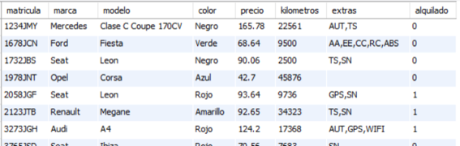

# UNIDAD 4. REALIZACIÓN DE CONSULTAS.

## 1.- LA INSTRUCCIÓN SELECT

La instrucción SQL para consultar los datos almacenados en las tablas de una base de datos es **SELECT**. Normalmente es la instrucción más utilizada por los usuarios de una base de datos.

Cuando se ejecuta SELECT, si no tiene errores la instrucción, el SGBD devuelve una hoja de resultados que se muestra en forma de tabla en el cliente que estemos usando.


Sintaxis completa de SELECT:


Sintaxis principal de SELECT:


Descripción de la sintaxis principal de SELECT:

- Entre SELECT y FROM se escriben separadas por comas las columnas o expresiones que se quieren consultar. Pueden consultarse datos que no pertenecen a tablas, como lo devuelto por una función.
- DISTINCT permite que no se repitan filas de resultados iguales.
- FROM permite indicar la tabla o las tablas de las que se extraen los datos.
- WHERE permite seleccionar las filas de las que se extraen datos, poner condiciones sobre lo que se quiere consultar.
- GROUP BY permite agrupar filas que tengan valores iguales en una o varias columnas para que salgan en una sola fila.
- HAVING permite establecer condiciones sobre datos obtenidos de agrupamientos.
- ORDER BY permite ordenar la hoja de resultados por una columna, por varias columnas o por una expresión.
- LIMIT permite indicar que de las filas devueltas por una SELECT solo se muestre un número máximo de ellas.

Ejemplos de consultas SELECT sin FROM.

Obtener la fecha y hora actuales.

```sql
SELECT curdate(), curtime();
```

Obtener el resultado de la división entre 7 y 2 y el resultado del cociente y resto de su división.

```sql
SELECT 7/2, 7 div 2, 7 mod 2;
```

Obtener el usuario actual y la versión de MySQL Server.

```sql
SELECT  current_user(),version();
```

### 1.1.-Operadores en consultas SELECT

Como hemos visto anteriormente, en las expresiones que se escriben en SELECT se pueden usar operadores. También se pueden usar en otras instrucciones.

**Operadores aritméticos**:

- operador +, se utiliza para sumar dos números y, como operador unario, para simbolizar signo positivo de un número. 
- operador -, se utiliza para hallar la diferencia entre dos números y, como operador unario, para simbolizar signo negativo de un número. 
- operador *, se utiliza para multiplicar dos números.
- operador / , se utiliza para dividir dos números y obtener un resultado de tipo coma  flotante.
- operador div, se utiliza para dividir dos números y el resultado cociente en forma de entero (división entera) entero. 
- operadores % o mod, dividen dos números y devuelven el resto entero de la división.

**Operadores de comparación o relacionales**:

- operador  = , compara	si igual
- operador  > , compara	si mayor
- operador  < , compara	si menor
- operador  <= , compara si menor o igual
- operador  >= , compara si mayor o igual
- operador  <>  , compara si distinto
 

**Modelo relacional de la Base de datos ALQUILERES, que vamos a usar en todos los ejemplos de esta unidad.**


### 1.2.- Consultar todas las filas de una tabla

Cuando se ejecuta SELECT **sin la cláusula WHERE**, se consultan todas las filas de la tabla. 

Para obtener todos los datos de la tabla (todas las columnas) se puede usar el comodín *, salvo que queramos que las columnas se obtengan en orden diferente al de diseño de la tabla.

**Ejemplo:** Obtener todos los datos de la tabla automóviles.

```sql
SELECT * FROM automoviles;
```



Cuando queramos obtener algunas columnas y/o expresiones habrá que escribirlas separadas por comas.

**Ejemplo:** Obtener todos los datos de la tabla automóviles representando como primera columna, la columna alquilado.

```sql
SELECT alquilado, matricula, marca, modelo, color, precio, kilometros, extras FROM automoviles;
```


Cuando queramos obtener algunas columnas y/o expresiones habrá que escribirlas separadas por comas.

**Ejemplo:** Obtener las matriculas, marcas y modelos de todos los coches junto con el precio y el precio incrementado en un 10%.

```sql
SELECT matricula, marca, modelo, precio, precio*1.1 FROM automoviles;
```


### 1.3.- Ordenar resultados

Para ordenar la hoja de resultados por una o varias expresiones, se usa la cláusula **ORDER BY expr1, … [ASC|DESC]**.

**Ejemplo:** Obtener matricula, marca, modelo y precio de alquiler de todos los automóviles ordenados ascendentemente por marca y como segundo criterio por modelo.

```sql
SELECT matricula, marca, modelo, precio FROM automoviles ORDER BY marca, modelo;
```


**Ejemplo:** Obtener matricula, marca, modelo y precio de todos los automóviles ordenados por precio de alquiler de mayor a menor.

```sql
SELECT matricula, marca, modelo, precio FROM automoviles ORDER BY precio DESC;
```


**Ejemplo:** Obtener matricula, marca, modelo y precio de todos los automóviles ordenados por marca ascendentemente y después por precio de alquiler de mayor a menor.

```sql
SELECT matricula, marca, modelo, precio FROM automoviles ORDER BY marca, precio DESC;
```


### 1.4.- No repetir filas y limitar resultados.

Para que no se repitan en la hoja de resultados filas exactamente iguales se usa la cláusula **DISTINCT**.

**Ejemplo:** Mostrar los colores de todos los coches (pueden mostrarse repetidos).

```sql
SELECT color FROM automoviles;
```

**Ejemplo:** Mostrar los colores disponibles de coches.

```sql
SELECT DISTINCT color FROM automoviles;
```


**Ejemplo:** Obtener las marcas y modelos disponibles ordenados por marca y después por modelo.

```sql
SELECT DISTINCT marca,modelo FROM automoviles ORDER BY marca,modelo;
```


La cláusula **LIMIT** de la instrucción SELECT permite limitar el número de filas de la hoja de resultados. La sintaxis de la cláusula LIMIT dentro de SELECT es:

```sql
LIMIT [inicio,] numfilas
```

**Ejemplo:** Obtener la matrícula, marca y modelo de los 5 primeros coches que hay registrados en la tabla automóviles.

```sql
SELECT matricula,marca,modelo FROM automoviles LIMIT 5;
```


**Ejemplo:** Obtener la matrícula, marca, modelo y precio de los 5 coches de precio de alquiler más alto.

```sql
SELECT matricula,marca,modelo,precio FROM automoviles ORDER BY precio DESC LIMIT 5;
```


**Ejemplo:** Obtener la matrícula, marca, modelo y precio de los 5 coches de precio de alquiler más alto.

```sql
SELECT matricula,marca,modelo,precio FROM automoviles ORDER BY precio DESC LIMIT 5;
```


**Ejemplo:**  Obtener la matrícula, marca, modelo y precio de los 5 coches de precio de alquiler más alto exceptuando al más caro.

```sql
SELECT matricula,marca,modelo,precio FROM automoviles ORDER BY precio DESC LIMIT 1,5;
```


**Ejemplo:** Obtener el nombre, apellidos y fecha de nacimiento del cliente más joven.

```sql
SELECT nombre, apellidos FROM clientes ORDER BY fnac DESC LIMIT 1;
```


### 1.5.- Consultar algunas filas de una tabla

Cuando hablamos de seleccionar filas dentro de una consulta nos referimos a obtener las filas que cumplen con una condición determinada. Para seleccionar filas en una consulta SELECT, se usa la cláusula **WHERE**.

Dentro de la cláusula WHERE se usará una expresión que devuelve un valor booleano. Se seleccionan las filas que devuelven en esa expresión el valor true.

**Ejemplo:** Obtener la matrícula, modelo y precio de todos los automóviles disponibles de la marca SEAT.

```sql
SELECT matricula,modelo,precio FROM automoviles WHERE marca='seat';
```


**Ejemplo:** Obtener la marca, modelo y precio de alquiler de todos los automóviles de precio de alquiler por día superior o igual a 100€, ordenados por precio ascendentemente.

```sql
SELECT marca,modelo,precio FROM automoviles WHERE precio>=100 ORDER BY precio;
```


**Ejemplo:** Obtener todos los datos de los contratos efectuados en el año 2017.

```sql
SELECT * FROM contratos WHERE fini>'2016-12-31' and fini<'2018-01-01';

SELECT * FROM contratos WHERE year(fini)=2017;
```


**Ejemplo:** Obtener la matrícula, marca y modelo de todos los automóviles que figuran como disponibles para alquilar (no alquilados).

```sql
SELECT matricula,marca,modelo FROM automoviles WHERE alquilado!=true; 

SELECT matricula,marca,modelo FROM automoviles WHERE alquilado=false; 
```


**Ejemplo:** Obtener el nombre y apellidos de todas las clientes de nombre Alicia.

```sql
SELECT nombre,apellidos FROM clientes WHERE nombre='alicia';
```


### 1.6.-Seleccionar con IN, LIKE, BETWEEN y campos NULL

La cláusula **BETWEEN** es un operador que permite comprobar si un valor está dentro de un intervalo. Se usa con la sintaxis:

```sql
valor BETWEEN menor AND mayor
```

**Ejemplo:** Obtener los datos de todos los contratos efectuados entre el día 24 de diciembre de 2016 y el 6 de enero de 2017 (ambos incluidos).

```sql
SELECT * FROM contratos WHERE fini BETWEEN '2016-12-24' AND'2017-01-06';
```


**Ejemplo:** Obtener los nombres y apellidos de todos los clientes cuyo primer apellido comienza por la letra ‘D’.

```sql
SELECT nombre,apellidos FROM clientes WHERE apellidos BETWEEN 'D' AND 'E’;
```

(Saca también los del apellido que empiece con E)


La cláusula **IN** es un operador que permite comprobar si el valor de una expresión coincide o no con alguno de un conjunto de valores. El conjunto de valores se expresa entre paréntesis separando los valores con coma. La sintaxis para usar IN es:

```sql
expresión IN (valor1, valor2, valor3, ….,valorN)
```

**Ejemplo:** Obtener todos los datos de los automóviles de las marcas SEAT, AUDI, HYUNDAI o TOYOTA.

```sql
SELECT * FROM automoviles WHERE marca IN ('seat','audi','hyundai','toyota');
```


La cláusula **LIKE** es un operador que permite comprobar si una cadena de caracteres coincide con un patrón. 

La sintaxis para usar LIKE es:

```sql
expresión LIKE 'patron'
```

En patrón se escriben los caracteres que queremos que coincidan y, para representar a cualquier conjunto de caracteres, se usa el comodín % y para representar que se sustituye por un solo carácter se usa el comodín _.

**Ejemplo:** Obtener el nombre y apellidos de todos los clientes cuyo primer apellido comience por la letra D.

```sql
SELECT nombre, apellidos FROM clientes WHERE apellidos LIKE 'D%';
```


**Ejemplo:** Obtener la matricula, marca y modelo de todos los automóviles cuya matrícula termina con las letras NT.

```sql
SELECT matricula,marca,modelo FROM automoviles WHERE matricula LIKE '%NT';
```


**Ejemplo:** Obtener el nombre, apellidos y fecha de nacimiento de todos los clientes nacidos en enero. 

```sql
SELECT nombre, apellidos,fnac FROM clientes WHERE fnac LIKE '%-01-%';
```


**Ejemplo:** Obtener el nombre, apellidos y fecha de nacimiento de todos los clientes nacidos en los años 80.

```sql
SELECT nombre, apellidos,fnac FROM clientes WHERE fnac LIKE '198%';
```


**Ejemplo:** Obtener la matrícula, marca y modelo de todos los automóviles cuyo segundo dígito en la matrícula sea un dos y cuya primera letra en la matrícula sea J.

```sql
SELECT matricula,marca,modelo FROM automoviles WHERE matricula LIKE '_2__J__';
```


Cuando un campo de un registro o fila de una tabla está vacío se dice que está a valor nulo. 

Para comprobar si una expresión (normalmente una columna) es nula, se usa a sintaxis:

```sql
expresión IS NULL
```

Para comprobar si una expresión no es nula, es decir, contiene algo, se usa a sintaxis:

```sql
expresión IS NOT NULL
```

**Ejemplo:** Dado que en los contratos se tiene la fecha final a nulo cuando los contratos no han finalizado, obtener la matrícula de los automóviles que están actualmente contratados y la fecha de inicio del contrato.

```sql
SELECT matricula,fini FROM contratos WHERE ffin IS NULL;
```


**Ejemplo:** Obtener el número de contrato, la matrícula del automóvil y los kilómetros recorridos de todos los contratos de alquiler finalizados.

```sql
SELECT numcontrato,matricula,kfin-kini FROM contratos WHERE ffin IS NOT NULL;
```


### 1.7.- Operadores Lógicos

Podemos realizar expresiones compuestas de varias condiciones mediante los operadores lógicos.

| Operador | Función|
| ------------- | ------------- |
| AND  | Devuelve el valor TRUE cuando las condiciones son verdaderas  |
| OR | Devuelve el valor FALSE cuando todas las condiciones son falsas  |
| NOT  | Devuelve lo opuesto a la condición que sigue a NOT  |

Prevalencia de los operadores lógicos y de comparación:

1. operadores de comparación
2. operador NOT
3. operador AND
4. operador OR

**Ejemplo:** Obtener la matrícula, marca, modelo  y precio de todos los automóviles de precio de alquiler comprendido entre 80 y 90 €.

```SQL
SELECT matricula,marca,modelo,precio FROM automoviles WHERE precio>=80 AND precio <=90;
```


**Ejemplo:** Obtener la matrícula, marca, modelo y precio de todos los automóviles de precio de alquiler comprendido entre 80 y 90 € o entre 100 y 120€.

```sql
SELECT matricula,marca,modelo,precio FROM automoviles WHERE (precio>=80 AND precio <=90) OR (precio>=100 AND precio <=120);
```


**Ejemplo:** Obtener la matricula, marca y modelo de todos los automóviles de las marcas SEAT, AUDI, HYUNDAI, TOYOTA.

```sql
SELECT matricula,marca,modelo FROM automoviles WHERE marca='seat' OR marca='audi' OR marca='hyundai' OR marca='toyota';
```


**Ejemplo:** Obtener todos los datos de los contratos iniciados en el año 2017 y que ya hayan finalizado.

```sql
SELECT * FROM contratos WHERE ffin IS NOT NULL AND fini LIKE '2017%';
```


**Ejemplo:** Obtener todos los datos de los automóviles que no son de las marcas SEAT o AUDI.

```sql
SELECT matricula,marca,modelo FROM automoviles WHERE marca!='seat' AND marca!='audi';

SELECT matricula,marca,modelo FROM automoviles WHERE NOT (marca='seat' OR marca='audi');
```


## HOJAS DE EJERCICIOS

💻 Hoja de ejercicios 1.

💻 Hoja de ejercicios 2.

💻 Hoja de ejercicios 3.

💻 Hoja de ejercicios 4.

💻 Hoja de ejercicios 5.

💻 Hoja de ejercicios 6.(opcional)

## 2.- CONSULTAS SOBRE TABLAS COMBINADAS

Hasta ahora únicamente hemos visto consultas realizadas sobre una única tabla. 

Es muy frecuente y necesario tener que realizar consultas sobre combinaciones de tablas dado que necesitamos obtener datos en la consulta de varias tablas y/o tener condiciones aplicadas a datos de varias tablas. 

Por ejemplo, en la base de datos de alquileres, para obtener el nombre y apellidos de los clientes que han alquilado coches en enero, necesitamos usar o combinar dos tablas en la consulta: clientes y contratos.

En MySQL podemos usar las siguientes operaciones de combinación de tablas:

- Producto cartesiano o CROSS JOIN
- Combinación INNER JOIN
- Combinación LEFT JOIN
- Combinación RIGHT JOIN

### 2.1.- La reunión interna. INNER JOIN

Permite emparejar filas de dos tablas a través de una relación entre una columna de una tabla y otra columna de otra tabla. 

Lo normal es que sean la clave principal de una tabla y la correspondiente clave ajena relacionada en la otra tabla, aunque pueden ser columnas que no tienen relación de clave ajena establecida. 

En una consulta de este tipo, para cada fila de una de las tablas se busca en la otra tabla la fila o filas que cumplen la condición de relación que se quiera entre las dos columnas (normalmente se busca igualdad entre clave principal y clave ajena). 


Permite emparejar filas de dos tablas a través de una relación entre una columna de una tabla y otra columna de otra tabla. 

Lo normal es que sean la clave principal de una tabla y la correspondiente clave ajena relacionada en la otra tabla, aunque pueden ser columnas que no tienen relación de clave ajena establecida. 

En una consulta de este tipo, para cada fila de una de las tablas se busca en la otra tabla la fila o filas que cumplen la condición de relación que se quiera entre las dos columnas (normalmente se busca igualdad entre clave principal y clave ajena). 

La sintaxis de esta operación dentro de una SELECT es:

```sql
SELECT   ......  FROM   tabla1  INNER JOIN  tabla2  ON   columna1 condicion_relacion columna2
```

Tabla 1 y tabla 2 podrían ser incluso la misma tabla si hay alguna relación entre una columna de la tabla y la clave principal de la misma tabla. En este caso, al menos uno de los nombres de tabla tendría que ser un alias.
 
Columna1 y columna2 son las columnas que se emparejan o relacionan y deben tener el mismo tipo de datos o datos compatibles. 
 
Condicion_relacion representa cualquier operación relacional, aunque normalmente se usa la igualdad. Se pueden combinar más de dos tablas usando varios INNER JOIN.  

Cuando coincida el nombre de las dos columnas relacionadas, tendremos que escribir nombres cualificados, escribiendo el nombre de la tabla a la que pertenecen, un punto y el nombre de la columna. En ese caso, también se puede usar y es más adecuada esta sintaxis:

```sql
SELECT   ......  FROM   tabla1  INNER JOIN  tabla2  USING (columna);
```


Vamos a hacer pruebas en la BD empresa:

```sql
select * from empleados 
inner join departamentos 
on empleados.numde=departamentos.numde;
```

Salen los datos de las dos tablas, el campo numde sale dos veces.

```sql
select * from empleados 
inner join departamentos using(numde);
```

Sacamos los datos que nos interesan de ambas tablas, vemos que si el nombre de la columna es igual en ambas tablas, tenemos que indicar de que tabla queremos sacarlo.

```sql
select empleados.numde,numem, nomem,nomde 
from empleados 
inner join departamentos 
using(numde);
```

Comprobamos que el número de registros de las consultas es el mismo.

**Ejemplo:** Obtener el número de contrato y la matrícula, marca y modelo de todos los automóviles que están contratados actualmente por algún cliente.

```sql
SELECT numcontrato,automoviles.matricula,marca,modelo FROM contratos INNER JOIN automoviles ON contratos.matricula=automoviles.matricula WHERE ffin IS NULL;
```


**Ejemplo:** Obtener el número de contrato y el nombre y apellidos de todos los clientes que tienen actualmente contrato algún automóvil.

```sql
SELECT numcontrato,nombre,apellidos FROM clientes INNER JOIN contratos ON dnicliente=dni WHERE ffin IS NULL;
```


**Ejemplo:** De todos los contratos finalizados, obtener la matricula, marca y modelo de cada coche contratado, el nombre y apellidos del cliente que hizo cada contrato y los kilómetros recorridos por el coche en el contrato.

```sql
SELECT numcontrato,automoviles.matricula,marca,modelo,nombre,apellidos, kfin-kini FROM (contratos INNER JOIN automoviles ON contratos.matricula = automoviles.matricula) INNER JOIN clientes ON dnicliente=dni WHERE ffin IS NOT NULL;
```


**Ejemplo:** Obtener el nombre y apellidos de los clientes que han contratado automóviles de la marca Seat.

```sql
SELECT DISTINCT nombre,apellidos FROM (contratos INNER JOIN automoviles ON contratos.matricula = automoviles.matricula) INNER JOIN clientes ON dnicliente=dni WHERE marca='seat';
```


**Ejemplo:** En una base de datos nba tenemos una tabla equipos. En la tabla equipos, entre otros datos, se tiene el nombre del equipo y la división en la que participa. Obtener todos los enfrentamientos o partidos posibles entre equipos de la división central sin usar la tabla partidos, buscando los distintos cruces.

```sql
SELECT a.nombre AS local,b.nombre AS visitante FROM equipos AS a INNER JOIN equipos AS b ON a.nombre <> b.nombre WHERE a.division='central' AND b.division='central';
```


Explicación: Tenemos una INNER JOIN entre dos tablas que son la misma. A la primera la renombramos como tabla a y la segunda como tabla b, pero las dos son equipos. 

## HOJAS DE EJERCICIOS

💻 Hoja de ejercicios 7.

### 2.2.- El producto cartesiano

El producto cartesiano de dos tablas permite obtener una tabla con las columnas de la primera tabla y las columnas de la segunda tabla (aunque tengan nombres iguales). 
Las filas de la hoja de resultados resultante son todas las posibles combinaciones entre filas de la primera tabla y filas de la segunda tabla. Así, si una tabla tiene 6 filas y la otra tiene 8, el resultado del producto cartesiano es una tabla de 48 filas.  Pero si una tabla tiene 6000 filas y otras 8000, se crea en memoria una tabla de 48 millones de filas, cada una de las cuales contiene varios bytes. Eso supone crear mucho espacio en memoria y puede ser un GRAVE PROBLEMA.


Para obtener el producto cartesiano total entre dos tablas se escribe * (todas las columnas) después de SELECT y los nombres de las dos tablas separadas con coma después de FROM. No es muy normal tener que obtener el producto cartesiano total entre dos o más tablas.  Lo normal es que sobre el resultado de un producto cartesiano apliquemos condiciones para extraer los datos combinados que queremos.

Por ejemplo, si ejecutamos:

```sql
SELECT * FROM automoviles,contratos;
```


Vemos que en el resultado vemos múltiples filas para el contrato 1. Vemos que ese contrato corresponde a la matrícula 12434JMY. Pero ese contrato se ha combinado con cada uno de los automóviles, es decir, se ha combinado con automóviles de matrículas distintas a las del contrato. Lo lógico es que, para cada contrato, relacionemos el contrato con los datos del automóvil que corresponda. Eso hay que hacerlo con una condición WHERE.

```sql
SELECT * FROM automoviles,contratos WHERE automoviles.matricula = contratos.matricula;
```

Aunque ahora veamos en el resultado una fila por cada contrato, realmente se ha creado en memoria una tabla intermedia con el producto cartesiano completo.

Vamos a ver varios ejemplos en los que se realizan consultas en las que se puede usar el producto cartesiano. Se aplica la combinación producto cartesiano y se establecen condiciones de selección WHERE y se indican las columnas o expresiones que se quieren consultar.

Ejemplo: Obtener la matricula, marca, modelo, fecha inicial y fecha final del contrato número 1 (habrá que establecer la condición WHERE para que el contrato sea el número 1 y para que la matrícula del automóvil coincida con la del contrato).

```sql
SELECT contratos.matricula,marca,modelo,fini,ffin FROM automoviles,contratos WHERE numcontrato=1 AND contratos.matricula=automoviles.matricula;
```


Vemos que en la instrucción se deben usar cualificadores de tabla en columnas que tienen el mismo nombre en las dos tablas.

Cuando se combinan tablas puede ser útil a veces renombrarlas. Por ejemplo, la instrucción usada en la anterior diapositiva:

```sql
SELECT contratos.matricula,marca,modelo,fini,ffin FROM automoviles,contratos WHERE numcontrato=1 AND contratos.matricula=automoviles.matricula;
```

Sería equivalente a esta que usa renombrado de tablas:

```sql
SELECT c.matricula,marca,modelo,fini,ffin FROM automoviles AS a,contratos AS c WHERE numcontrato=1 AND c.matricula=a.matricula;
```

Ejemplo: Suponiendo que tenemos en una base de datos una tabla con los módulos de un curso y otra tabla con los alumnos del curso, realizar una consulta que obtiene todas las posibles combinaciones de códigos o números de alumnos con todos los códigos de módulos del curso DAM1.


```sql
SELECT numalumn,codmodulo FROM alumnos,modulos ORDER BY codmodulo;
```


Ejemplo: En la base de datos alquileres obtener la marca y modelo (sin repetir) de todos los automóviles contratados alguna vez en diciembre de 2017.

```sql
SELECT DISTINCT marca,modelo FROM automoviles,contratos WHERE automoviles.matricula=contratos.matricula AND fini LIKE '2017-12%';
```


Ejemplo: Del contrato de alquiler de coches número 10, obtener el cliente que hizo el contrato, la matrícula, marca y modelo del coche y la duración del contrato.

```sql
SELECT apellidos, nombre, contratos.matricula, marca, modelo, fini, ffin FROM automoviles, contratos,clientes WHERE automoviles.matricula = contratos.matricula AND contratos.dnicliente=clientes.dni AND numcontrato=10;
```


Ejemplo: En una base de datos nba tenemos una tabla equipos. En la tabla equipos, entre otros datos, se tiene el nombre del equipo y la división en la que participa. Obtener todos los enfrentamientos o partidos posibles entre equipos de la división central. Habrá que combinar la tabla equipos consigo misma evitando que el equipo local y el visitante sea el mismo.

```sql
SELECT a.nombre AS local,b.nombre AS visitante FROM equipos AS a, equipos AS b WHERE a.division='central' AND b.division='central' AND a.nombre <> b.nombre;
```


**IMPORTANTE:** 

El producto cartesiano debe evitarse, siempre y cuando la consulta se pueda realizar con otra operación de combinación, cuando las tablas que se combinan tienen muchas filas.
La combinación produce el producto del número de filas combinadas y eso pueden ser muchísimas filas (y muchas columnas también). Todo eso se almacena temporalmente en RAM y ocupa mucho espacio.

Las consultas de los ejemplos de las diapositivas 19 y 22 son casos de una buena utilización del producto cartesiano ya que ahí si que queremos combinar todas las filas de una tabla con todas las de la otra.

Sin embargo, los otros ejemplos de este apartado se podrían realizar más óptimamente con otras operaciones de combinación. 

## HOJAS DE EJERCICIOS

💻 Hoja de ejercicios 8.

💻 Hoja de ejercicios 9.

💻 Hoja de ejercicios 10.
