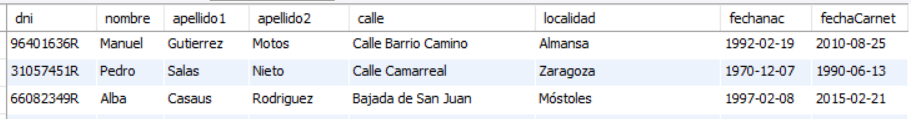
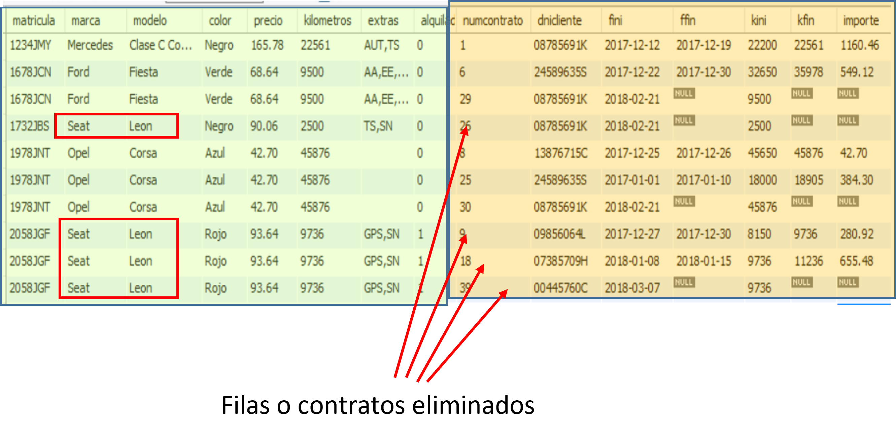
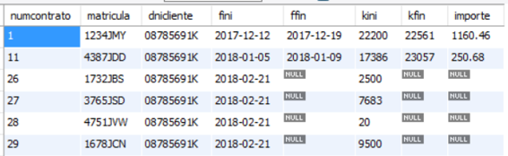

# UNIDAD 5. EDICIÓN DE LOS DATOS

- [UNIDAD 5. EDICIÓN DE LOS DATOS](#unidad-5-edición-de-los-datos)
  - [1.- INSERCIÓN DE FILAS. INSTRUCCIÓN INSERT.](#1--inserción-de-filas-instrucción-insert)
  - [HOJAS DE EJERCICIOS](#hojas-de-ejercicios)
  - [2.- ACTUALIZACIÓN DE DATOS. LA INSTRUCCION UPDATE.](#2--actualización-de-datos-la-instruccion-update)
  - [HOJAS DE EJERCICIOS](#hojas-de-ejercicios-1)
  - [3.- ELIMINACIÓN DE FILAS. LA INSTRUCCIÓN DELETE](#3--eliminación-de-filas-la-instrucción-delete)
  - [HOJAS DE EJERCICIOS](#hojas-de-ejercicios-2)
  - [ACTIVIDAD GRUPAL](#actividad-grupal)
  - [4.- EDICIÓN AVANZADA DE LOS DATOS. INSTRUCCIÓN INSERT.](#4--edición-avanzada-de-los-datos-instrucción-insert)
  - [HOJAS DE EJERCICIOS](#hojas-de-ejercicios-3)
  - [5.- ACTUALIZACIÓN AVANZADA DE DATOS. INSTRUCCIÓN UPDATE.](#5--actualización-avanzada-de-datos-instrucción-update)
  - [HOJAS DE EJERCICIOS](#hojas-de-ejercicios-4)
  - [6.- ELIMINACIÓN AVANZADA DE DATOS.](#6--eliminación-avanzada-de-datos)
  - [HOJAS DE EJERCICIOS](#hojas-de-ejercicios-5)
  - [7.- TRANSACCIONES](#7--transacciones)
  - [HOJAS DE EJERCICIOS](#hojas-de-ejercicios-6)
  - [8.- CONCURRENCIA](#8--concurrencia)
  - [HOJAS DE EJERCICIOS (DE REPASO)](#hojas-de-ejercicios-de-repaso)


## 1.- INSERCIÓN DE FILAS. INSTRUCCIÓN INSERT.

Para insertar filas en una tabla se utiliza la instrucción **INSERT**.

Mediante esta instrucción se pueden insertar una o varias filas con los valores que se especifiquen en la instrucción. 

```sql
INSERT …..   VALUES
INSERT …..   SET
```

Se pueden insertar los datos correspondientes a varias filas resultado de una consulta SELECT sobre otra u otras tablas.

```sql
INSERT …..  SELECT 
```

La sintaxis completa de **INSERT ….. VALUES** es la siguiente:

```sql
INSERT   INTO tabla  (col1, col2, ...)
    VALUES ({expr1 | DEFAULT} , {expr2 | DEFAULT}, ...),
	 ({expr1 | DEFAULT} , {expr2 | DEFAULT}, ...),
	……….
    [ ON DUPLICATE KEY UPDATE col_name1=expr[, col_name2=expr] ... ]
```

- Entre paréntesis se escriben los nombres de columnas en las que se asignan valores.
- Tras VALUES y entre paréntesis se especifican los valores que se asignan a las columnas para cada fila insertada.
- En una misma INSERT se pueden añadir o insertar varias filas.
- Se usa DEFAULT para indicar que se asigne a la columna el valor por defecto, si es que esa columna se ha diseñado con valor por defecto.
- Las columnas a las que no se asignan valores en INSERT, las que no están en la lista de columnas, reciben el valor por defecto o nulo. Si  no admiten nulos, la instrucción da error.
- La cláusula ON DUPLICATE KEY UPDATE establece que si al insertar una fila se produce un error por PRIMARY KEY duplicada o repetida, se asignen los valores que se indican tras esa cláusula.

**Ejemplo 1:** Insertar una fila en la tabla automóviles para un Seat Leon 2.0 TDI negro, matrícula 4751JVW, con extras GPS y SN y 20 kilómetros recorridos y estado no alquilado. No se carga el precio (o se carga el valor por defecto).

```sql
INSERT INTO automoviles (matricula, marca, modelo, color, kilometros, extras, alquilado) 
VALUES ('4751JVW', 'Seat', 'Leon 2.0 TDI', 'Negro', 20, 'GPS,SN', false);
```

Otra posible solución puede darse no especificando la lista de columnas, en cuyo caso, hay que indicar los valores para todas las columnas y en el orden en que están declaradas en la tabla.

```sql
INSERT INTO automoviles 
VALUES ('4751JVW', 'Seat', 'Leon 2.0 TDI', 'Negro', null, 20, 'GPS,SN', false);
```

**Ejemplo 2:** Insertar un nuevo contrato iniciado el 19 de febrero de 2018 por el cliente de DNI 00371569B del automóvil de matrícula 5678JRZ, con kilómetros iniciales 7659.

```sql
INSERT INTO  contratos (matricula, dnicliente, fini,kini) 
VALUES ('5678JRZ','00371569B ','2018-02-19',7659);
```

**Ejemplo 3:** Insertar un nuevo cliente de nombre Javier, apellidos: Quesada Gómez, ciudad:Madrid, direccion: C/ Marques de Otaiza 3, 4º B, tipo de permiso B.
 
```sql
INSERT INTO clientes (nombre, apellidos, localidad, direccion, carnet) 
VALUES ("Javier","Quesada Gómez","Madrid","C/ Marques de Otaiza 3, 4º B", "B");
```
¿Qué ocurre con esta inserción?

**Ejemplo 4:** Se tiene anotado un contrato que no se sabe si se insertó en la tabla de datos. Se sabe que ese contrato era el número 20 para la matrícula 2123JTB y el cliente con DNI 03549358G. La fecha de inicio debía ser 9 de enero de 2018 y la fecha de finalización el 21 de enero, los kilómetros iniciales eran 34323 y los finales 36545.

Insertar el nuevo contrato:

```sql
INSERT INTO contratos (numcontrato, dnicliente, matricula, fini, ffin, kini, kfin)
VALUES (20, '03549358G','2123JTB',  '2018-01-9', '2018-01-21', 34323, 36545);
```

Esta instrucción nos da error ya que existe el contrato número 20. Vamos a modificarla para que en caso de DUPLICATE KEY se asignen en el contrato existente los valores que se han indicado para la fecha final y kilómetros finales:

```sql
INSERT INTO contratos (numcontrato,dnicliente,matricula,fini,ffin,kini,kfin) 
VALUES (20, '03549358G','2123JTB',  '2018-01-9', '2018-01-21', 34323, 36545) 
ON DUPLICATE KEY UPDATE ffin='2018-01-21', kfin=36545;
```

**Ejemplo 5:** Se trata de insertar un contrato para un cliente con DNI 13987654C. El cliente quiere contratar en la fecha de hoy el automóvil de matrícula 4387JDD que tiene actualmente 23057 kilómetros.

```sql
INSERT INTO contratos (dnicliente,matricula,fini,kini) 
VALUES ('13987654C','4387JDD', curdate(), 23057);
```

Verás que se ha producido un error:

```sql
Error Code: 1452. Cannot add or update a child row: 
a foreign key constraint fails (`alquileres`.`contratos`, 
CONSTRAINT `fk_contrato_cliente` FOREIGN KEY (`dnicliente`) 
REFERENCES `clientes` (`dni`) ON DELETE NO ACTION ON UPDATE CASCADE)
```

El error se ha producido porque no se puede añadir una nueva fila en la que falla una restricción de clave ajena, la correspondiente al dni del cliente, ya que ese dni 13987654C no existe en la tabla clientes.

**Ejemplo 6:** Inserción de múltiples filas. Insertar con una sola instrucción INSERT los clientes cuyos datos que se muestran a continuación y con el tipo de carnet B:

```sql
INSERT INTO clientes(dni,nombre, apellidos, direccion, localidad,fnac, fcarnet, carnet)
VALUES
('96401636R','Manuel','Gutierrez Motos',"Calle Barrio Camino",'Almansa','1992-02-19','2010-08-25','B'),
('1057451R','Pedro','Salas  Nieto',"Calle Camarreal",'Zaragoza','1970-12-07','1990-06-13','B'),
('66082349R','Alba','Casaus Rodriguez',"Bajada de San Juan",'Móstoles','1997-02-08','2015-02-21','B');
```



La sintaxis de **INSERT …  SET** es la siguiente:

```sql
INSERT INTO table
SET col1={expr1 | DEFAULT}, col2={expr2 | DEFAULT}, ...
[ ON DUPLICATE KEY UPDATE col_name1=expr1 , col_name2=expr2, ... ]
```

- Se puede usar para los mismos casos que VALUES aunque nunca se puede usar para insertar múltiples filas.
- Tras SET se asignan valores a cada una de las columnas de la fila a insertar, aunque no es necesario asignárselos a todas las columnas (solo a las que no admiten nulos y no tienen valor por defecto).
- Se usa DEFAULT para indicar que se asigne a la columna el valor por defecto, si es que esa columna se ha diseñado con valor por defecto.
- Las columnas a las que no se asignan valores en INSERT, las que no están en la lista de columnas, reciben el valor por defecto o nulo. Si  no admiten nulos, la instrucción da error.
- La cláusula ON DUPLICATE KEY UPDATE establece que si al insertar una fila se produce un error por PRIMARY KEY duplicada o repetida, se asignen los valores que se indican tras esa cláusula.

**Ejemplo 7:**Insertar una fila en la tabla automóviles para un Seat Leon 2.0 TDI negro, matrícula 4751JVW, con extras GPS y SN y 20 kilómetros recorridos y estado no alquilado. No se carga el precio (o se carga el valor por defecto).

```sql
INSERT INTO automoviles SET 
matricula='4751JVW', 
marca='Seat', 
modelo= 'Leon 2.0 TDI', 
color='Negro', 
kilometros= 20, 
extras= 'GPS,SN', 
alquilado= false;
```
Tenemos otra sintaxis para **INSERT combinado con SELECT**:

```sql
INSERT INTO tabla (col1,_col2, ...)
SELECT ...
[ ON DUPLICATE KEY UPDATE col_name1=expr1, col_name2=expr2, ... ]
```

- Permite insertar en TABLA tantas filas como filas resulten de ejecutar la SELECT que se aplica a la inserción.
- Las columnas obtenidas en SELECT deben ser del mismo tipo o compatibles(no se necesita que tengan el mismo nombre) que las columnas correspondientes donde se van a insertar los datos.
- Las columnas a las que no se asignan valores en INSERT, las que no están en la lista de columnas, reciben el valor por defecto o nulo. Si  no admiten nulos, la instrucción da error.
- La cláusula ON DUPLICATE KEY UPDATE establece que si al insertar una fila se produce un error por PRIMARY KEY duplicada o repetida, se asignen los valores que se indican tras esa cláusula.

**Ejemplo 8:** Añadir los contratos de la tabla contratos2 a la tabla contratos.

```sql
INSERT INTO contratos SELECT * FROM contratos2;
```

Si ejecutamos actualmente esto en nuestra base de datos alquileres, se produce error ya que, al menos hay un contrato en contratos2 con número 1 y ese número de contrato también existe en contratos. Con que haya un error se rechazan todas las filas a insertar.

```sql
Error Code: 1062. Duplicate entry '1' for key 'PRIMARY'
```

Siguiendo con el ejemplo anterior, para solucionar el error, vamos a hacer que el número de contrato que se inserte sea la suma del número de contrato en contratos 2 más el mayor número de contrato existente en la tabla contratos (supongamos que es el 24).

```sql
INSERT INTO contratos(numcontrato, matricula,dnicliente, fini, ffin, kini, kfin) 
SELECT numcontrato+24, matricula,dnicliente, fini, ffin, kini, kfin 
FROM contratos2;

INSERT INTO contratos(numcontrato, matricula,dnicliente, fini, ffin, kini, kfin)
SELECT numcontrato+(select max(numcontrato) from contratos), 
matricula,dnicliente, fini, ffin, kini, kfin 
FROM contratos2;
```

**Ejemplo 9:** El cliente con dni 08785691K ha comunicado que hoy mismo quiere alquilar todos los automóviles de la marca Seat que no estén alquilados actualmente. Insertar los nuevos contratos para ese cliente con la fecha actual y las matriculas de esos automóviles. 
Se insertará en kilómetros iniciales los kilómetros registrados en la tabla automóviles y se comprobará que no estén alquilados.

```sql
INSERT INTO contratos(matricula,dnicliente, fini, kini) 
SELECT matricula, '08785691K',curdate(),kilometros 
FROM automoviles 
WHERE alquilado=false AND marca='seat';
```

**Ejemplo 10:**  Mariano Dorado ha comunicado que hoy mismo quiere alquilar todos los automóviles de precio inferior a 70€ que no estén alquilados actualmente. Insertar los nuevos contratos para ese cliente suponiendo que no podemos conocer su dni primero para después usarlo en INSERT.

```sql
INSERT INTO contratos (matricula,dnicliente, fini, kini) 
SELECT matricula, dni,curdate(),kilometros 
FROM automoviles,clientes 
WHERE alquilado=false 
AND precio<70 
AND nombre='mariano' 
AND apellidos='dorado';
```

ES UNA CONSULTA CON PRODUCTO CARTESIANO, HACE TODAS LAS COMBINACIONES DE LOS COCHES CON EL CLIENTE.

**Ejemplo 11:** Supongamos que en la base de datos LIGATERCERA tenemos una tabla CALENDARIO(eqLocal, eqVisitante, numjornada, numpartido,fecha) donde la clave principal está formada por las dos primeras columnas (los códigos del equipo local y del visitante) y las otras columnas admiten nulos, insertar todos los posibles enfrentamientos o partidos entre los equipos de la liga.

```sql
INSERT INTO calendario  (eqLocal, eqVisitante) 
SELECT a.codeq, b.codeq 
FROM equipos AS a, equipos AS b 
WHERE a.codeq!=b.codeq;
```

## HOJAS DE EJERCICIOS

💻 Hoja de ejercicios 1.

## 2.- ACTUALIZACIÓN DE DATOS. LA INSTRUCCION UPDATE.

La instrucción para realizar modificaciones de los datos es **UPDATE**. La sintaxis de UPDATE es:

```sql
UPDATE [IGNORE] tabla |  combinación_de_tablas  
SET   columna1=expresión1, columna2=expresión2, ..... 
WHERE condición;
```

- Tras UPDATE, se escribe la tabla en la que se van a actualizar datos o, en su caso, la combinación de tablas afectadas por la operación.

- Modifica los valores de las columnas indicadas en SET con el resultado de las expresiones. Si se usa WHERE, sólo se modifican las filas que cumplen la condición.

- Dentro de la sintaxis, incluso se permite usar ORDER BY para establecer el orden en que se van modificando datos de filas.

Condiciones de la sintaxis y ejecución de UPDATE.

1. Detrás de UPDATE se puede especificar:
El nombre de una tabla si la modificación sólo afecta a esa tabla y está condicionada al contenido de esa tabla.
La combinación de varias tablas cuando la modificación afecta a dos o más tablas relacionadas o bien está condicionada al contenido de varias tablas.

2. Detrás de SET se especifican los valores que se van a asignar a las columnas que se quieren modificar. Estos valores pueden ser:
    - Valores constantes.
    - El resultado de una expresión que utiliza o no los valores almacenados en otras columnas o en la misma columna.
    - El resultado de una función.
    - El resultado de una subconsulta.

3. Si para calcular una expresión, se usa una columna que también se modifica, el valor que se usa es el almacenado antes de hacer la modificación.

4. Es indiferente el orden en el que se especifiquen las columnas a modificar puesto que las modificaciones se ejecutan calculando primero los nuevos valores que va a haber en una fila y modificando después el contenido de la fila con esos valores.
 

5. Las expresiones deben ser calculables a partir de los valores correspondientes a la fila que se esté modificando.

6. Con la cláusula WHERE se indica la condición que deben cumplir las filas que se van a modificar. Si no se usa WHERE, la modificación afectará a todas las filas de la tabla. 

7. Al modificar el contenido de una columna, está columna deberá cumplir todas las condiciones de dominio, clave principal, clave ajena e integridad referencial que se tengan que cumplir en función de las restricciones establecidas en las tablas de la base de datos.

8. Si se modifica una clave principal que tiene relación de integridad referencial con actualización en cascada con respecto a una clave ajena en otra tabla, el valor de la clave ajena se modifica con el nuevo valor de la clave principal en todas las filas relacionadas.

9. La cláusula IGNORE no aborta el proceso de actualización cuando se tratan de actualizar varias filas y algunas no pueden actualizarse por conflictos de clave primaria, clave ajena, errores de conversión de datos, etc. Las que producen errores no se actualizan y si que se actualizan las que no los producen. Si no se usa IGNORE y alguna fila produce error,  se rechaza por completo la actualización.

**Ejemplo 1:** Modificar el contrato número 19 para que contenga fecha final 14 de enero de 2020 y kilómetros finales 48111. Comprueba previamente el contenido del contrato 19.

```sql
UPDATE contratos 
SET ffin='2020-01-14', kfin=48111 
WHERE numcontrato=19;
```

Comprueba el contenido del contrato 19 tras ejecutar UPDATE.

¡¡¡Hay que tener mucho cuidado al probar o realizar estas instrucciones. Si en este caso no hubiéramos escrito la condición WHERE, modificaríamos las fechas y kilómetros de todos los contratos existentes. !!!

**Ejemplo 2:** Modificar la columna alquilado del vehículo 7839JDR para que indique que está disponible.

```sql
UPDATE  automoviles 
SET alquilado=false 
WHERE matricula='7839JDR';
```

**Ejemplo 3:** Modificar la columna alquilado del vehículo 7839JDR para que contenga lo opuesto a lo que contenía.

```sql
UPDATE  automoviles 
SET alquilado=NOT alquilado 
WHERE matricula='7839JDR';
```

**Ejemplo 4:** Modificar la columna precio de todos los automóviles de precio de alquiler superior a 100 euros para que su precio se reduzca en un 30% y en un 25% el de los de alquiler inferior a 100 euros. El precio debe quedar con dos decimales. 

Ojo, dado que hay que reducir precios, es importante reducir primero los de precio inferior. Si no se hace así, puede que reduzcamos el precio dos veces para algún coche.

```sql
UPDATE automoviles 
SET precio=round(precio*0.75,2)  
WHERE precio<100;

UPDATE automoviles 
SET precio=round(precio*0.7,2)  
WHERE precio>=100;
```

Se podría dar una solución con una sola instrucción usando la función IF:

```sql
UPDATE automoviles 
SET precio=if(precio<100,round(precio*0.75,2), round(precio*0.7,2));
```

**Ejemplo 5:** Antes de realizar la siguiente instrucción comprueba cuales son los contratos realizados para el coche de matrícula 3273JGH. Modificar la matrícula del automóvil de matrícula 3273JGH para que tenga la matrícula 3233JMG.

```sql
UPDATE automoviles 
SET matricula='3233JMG' 
WHERE matricula='3273JGH';
```

En este caso, dado que la columna matricula de la tabla contratos es clave ajena o FOREIGN KEY relacionada con las matricula de la tabla contratos con restricción de integridad referencial por actualización en cascada, además de haberse modificado la matrícula en la tabla automóviles, se habrá modificado la matrícula en todos los contratos correspondientes a ese automóvil.

**Ejemplo 6:** Modificar las fechas de los contratos para que en todos aquellos que tengan una fecha inicial superior a la fecha actual, se le reste un año en la fecha que tienen.

```sql
UPDATE contratos 
SET fini=subdate(fini,INTERVAL 1 YEAR) 
WHERE fini>curdate();
```

**Ejemplo 7:** Modificar las fechas de los contratos para que en todos aquellos en los que la fecha final sea inferior a la inicial, se intercambie el valor de esas fechas.

```sql
UPDATE contratos 
SET fini=ffin, ffin=fini 
WHERE fini>ffin;
```
Si al actualizar varias filas, una de ellas da error al actualizar, no se actualiza ninguna. Si no queremos que eso suceda, utilizamos la clausula IGNORE.

```sql
UPDATE IGNORE contratos 
SET fini=ffin, ffin=fini 
WHERE fini>ffin;
```

Al usar IGNORE, si una de las filas a actualizar da error, no se actualiza, pero el resto de filas que no dan error, si se actualizan.

## HOJAS DE EJERCICIOS

💻 Hoja de ejercicios 2.

💻 Hoja de ejercicios 3.

## 3.- ELIMINACIÓN DE FILAS. LA INSTRUCCIÓN DELETE

La instrucción para eliminar o borrar filas en tablas es **DELETE**. La sintaxis de DELETE es:

```sql
DELETE [IGNORE] [tabla1,  ...]  
FROM {tabla | combinacion de tablas}
[WHERE condicion] [ORDER BY criterio] [LIMIT num_filas]
```

O bien 

```sql
DELETE [IGNORE] [tabla1,  ...]  
USING {tabla | combinacion de tablas}
[WHERE condicion] [ORDER BY criterio] [LIMIT num_filas]
```

En la instrucción se indica la tabla o las tablas en las que se eliminan filas. Se eliminan las filas resultado de la combinación de tablas que se indica tras FROM o USING que cumplan, en su caso, la condición WHERE.

Condiciones de la sintaxis y ejecución de DELETE.

1. Detrás de DELETE se indica la tabla o las tablas en las que se eliminan filas (la combinación de tablas se suele usar cuando la condición where depende del contenido de otra). Lo normal es que se eliminen filas de una sola tabla. Es muy raro necesitar eliminar filas de más de una tabla con una instrucción DELETE.

2. Detrás de FROM o USING se indica la tabla o la combinación de tablas (INNER JOIN, LEFT JOIN, producto cartesiano) sobre las que se va a condicionar el borrado o eliminación. Necesariamente la tabla de la que se eliminan filas tiene que formar parte de la combinación de tablas.

3. Si se eliminan filas de una tabla que cumplen determinadas condiciones en esa tabla, no habría combinación de tablas detrás de FROM y la sintaxis sería:

```sql
DELETE FROM tabla WHERE …..
```

Por tanto, tras DELETE no se escribe el nombre de la tabla de la que se eliminan los datos. Se eliminan de la tabla que se indica tras FROM.

4. Si no se usa WHERE, se borrarán todas las filas de la tabla. 

5. Se puede usar ORDER BY para determinar el orden en el que se van eliminando las  filas y LIMIT para establecen que no se eliminen más filas que las indicadas en esa cláusula.

6. Una vez eliminadas las filas, ya no se pueden recuperar, salvo que hayamos hecho la eliminación dentro de una TRANSACCIÓN.

7.  Si la tabla donde se realiza la eliminación está relacionada con otra u otras tablas con integridad referencial, se cumplirán las reglas de eliminación aplicadas. Si está establecida la condición NO ACTION o la condición RESTRICT, no se permite el borrado en la tabla principal si tiene filas relacionadas en la tabla relacionada. Si admite la eliminación en cascada, se eliminan las filas de la tabla principal y todas las filas relacionadas de la tabla relacionada.

8. La cláusula IGNORE hace que se ignoren los errores de borrado en una instrucción que borre varias filas. Si se usa IGNORE y alguna de las filas a eliminar no se pudiera eliminar, no se abortaría toda la eliminación, se eliminarían todas las que no causan error. El sistema nos daría avisos warning.


**Ejemplo 1:** Eliminar todas las filas de la tabla contratos2.

```sql
DELETE FROM contratos2;
```
 
**Ejemplo 2:** Eliminar en la tabla clientes el cliente con dni 08785691K.

Aquí, además de eliminar el cliente con ese dni, podrían eliminarse filas en la tabla relacionada contratos si hubiera entre las dos tablas relación de clave ajena con integridad referencial con eliminación ON CASCADE, o no permitirse la eliminación del cliente si está establecida la restricción de eliminación NO ACTION o la restricción  RESTRICT.

Comprueba cual es la regla de integridad referencial en la relación FOREIGN KEY entre contratos y clientes y comprueba lo que va a ocurrir.

```sql
DELETE FROM clientes 
WHERE  dni=’08785691K’;
```

**Ejemplo 3:** Eliminar todos los contratos realizados hoy.

```sql
DELETE FROM contratos 
WHERE fini=curdate();
```

**Ejemplo 4:** Eliminar todos los contratos terminados hace más de un año.

```sql
DELETE FROM contratos 
WHERE ffin<date_sub(curdate(),INTERVAL 1 YEAR);
```
**Ejemplo 5:** Vamos a ver cómo se pueden ejecutar instrucciones, en este caso de eliminación de filas, dentro de una transacción y tras detectar que hemos eliminado datos accidentalmente, los podemos recuperar anulando la transacción.

1. Inicia una transacción.

```sql
START TRANSACTION;
```

2. Elimina el último contrato de la tabla contratos.

```sql
DELETE FROM contratos 
ORDER BY numcontrato DESC LIMIT 1;
```

3. Ahora queremos eliminar los contratos realizados hoy y ejecutamos accidentalmente.

```sql
DELETE FROM contratos 
WHERE fini;
```
4. Obtenemos el contenido de la tabla contratos y nos damos cuenta que nos hemos cargado todos los contratos.
5. Podemos volver al punto en el que se encontraba la base de datos antes de comenzar la transacción anulando ésta con la instrucción:

```sql
ROLLBACK;
```

6. Si todo hubiera ido bien, en lugar de ROLLBACK, habríamos ejecutado COMMIT para confirmar todo lo realizado durante la transacción.

**Ejemplo 5:** Ahora vamos a usar una combinación de tablas para condicionar las filas que se eliminan en una tabla.

Realiza el ejemplo dentro de una transacción para así no perder información en la base de datos. Se trata de un ejemplo y únicamente queremos ver que funciona, no deseamos eliminar realmente esas filas.

Elimina todos los contratos realizados y por el cliente de nombre Carlos Javier y apellidos Lopez Carvajal. Fíjate que se elimina en contratos y que la condición de eliminación se establece sobre datos de la tabla clientes.

```sql
DELETE contratos 
FROM contratos INNER JOIN clientes ON dnicliente=dni 
WHERE nombre='carlos javier' 
AND apellidos='lopez carvajal';
```

**Ejemplo 6:**  Elimina todos los contratos realizados por Mariano Dorado y los datos de ese cliente. Se podría hacer lo siguiente si hubiera relación de integridad referencial con regla de borrado en cascada entre clientes y contratos. Al eliminar el cliente se eliminarían todos sus contratos.

```sql
DELETE FROM clientes 
WHERE nombre='mariano' 
AND apellidos='dorado';
```

Pero eso no se puede hacer ya que no hay esa regla, se trata de eliminar un cliente que tiene contratos y el servidor no lo permite ya que hay restricción de borrado NO ACTION. Tampoco se permitiría esto por la misma razón.

```sql
DELETE clientes,contratos 
FROM contratos INNER JOIN clientes ON dnicliente=dni 
WHERE nombre='mariano' 
AND apellidos='dorado';
```

Por tanto, hay que eliminar primero los contratos y después el cliente:

```sql
DELETE contratos FROM contratos INNER JOIN clientes ON dnicliente=dni 
WHERE nombre='mariano' AND apellidos='dorado';

DELETE FROM clientes 
WHERE nombre='mariano' AND apellidos='dorado';
```

## HOJAS DE EJERCICIOS

💻 Hoja de ejercicios 4.

💻 Hoja de ejercicios 5. NO LO HACEMOS

💻 Hoja de ejercicios 6. NO LO HACEMOS

## ACTIVIDAD GRUPAL

Esta actividad grupal contará un 10% de la nota de la unidad 5.

💻 Crisis en la empresa. Parte 1.

💻 Crisis en la empresa. Parte 2.

## 4.- EDICIÓN AVANZADA DE LOS DATOS. INSTRUCCIÓN INSERT.

Hasta ahora hemos visto inserciones con INSERT usando tres sintaxis:

```sql
INSERT  ……   VALUES

INSERT  ……   SET

INSERT  ……   SELECT
```

Hasta ahora, con las dos primeras sintaxis hemos insertado filas en una tabla con  valores constantes, obtenidos de una función o resultado de una expresión calculada. Pero podemos cargar valores obtenidos de una subconsulta.

**Ejemplo 1:** queremos insertar mediante una sola instrucción dos nuevos contratos realizados en la fecha actual por el cliente de DNI 11223344M para los automóviles de matrícula 5031JHL y 4738JBJ. En kilómetros iniciales del contrato, se deben cargar los kilómetros que hay registrados en los automóviles de esas matrículas.

Una solución, no adecuada para realizar esto, sería mirar los kilómetros que hay en la tabla automóviles para esos automóviles y cargar en INSERT esos valores. Esto no es adecuado ya que cualquier ejercicio, salvo que se diga lo contrario, se debe resolver con una instrucción. No se podrían consultar primero los kilómetros de los automóviles con SELECT. Pero, si se pudiera hacer, la solución sería:
 
```sql
INSERT INTO contratos (matricula,dnicliente,fini,kini) 
VALUES ('5031JHL','11223344M',curdate(),24796),
('4738JBJ','11223344M',curdate(),8008);
```

Una solución, que sería perfectamente válida para resolver el ejemplo anterior, es hacer uso de la sintáxis INSERT … SELECT:

```sql
INSERT INTO contratos (matricula,dnicliente,fini,kini) 
SELECT matricula,'11223344M',curdate(),kilometros
FROM automoviles
WHERE matricula='5031JHL' OR matricula='4738JBJ';
```

Pero hay otra solución que usando la sintaxis INSERT … VALUES permite resolver el ejercicio. Pero en la instrucción tendremos que usar SUBCONSULTAS para obtener los kilómetros de cada automóvil:

```sql
INSERT INTO contratos (matricula,dnicliente,fini,kini) 
VALUES 
('5031JHL' ,'11223344M',curdate(),(SELECT kilometros FROM automoviles WHERE matricula='5031JHL')),
('4738JBJ', '11223344M',curdate(),(SELECT kilometros FROM automoviles WHERE matricula='4738JBJ'));
```

**Ejemplo 2:** Añadir un nuevo contrato con fecha de hoy realizado por Sandra Flores Jorje sobre el automóvil de matrícula ‘2058JGF’ poniendo los kilómetros iniciales a los kilómetros del automóvil.

```sql
INSERT INTO contratos (matricula,dnicliente,fini,kini) 
VALUES ('2058JGF' ,
(SELECT dni FROM clientes WHERE nombre='Sandra' AND apellidos='flores jorje'),
curdate(),
(SELECT kilometros FROM automoviles WHERE matricula='2058JGF'));
```

También se podría solucionar sin subconsultas, usando la sintaxis INSERT … SELECT, pero habría que hacer la SELECT sobre un producto cartesiano:

```sql
INSERT INTO contratos (matricula,dnicliente,fini,kini) 
SELECT '2058JGF' , dni, curdate(), kilometros 
FROM clientes, automoviles 
WHERE matricula='2058JGF' AND nombre='Sandra' AND apellidos='flores jorje';
```

**Ejemplo 3:** Añadir un nuevo contrato con fecha de hoy realizado por Anais Rodriguez sobre el automóvil más barato de los que no tienen un contrato sin finalizar actualmente. En kilómetros iniciales pondremos el valor cero.

Hay que tener en cuenta que para sacar el automóvil más barato de los que no están contratados actualmente (según el campo alquilado en automoviles), haríamos:

```sql
SELECT matricula 
FROM automoviles 
WHERE alquilado=false 
ORDER BY precio LIMIT 1;
```

Por lo que la instrucción para insertar el contrato sería:

```sql
INSERT INTO contratos (matricula,dnicliente,fini,kini) 
VALUES (
(SELECT matricula FROM automoviles WHERE alquilado=false ORDER BY precio LIMIT 1),
(SELECT dni FROM clientes WHERE nombre='Anais' AND apellidos='Rodriguez'),
curdate(),0);
```

**Ejemplo 4:** Añadir un nuevo contrato con fecha de hoy realizado por la cliente de dni ' 11223344M ' sobre los 3 automóviles más baratos. En kilómetros iniciales pondremos el valor cero.

Esto no lo podemos hacer con una subconsulta de esta forma (estaríamos tratando de insertar 3 matrículas en un mismo VALUES, por tanto, en un mismo contrato:

```sql
INSERT INTO contratos (matricula,dnicliente,fini,kini) 
VALUES ((SELECT matricula FROM automoviles ORDER BY precio LIMIT 3),
' 11223344M ',curdate(),0);
```
 La única forma de hacerlo, con una sola instrucción, es mediante la sintaxis INSERT … SELECT

```sql
INSERT INTO contratos (matricula,dnicliente,fini,kini) 
SELECT matricula, '11223344M', curdate(), kilometros 
FROM automoviles 
WHERE matricula NOT IN (SELECT matricula 
                        FROM contratos WHERE ffin IS NULL) 
ORDER BY precio LIMIT 3;
```

**Ejemplo 5:** Añadir un nuevo contrato con fecha de hoy realizado por Anais Rodriguez sobre el automóvil más barato de los que no tienen un contrato sin finalizar actualmente. En kilómetros iniciales pondremos el valor cero.

Hay que tener en cuenta que para sacar el automóvil más barato de los que no están contratados actualmente (según la fecha final de contratos), haríamos:

```sql
SELECT matricula 
FROM automoviles 
WHERE matricula NOT IN (SELECT matricula 
                        FROM contratos WHERE ffin IS NULL) 
ORDER BY precio LIMIT 1;
```

Por lo que la instrucción para insertar el contrato sería, en principio:

```sql
INSERT INTO contratos (matricula,dnicliente,fini,kini) 
VALUES (
(SELECT matricula FROM automoviles 
WHERE matricula NOT IN (SELECT matricula 
                        FROM contratos WHERE ffin IS NULL) 
ORDER BY precio LIMIT 1),
(SELECT dni FROM clientes 
WHERE nombre= 'Anais' AND apellidos= 'Rodriguez '),
curdate(), 0);
```

Pero esto da error, NO SE PUEDE TENER EN UNA SUBCONSULTA LA TABLA EN LA QUE SE ESTÁN INSERTANDO DATOS. En definitiva no se puede usar contratos en la subconsulta para insertar datos en esa misma tabla contratos.

LA SOLUCIÓN ES HACER UN RENOMBRADO A TABLA DE UNA CONSULTA SOBRE CONTRATOS. 

La SELECT sería así:

```sql
SELECT matricula 
FROM automoviles 
WHERE matricula NOT IN (SELECT a.matricula 
                        FROM (SELECT matricula FROM contratos) AS a 
                        ORDER BY a.precio LIMIT 1);
```

Por lo que la instrucción para insertar el contrato sería, en principio:

```sql
INSERT INTO contratos (matricula,dnicliente,fini,kini) 
VALUES (
(SELECT matricula FROM automoviles 
WHERE matricula NOT IN (SELECT a.matricula 
                        FROM (SELECT matricula 
                                FROM contratos  WHERE ffin IS NULL ) AS a) 
                        ORDER BY precio LIMIT 1),
(SELECT dni FROM clientes WHERE nombre= 'Anais' AND apellidos= 'Rodriguez'),
curdate(), 0);
```

## HOJAS DE EJERCICIOS

💻 Hoja de ejercicios 7.

## 5.- ACTUALIZACIÓN AVANZADA DE DATOS. INSTRUCCIÓN UPDATE.

Hemos visto que la sintaxis de **UPDATE** es:

```sql
UPDATE [IGNORE] tabla |  combinación_de_tablas  
SET   columna1=expresión, columna2=expresión, ..... 
WHERE condicion;
```

En la instrucción UPDATE podemos usar una combinación de tablas para 

- Indicar las tablas en las que se modifican datos.
- Establecer las condiciones que cumplen las filas en las que se modifican datos.

**Ejemplo 1:** Modificar la columna alquilado  de la tabla automóviles para que todos los automóviles que están actualmente contratados queden marcados como no disponibles y que los que no están contratados figuren como disponibles.

```sql
UPDATE automoviles SET alquilado=false;

UPDATE automoviles INNER JOIN contratos 
ON contratos.matricula=automoviles.matricula  
SET alquilado=true WHERE ffin IS NULL;
```

No es normal, aunque se puede, modificar datos de columnas de dos o más tablas en UPDATE.

**Ejemplo 2:** Modificar la columna alquilado  de la tabla automóviles para que todos los automóviles que están actualmente contratados queden marcados como no disponibles y que la fecha inicial de los contratos actuales de esos automóviles, la fecha de inicio sea un día superior a la que tienen actualmente.

```sql
UPDATE automoviles INNER JOIN contratos 
ON contratos.matricula=automoviles.matricula  
SET alquilado=true,fini=adddate(fini, interval 1 day) 
WHERE ffin IS NULL;
```

**Ejemplo 3:** Suponiendo que añadimos una columna importe a la tabla contratos, establecer el importe de cada contrato finalizado como el precio por los días alquilado.

```sql
ALTER TABLE contratos ADD COLUMN importe decimal(6,2);
```

```sql
UPDATE automoviles INNER JOIN contratos 
ON contratos.matricula=automoviles.matricula  
SET importe=precio*datediff(ffin,fini) 
WHERE ffin IS NOT NULL;
```

Dentro de UPDATE, podemos usar subconsultas, tanto para obtener los valores que se asignan con SET como para establecer las condiciones WHERE.

**Ejemplo 4:** Dentro de UPDATE, podemos usar subconsultas, tanto para obtener los valores que se asignan con SET como para establecer las condiciones WHERE. 

Modificar las fechas de inicio y  de finalización de los contratos realizados por Mariano Dorado para que tengan una fecha un día superior a la que tienen.

```sql
UPDATE contratos  
SET fini=adddate(fini,INTERVAL 1 DAY),ffin=adddate(ffin,INTERVAL 1 DAY)
WHERE dnicliente=
(SELECT dni FROM clientes WHERE nombre='Mariano' AND apellidos='Dorado');
```

Este ejemplo también se podría haber resuelto fácilmente con UPDATE usando un INNER JOIN  entre clientes y contratos.

**Ejemplo 5:** Establecer que el contrato 25 fue realizado por Antonio Diaz Vera.

```sql
UPDATE contratos  
SET dnicliente=
(SELECT dni FROM clientes WHERE nombre='Antonio' AND apellidos='Diaz vera')
WHERE numcontrato=25;
```

**Ejemplo 6:** Establecer que en los kilómetros de los automóviles se carguen los kilómetros finales del último contrato finalizado de cada automóvil.

```sql
UPDATE automoviles SET kilometros=
(SELECT max(kfin) FROM contratos 
WHERE kfin  IS NOT NULL AND contratos.matricula=automoviles.matricula);
```

Como puede verse, en la subconsulta, se compara la matricula de cada contrato con la matricula del automóvil que se está modificando. La ejecución de esta instrucción supone que por cada automóvil, se ejecuta la subconsulta para obtener el máximo valor de kilómetros finales para ese automóvil.

Si un automóvil no tuviera contratos, se cargaría el valor NULL en kilómetros, lo cual no sería muy adecuado. 

**Ejemplo 7:** Para que no ocurra lo anterior, modifica los kilómetros sólo de automóviles con contratos finalizados para que contengan los kilómetros finales de cada uno de los últimos contratos finalizados.

Una posible solución es:

```sql
UPDATE automoviles SET kilometros=
(SELECT max(kfin) FROM contratos 
WHERE kfin  IS NOT NULL AND contratos.matricula=automoviles.matricula)
WHERE matricula IN 
(SELECT matricula FROM contratos 
WHERE ffin  IS NOT NULL);
```

Otra posible solución, quizás más complicada, es usar una subconsulta dentro de la referencia de tablas renombrada a tabla C.

```sql
UPDATE automoviles INNER JOIN (SELECT matricula,max(kfin) AS m 
                                FROM contratos WHERE ffin IS NOT NULL 
                                GROUP BY matricula) 
AS c ON c.matricula=automoviles.matricula  SET kilometros=m;
```
**Ejemplo 8:** Establecer que el contrato número 26 ha sido realizado por el mismo cliente del contrato número 4.

Si hacemos, como puede suponerse:
```sql
UPDATE contratos  
SET dnicliente= (SELECT dnicliente 
                FROM contratos WHERE numcontrato=4)
WHERE numcontrato=26;
```

Nos da un error en la instrucción, bastante común, debido a que no se puede usar en una subconsulta la misma tabla sobre la que se están modificando datos.

Error Code: 1093. You can't specify target table 'contratos' for update in FROM clause

Para solucionarlo hay que usar un renombrado de subconsulta a tabla:

```sql
UPDATE contratos  
SET dnicliente=
(SELECT a.dnicliente FROM (SELECT * FROM contratos WHERE numcontrato=4) AS a)
WHERE numcontrato=26;
```

**Ejemplo 9:** Suponiendo que en la tabla clientes hay  una columna NUMCONTRATOS  para contener cuantos contratos ha realizado cada cliente, establecer en la columna NUMCONTRATOS el número de contratos realizados por Mariano Dorado.

```sql
UPDATE clientes 
SET numcontratos= (SELECT count(*) FROM contratos WHERE dni=dnicliente)
WHERE nombre='Mariano' AND apellidos='Dorado';
```

En la  instrucción UPDATE establecemos que se modifique sólo el cliente llamado Mariano Dorado. 

Para ese cliente, en la subconsulta se obtiene cuantos contratos ha realizado y se asigna ese valor a numcontratos. 

En la subconsulta se cuentan sólo contratos  en los que dnicliente coincide con el valor de dni (el DNI del cliente que se está modificando, es decir, de Mariano Dorado).

```sql
UPDATE clientes 
SET numcontratos= (SELECT count(*) FROM contratos WHERE dni=dnicliente)
WHERE nombre='Mariano' AND apellidos='Dorado';
```

Dicho de otra forma, cuando tenemos una subconsulta dentro de un update tenemos que tener en cuenta que esa subconsulta se va a volver a evaluar por cada línea de la tabla que estamos modificando.

En este ejemplo, por cada cliente en clientes se evaluará la subconsulta: 

```sql
SELECT count(*) FROM contratos WHERE dni=dnicliente.
```

Por eso no tenemos que poner group by, tenemos que usar un where para filtrar todos los contratos y quedarnos solo los que corresponden al dni del cliente que se esté evaluando en ese momento (cuando se modifica la primera línea el dni de la primera, en la segunda el de la segunda, etc.)

**Ejemplo 10:** Suponiendo que en la tabla clientes hay  una columna NUMCONTRATOS  para contener cuantos contratos ha realizado cada cliente, establecer en la columna NUMCONTRATOS el número de contratos realizados por cada cliente.

```sql
UPDATE clientes 
SET numcontratos= (SELECT count(*) FROM contratos WHERE dni=dnicliente);
```

En la  instrucción UPDATE establecemos que se modifiquen todos, no hay WHERE aplicado. Al ejecutar una UPDATE que afecta a varias filas y que tiene subconsultas asignadas a valores con SET, por cada fila, se realiza la subconsulta correspondiente. Por tanto, en nuestro caso, por cada cliente (por cada dni), se obtienen cuantos contratos tienen un dnicliente igual al dni del cliente que se está modificando.

Así a cada cliente se le asigna el número de contratos obtenidos en la subconsulta (los contratos del cliente). A los que no tienen contratos se les asigna de forma correcta el valor cero.

## HOJAS DE EJERCICIOS

💻 Hoja de ejercicios 8.

💻 Hoja de ejercicios 9.

## 6.- ELIMINACIÓN AVANZADA DE DATOS.

La instrucción DELETE admite en su sintaxis una combinación de tablas para indicar la tabla en la que se eliminan filas y las tablas relacionadas que condicionan las filas que se eliminan. La sintaxis para utilizar una combinación de tablas es:

```sql
DELETE [IGNORE] tabla  FROM combinacion_tablas [WHERE condicion]
```

Donde tabla es la tabla en la que se eliminan las filas.
En la combinación de tablas es obligatorio que esté incluida tabla.

**IMPORTANTE:** Hay que recordar que entre DELETE y FROM no se escribe ninguna tabla cuando se eliminan filas en una tabla sobre la que también se establecen las condiciones de eliminación:

```sql
DELETE [IGNORE] FROM tabla [WHERE condicion]

DELETE contratos 
FROM automoviles INNER JOIN contratos ON contratos.matricula=automoviles.matricula
WHERE marca='seat' AND modelo='leon';
```

Resultado de automoviles INNER JOIN contratos ON contratos.matricula=automoviles.matricula:



**Ejemplo 1:** Eliminar todos los clientes que no hayan realizado contratos.

```sql
DELETE clientes 
FROM clientes LEFT JOIN contratos ON dni=dnicliente 
WHERE numcontrato IS NULL;
```

**Ejemplo 2:** Eliminar los contratos realizados por Mariano Dorado.

```sql
DELETE contratos 
FROM clientes INNER JOIN contratos ON dni=dnicliente 
WHERE nombre='Mariano' AND apellidos='Dorado';
```

En el anterior ejemplo teníamos:

```sql
DELETE contratos 
FROM clientes INNER JOIN contratos ON dni=dnicliente 
WHERE nombre='Mariano' AND apellidos='Dorado';
```

Al ejecutar se borrarán los mismos contratos que los devueltos por la SELECT que obtienen los contratos realizados por Mariano Dorado:

```sql
SELECT contratos.*
FROM clientes INNER JOIN contratos ON dni=dnicliente 
WHERE nombre='Mariano' AND apellidos='Dorado';
```



Dentro de una instrucción DELETE también podemos usar subconsultas:

Dentro de la cláusula WHERE (lo  habitual).
Dentro de la cláusula FROM renombrando la subconsulta a tabla (en casos muy excepcionales que no se puedan resolver de otra forma).

**Ejemplo 3:** Eliminar todos los clientes que no hayan hecho ningún contrato. Realizarlo obteniendo en una subconsulta los DNIs de clientes que han realizado contratos.

```sql
DELETE FROM clientes 
WHERE dni NOT IN 
(SELECT DISTINCT dnicliente FROM contratos);
```

**Ejemplo 4:** Eliminar todos los automóviles para los que no se haya iniciado contratos en los dos últimos meses excepto los que tengan contratos más antiguos no finalizados.

```sql
DELETE FROM automoviles  
WHERE matricula NOT IN 
(SELECT DISTINCT matricula FROM contratos 
WHERE ffin IS NULL OR fini>date_sub(curdate(),INTERVAL 2 MONTH));
```

En la subconsulta sacamos matrículas de los que no han finalizado y también de los realizados en los últimos dos meses.

**Ejemplo 5:** Eliminar de la tabla contratos todos los contratos realizados por Jorge Perez Perez.

```sql
DELETE  FROM contratos 
WHERE dnicliente=
(SELECT dni FROM clientes 
WHERE nombre='Jorge' AND apellidos='Perez Perez');
```

**Ejemplo 6:** Eliminar todos los contratos realizados el mismo día que el día de inicio del último contrato del cliente con dni 03549358G.

```sql
DELETE FROM contratos 
WHERE fini=
(SELECT fini FROM contratos 
WHERE dnicliente= '03549358G' 
ORDER BY numcontrato DESC LIMIT 1);
```

ERROR: No se puede usar en una subconsulta alguna de las tablas que hay dentro de DELETE FROM.

SOLUCIÓN: Subconsulta renombrada a tabla

```sql
DELETE FROM contratos 
WHERE fini=
(SELECT a.fini FROM (SELECT * FROM contratos) AS a
WHERE a.dnicliente= '03549358G' 
ORDER BY a.numcontrato DESC LIMIT 1);
```

**Ejemplo 7:** Eliminar de la tabla contratos todos los contratos realizados en el año anterior al actual y anteriores al primer contrato realizado ese año por la clienta Reyes Sanz Lopez.

```sql
DELETE  FROM contratos 
WHERE year(fini)=year(curdate())-1 
AND fini< (SELECT a.fini FROM 
(SELECT * FROM contratos INNER JOIN clientes ON dnicliente=dni) AS a 
WHERE a.nombre='Reyes' AND a.apellidos='Sanz Lopez' 
ORDER BY numcontrato LIMIT 1);
```

## HOJAS DE EJERCICIOS

💻 Hoja de ejercicios 10 (se puede hacer la versión ligera).

## 7.- TRANSACCIONES

Una transacción es un conjunto de operaciones o instrucciones SQL, generalmente de actualización de datos,  que forman un proceso conjunto. 

El conjunto de instrucciones de una transacción no queda realizado a medias, o se realizan todas las operaciones o no se realiza ninguna de las operaciones de la transacción. 

Durante la ejecución de las instrucciones que forman una transacción, podemos anular todas las instrucciones o confirmarlas.

Por defecto, MySQL se comporta de forma que toda instrucción es una transacción que se confirma automáticamente en el momento de ejecutarla. Por tanto, no se puede anular su ejecución una vez realizada. **SE DICE QUE POR DEFECTO TRABAJA EN ESTADO NO TRANSACCIONAL.**

En MySQL se pueden usar transacciones con tablas InnoDB (las tablas que se crean por defecto). En algunos otros tipos de tablas no se pueden usar como, por ejemplo, en tablas MyISAM.

Las cuatro propiedades de las transacciones (ACID) 

- **Atomicidad:** Significa que es una unidad indivisible. Es la propiedad que asegura que la operación se ha realizado o no, y por lo tanto ante un fallo del sistema no puede quedar a medias. 

- **Consistencia:** Indica que después de ejecutarse una transacción, la BD debe quedar en estado correcto. 

- **Isolation (Aislamiento):** Indica que el comportamiento de una transacción no se ve afectada por el hecho de que otras transacciones sean ejecutadas al mismo tiempo. 

- **Durabilidad:** Cuando se completa una transacción con éxito los cambios se vuelven permanentes. 

**Ejemplo de transacción en base de datos alquileres**

Al finalizar un contrato, se deben realizar varias operaciones de actualización:

- Establecer la fecha final del contrato
- Establecer los kilómetros finales del contrato
- Establecer el importe del contrato 
- Marcar el automóvil como no alquilado o disponibles
- Establecer en kilómetros del automóvil los kilómetros que tenía el automóvil al finalizar el contrato.

Todas las instrucciones que realizan estas operaciones deben quedar realizadas o bien no quedar realizada ninguna. Si se realizan algunas de ellas y otras no, la base de datos quedaría en una estado incongruente.

Por ejemplo, si no se realiza la última operación, ocurrirá que un automóvil tendrá menos kilómetros que los que tiene registrados en su último contrato.

**Ejemplo de transacción en base de datos alquileres**

 Escribir las instrucciones que forman la transacción para hacer todas las operaciones correspondientes a que el contrato número 21 finaliza hoy con 73256 kilómetros del automóvil al finalizar el contrato.

```sql
UPDATE contratos 
SET ffin=curdate(),kfin=73256 
WHERE numcontrato=21;

UPDATE contratos INNER JOIN automoviles 
ON contratos.matricula=automoviles.matricula 
SET importe=precio*datediff(ffin,fini) 
WHERE numcontrato=21;

UPDATE contratos INNER JOIN automoviles 
ON contratos.matricula=automoviles.matricula 
SET alquilado=false,kilometros=73256 
WHERE numcontrato=21;
```

En definitiva, para realizar lo anterior como transacción, ejecutaríamos:

```sql
START TRANSACTION;

UPDATE contratos 
SET ffin=curdate(),kfin=73256 
WHERE numcontrato=21;

UPDATE contratos INNER JOIN automoviles 
ON contratos.matricula=automoviles.matricula 
SET importe=precio*datediff(ffin,fini) 
WHERE numcontrato=21;

UPDATE contratos INNER JOIN automoviles 
ON contratos.matricula=automoviles.matricula 
SET alquilado=false,kilometros=73256 
WHERE numcontrato=21;

/*Y si todo ha ido bien, ejecutaríamos al final la instrucción para que se confirme la transacción:*/

COMMIT;
```

En MySQL podemos usar dos estados de gestión de transacciones.

1.- En su configuración por defecto, tiene establecido el **estado no transaccional**. 

Si ejecutamos una instrucción de actualización de datos, ésta queda realmente realizada, no hay vuelta atrás. Podemos realizar transacciones con varias instrucciones iniciando una transacción con START TRANSACTION.Podemos confirmar todos lo realizado en la transacción con COMMIT o anularlo con ROLLBACK.

2.- El otro es el **estado transaccional**. En este estado:

No hay que indicar que se inicia una transacción. Una transacción comienza cuando otra finaliza. Una transacción finaliza cuando se confirma su realización o cuando se anula su realización.


Cambio de estado de gestión de transacciones. Cada sesión cliente MySQL trabaja en un estado (transaccional o no transaccional).

Puedes cambiar el estado para tu sesión mediante la instrucción **SET AUTOCOMMIT**.

```sql
SET AUTOCOMMIT=0;  /*Establece el estado transaccional*/
SET AUTOCOMMIT=1;  /*Establece el estado NO transaccional*/
```

Por defecto, toda sesión se inicia en estado no transaccional (toda instrucción es una transacción que se autoconfirma al ejecutarla).

También podemos leer el estado de esta variable del sistema con la instrucción:

```sql
SHOW VARIABLES WHERE Variable_name='autocommit';
```

**Ejemplo de ejecución de instrucciones en estado transaccional:**

1. INSTRUCCIÓN 1
2. INSTRUCCIÓN 2
3. INSTRUCCIÓN 3
4. COMMIT;   (quedan hechas realmente las instrucciones 1, 2 y 3)
5. INSTRUCCIÓN 4
6. INSTRUCCIÓN 5   (se ha producido algún problema por ser la instrucción incorrecta, por haber sido rechazada su ejecución, etc. y queremos anular la realizado)
7. ROLLBACK; (se anulan las instrucciones 4 y 5, se vuelve al estado en el que estaba la base de datos en el punto 4)
8. INSTRUCCIÓN 6
9. ALTER TABLE …..;  (produce un COMMIT por lo que queda hecha realmente la instrucción 6
10. INSTRUCCIÓN 7
11. INSTRUCCIÓN 8
12. Terminamos la sesión cliente (No se ha confirmado la transacción y queda anulado lo realizado en las instrucciones 7 y 8).

**Ejemplo de ejecución de instrucciones en estado NO transaccional:**

1. INSTRUCCIÓN 1 (queda realmente hecha la instrucción 1)
2. START TRANSACTION (se inicia una transacción)
3. INSTRUCCIÓN 2
4. INSTRUCCIÓN 3
5. COMMIT;   (quedan hechas realmente las instrucciones 2 y 3)
6. INSTRUCCIÓN 4   (queda realmente hecha la instrucción 4)
7. INSTRUCCIÓN 5   (queda realmente hecha la instrucción 5)
8. START TRANSACTION; (se inicia una transacción)
9. INSTRUCCIÓN 6
10. INSTRUCCIÓN 7 (ha habido algún problema)
11. ROLLBACK;  (quedan anuladas las instrucciones 6 y 7)
12. INSTRUCCIÓN 8   (queda realmente hecha la instrucción 8)

En MySQL InnoDB las instrucciones de gestión de transacciones son:

- START TRANSACTION o BEGIN: marca el inicio de una transacción en estado no transaccional. 
- ROLLBACK: Cierra la transacción en curso. Anula las instrucciones realizadas en ella.
- COMMIT: Confirma el conjunto de operaciones ejecutadas tras el comienzo de la transacción.
- SAVEPOINT etiqueta: Donde se ejecute, marca un punto de retorno o punto para anular instrucciones ejecutadas desde ahí en adelante. En etiqueta podemos poner el nombre que queramos.  Dentro de una transacción podemos establecer varios puntos de retorno.
- ROLLBACK TO SAVEPOINT etiqueta: Hace que se anulen las instrucciones ejecutadas desde el punto donde se ejecutó SAVEPOINT etiqueta.  No confirma las instrucciones ejecutadas desde el comienzo de la transacción hasta el punto SAVEPOINT etiqueta.
- SET AUTOCOMMIT=valor: Permite cambiar el estado transaccional de la sesión

Hay muchas instrucciones que producen un **COMMIT IMPLÍCITO**. Es decir, que tras su ejecución es como si hubieses ejecutado también un commit. Algunas de ellas son:

- Las que definen o modifican los objetos de la base de datos: 
```sql
 ALTER EVENT, ALTER FUNCTION, ALTER PROCEDURE, ALTER SERVER, ALTER TABLE, ALTER VIEW, 
 CREATE DATABASE, CREATE EVENT, CREATE FUNCTION, CREATE INDEX, CREATE PROCEDURE, 
 CREATE ROLE, CREATE SERVER, CREATE SPATIAL REFERENCE SYSTEM, CREATE TABLE, 
 CREATE TRIGGER, CREATE VIEW, DROP DATABASE, DROP EVENT, DROP FUNCTION, 
 DROP INDEX, DROP PROCEDURE, DROP ROLE, DROP SERVER, 
 DROP SPATIAL REFERENCE SYSTEM, DROP TABLE, DROP TRIGGER, DROP VIEW...
 ```
Aquellas que modifican la base de datos mysql: 

```sql
 ALTER USER, CREATE USER, DROP USER, GRANT, RENAME USER, REVOKE, SET PASSWORD...
 ```

## HOJAS DE EJERCICIOS

💻 Hoja de ejercicios 10. 

## 8.- CONCURRENCIA

Cuando se realizan varias transacciones de forma simultánea, pueden darse diversas situaciones en el acceso concurrente a los datos, es decir, cuando se accede a un mismo dato en dos transacciones distintas. Estas situaciones son:

- **Lectura sucia** (Dirty Read). Una transacción lee datos que han sido escritos por otra transacción que aún no se ha confirmado.
- **Lectura no repetible** (Non-repeateable Read). Una transacción vuelve a leer los datos que ha leído anteriormente y descubre que otra transacción confirmada ha modificado o eliminado los datos.
- **Lectura fantasma** (Phantom Read). Una transacción vuelve a ejecutar una consulta que devuelve un conjunto de filas que satisface una condición de búsqueda y descubre que otra transacción confirmada ha insertado filas adicionales que satisfacen la condición.

Para una mejor gestión de estas situaciones debemos indicar el nivel de aislamiento que deseamos. De las cuatro propiedades de ACID de un SGBD, la **propiedad de aislamiento** es la más laxa. Un nivel de aislamiento bajo aumenta la capacidad de muchos usuarios para acceder a los mismos datos al mismo tiempo, pero también aumenta el número de efectos de concurrencia (como lecturas sucias). Un mayor nivel de aislamiento puede dar como resultado una pérdida de concurrencia y el aumento de las posibilidades de que una transacción bloquee a otra. 

Podemos solicitar al SGBD cuatro niveles de aislamiento. De menor a mayor nivel de aislamiento, tenemos:

- **READ UNCOMMITTED** (Lectura no confirmada). Las sentencias SELECT son efectuadas sin realizar bloqueos, por tanto, todos los cambios hechos por una transacción pueden verlos las otras transacciones. Permite que sucedan las 3 situaciones indicadas previamente: lecturas fantasma, no repetibles y sucias. 
- **READ COMMITTED** (Lectura confirmada). Los datos leídos por una transacción pueden ser modificados por otras transacciones. Se pueden dar lectuas fantasma y lecturas no repetibles.
- **REPEATEABLE READ** (Lectura repetible). Consiste en que ningún registro leído con un SELECT se puede cambiar en otra transacción. Solo pueden darse lecturas fantasma. 
- **SERIALIZABLE**. Las transacciones ocurren de forma totalmente aislada a otras transacciones. Se bloquean las transacciones de tal manera que ocurren unas detrás de otras, sin capacidad de concurrencia. El SGBD las ejecuta concurrentemente si puede asegurar que no hay conflicto con el acceso a los datos.

**Nivel de aislamiento y Lecturas**

| Nivel de aislamiento | Lecturas sucias | Lecturas no repetibles | Lecturas fantasma |
| ----------- | ------------ | ----------- | ------------ |
| READ UNCOMMITTED  | SÍ | SÍ | SÍ | 
| READ COMMITTED | NO | SÍ | SÍ |
| REPEATEABLE READ | NO | NO | SÍ |
| SERIALIZABLE | NO  | NO | NO |


Internamente el SGBD proporciona dicho nivel de aislamiento mediante **bloqueos** en los datos.


## HOJAS DE EJERCICIOS (DE REPASO)

💻 Hoja de ejercicios 11.

💻 Hoja de ejercicios 12.

