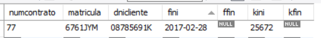

# UNIDAD 6. PROGRAMACIÓN DE BASES DE DATOS

- [UNIDAD 6. PROGRAMACIÓN DE BASES DE DATOS](#unidad-6-programación-de-bases-de-datos)
  - [1.- INTRODUCCIÓN](#1--introducción)
  - [2.- VARIABLES DE USUARIO Y DE SISTEMA](#2--variables-de-usuario-y-de-sistema)
  - [HOJAS DE EJERCICIOS](#hojas-de-ejercicios)
  - [3.- DESARROLLO DE PROCEDIMIENTOS ALMACENADOS](#3--desarrollo-de-procedimientos-almacenados)
  - [HOJAS DE EJERCICIOS](#hojas-de-ejercicios-1)
    - [Instrucciones de control de flujo.](#instrucciones-de-control-de-flujo)
  - [HOJAS DE EJERCICIOS](#hojas-de-ejercicios-2)
  - [HOJAS DE EJERCICIOS](#hojas-de-ejercicios-3)
  - [4.- DESARROLLO DE FUNCIONES](#4--desarrollo-de-funciones)
  - [HOJAS DE EJERCICIOS](#hojas-de-ejercicios-4)
  - [5.- TRIGGERS](#5--triggers)
        - [LOS OPERADORES  NEW y OLD](#los-operadores--new-y-old)
  - [HOJAS DE EJERCICIOS](#hojas-de-ejercicios-5)


## 1.- INTRODUCCIÓN

Todo SGBD permite que los usuarios puedan desarrollar **RUTINAS** formadas por una serie de instrucciones que permiten realizar una tarea. Una vez almacenada la rutina, ésta podrá ser invocada o llamada a ejecución en cualquier momento. 

Las rutinas que se pueden desarrollar en MySQL y, en general, en cualquier SGBD relacional son:

- Funciones.
- Procedimientos.
- Disparadores o Triggers.

**Ventajas** de usar rutinas almacenadas:

- Se automatizan procesos que constan de varias instrucciones. No hay que reescribir esas instrucciones.
- Desde los clientes se tiene que enviar muchísima menos información al servidor. El servidor ya tiene las rutinas almacenadas.
- Si están perfectamente comprobadas las rutinas, hay mayor seguridad de que los procesos se realicen correctamente.

**Desventajas** de usar rutinas almacenadas

- Portabilidad. Hay bastantes diferencias en el lenguaje SQL para crear rutinas en los diferentes SGBD por lo que una base de datos con rutinas creadas en un SGBD puede no ser portable a otro SGBD por esas rutinas.
- Pueden producirse errores de ejecución de una rutina que sean difícilmente detectables.

Para el desarrollo de rutinas se usa un lenguaje de programación. En MySQL, el lenguaje de programación incluye una serie de instrucciones para:

- Crear el tipo de rutina.
- Declarar variables.
- Manejar variables.
- Establecer el comportamiento de los parámetros.
- Realizar control de flujo.
- Manejar cursores.
- Controlar eventos.
- Devolver valores.

## 2.- VARIABLES DE USUARIO Y DE SISTEMA

En MySQL podemos usar dos tipos de variables:

- Variables de sistema: 
    - Las crea el servidor cuando se inicia y/o cuando se inicia una sesión. 
    - El valor que tengan estas variables configuran el comportamiento del servidor y de las sesiones. 
    - Por ejemplo, la variable autocommit que hemos visto al estudiar las transacciones es una variable de sistema y de sesión. 
    - Sólo los usuarios con los privilegios adecuados podrán modificar los valores de estas variables.

- Variables de usuario: 
    - Las declara o crea un usuario para usarlas y modificarlas dentro de la sesión. 
    - Cuando se cierra una sesión, todas las variables de usuario que se hubieran creado en la sesión desaparecen. 

**VARIABLES DEL SISTEMA**

El servidor crea y mantiene varias variables de sistema que indican cómo está configurado. Todas ellas tienen valores por defecto. Puede cambiarse el valor al arrancar el servidor usando opciones en la línea de comandos o en ficheros de configuración. En la mayoría de ellas (las dinámicas) podemos modificar su valor en tiempo de sesión usando el comando SET. 

Las variables de sistema pueden ser:
- Globales 
- Sesión 
  
Las **variables globales** establecen configuraciones globales del servidor: Iniciado el servidor, se puede modificar el valor de las  variables globales que sean dinámicas ejecutando el comando **SET GLOBAL variable=valor**.

Las **variables de sesión** configuran las sesiones o para conexiones individuales de clientes: El valor de las variables de sesión que son dinámicas se puede cambiar mediante un comando **SET SESSION variable=valor**.

Muchas de ellas son tanto globales como de sesión (realmente tienen un valor global y tienen un valor para cada sesión).

Se puede consultar las variables de sistema y sus valores usando el comando SHOW VARIABLES.


Ejemplos de modificación de variables mediante SET GLOBAL o SET SESSION. Si se escribe solo SET, es equivalente a SET SESSION. LOCAL, @@SESSION. y @@LOCAL. son equivalentes a SESSION.

Ejemplos:

```sql
SET SESSION autocommit=0;
SET autocommit=0;
SET GLOBAL max_connections=5;
SET GLOBAL character_set_results=utf8;
SET SESSION character_set_results=utf8;
SET @@SESSION.character_set_results=utf8;
SET  character_set_results=utf8;
SET LOCAL character_set_results=utf8;
SET @@local.character_set_results=utf8;
```

Se pueden consultar las variables de sistema cuyo nombre coincide con un patrón. Por ejemplo, si queremos ver los valores de las variables de sesión cuyo nombre comienza por auto_, ejecutaríamos:

SHOW SESSION VARIABLES LIKE 'auto\_%';


El resultado nos da el valor de dos variables que indican cual es el valor inicial o de arranque para una columna autoincrement y cuanto se incrementa el valor de esa columna cada vez que se inserta un nuevo registro.


También se pueden obtener los valores de las variables de sesión usando SELECT. Para consultar su valor se debe escribir el nombre de la variable precedido de @@

```sql
SELECT @@autocommit, @@max_connections, @@character_set_results;

```


ALGUNAS VARIABLES DE SISTEMA IMPORTANTES:

- autocommit: Vale 0 si está activado el estado transaccional.
- basedir: Ruta del directorio raíz de MySQL. No es dinámica.
- character_set_server: Conjunto de caracteres utilizado en el servidor.
- collation_server: Colación por defecto del servidor.
- datadir: Directorio donde se guardan las bases de datos. No es dinámica.
- init_file: Nombre del archivo de configuración del servidor, por defecto MY.INI. No dinámica.
- log: Vale true si se activa el registro de consultas. No dinámica
- log_updates: Vale true si se ha activado el registro de actualizaciones. No dinámica.
- max_connections: Máximo número de conexiones permitidas de forma simultánea.  
- max_user_connections: Máximo número de sesiones que puede tener iniciadas un usuario.
- port: Número de puerto que usa MySQL para escuchar conexiones TCP/IP. No dinámica.
- skip_networking: Vale true si el servidor sólo admite conexiones locales. No dinámica.
- table_type: Tipo de tabla predeterminado al crear tablas sin especificar su tipo. No dinámica.

**VARIABLES DE ESTADO**

El servidor mantiene muchas variables de estado que proveen de información sobre sus operaciones. Puede ver estas variables y sus valores utilizando la sentencia **SHOW STATUS.**

El valor de estas variables lo modifica el servidor en función del estado en que se encuentra o de las acciones realizadas por los usuarios.

Nunca puede un usuario modificar directamente el valor de estas variables.

ALGUNAS VARIABLES DE ESTADO:

- questions: El número de consultas que han sido enviadas al servidor.
- uptime: El número de segundos que el servidor ha estado funcionando.
- slow_queries: El número de consultas que han tardado más de long_query_time segundos
- max_used_connections: El número máximo de conexiones que han sido utilizadas simultáneamente desde que el servidor ha sido iniciado.
- innodb_rows_inserted: El número de registros insertados en tablas InnoDB.
- connections: El número de intentos de conexión (con éxito o no) al servidor MySQL.
- aborted_connects: El número de intentos de conexión al servidor MySQL que han fallado.
- com_select: Número de instrucciones select ejecutadas en la sesión.
- com_insert: Número de instrucciones insert ejecutadas en la sesión.

**VARIABLES DE USUARIO**

Un usuario puede crear variables propias o de usuario.

Las variables de usuario se declaran con @nombre_var, donde el nombre de variable nombre_var puede consistir de caracteres alfanuméricos y los caracteres '.', '_', y '$'. 

Una forma de establecer una variable de usuario es empleando una instrucción SET:
 
```sql
SET @nombre_var = expresion;
```

Otra forma de crear variables de usuario y/o asignarles valores es hacerlo asignándoles un valor devuelto por una consulta. Por ejemplo;

```sql
SELECT max(numcontrato) INTO @nummayor FROM contratos;
SELECT fini INTO @fecha FROM contratos WHERE numcontrato=@nummayor;
```
## HOJAS DE EJERCICIOS

💻 Hoja de ejercicios 1.


## 3.- DESARROLLO DE PROCEDIMIENTOS ALMACENADOS

Un procedimiento o PROCEDURE es una rutina formada por un conjunto de instrucciones SQL y:

- Tiene un determinado nombre formado por una combinación de caracteres alfanuméricos y cualquiera de estos (. $ _).
- Puede recibir valores al ser llamado a ejecución a través de parámetros encerrados entre paréntesis.
- Puede devolver valores a través de parámetros encerrados entre paréntesis.
- Al desarrollar un procedimiento tenemos que declarar los parámetros que usará, que podrán ser de tres tipos: IN, OUT , INOUT.
- Un procedimiento se crea con la instrucción CREATE PROCEDURE.
- Un procedimiento se ejecuta con la instrucción CALL nombreProc (params)

Todo procedimiento queda asociado a la base de datos abierta cuando se creó el procedimiento. Al ejecutar un procedimiento, el servidor MySQL ejecutará automáticamente una instrucción USE basedatos, donde basedatos es la asociada al procedimiento. De esta forma, podemos ejecutar un procedimiento asociado a una base de datos distinta a la que tenemos abierta especificando, en la llamada al procedimiento, un cualificador de la base de datos, de la forma:  

```sql
CALL nomBASEDATOS.nomProc (parámetros). 
```

Si ejecutamos 

```sql
CALL nomProc(parámetros), 
```

será necesario que el procedimiento se encuentre en la base de datos que tengamos abierta.

Cuando se crea un procedimiento, el servidor MySQL nos devolverá indicaciones sobre los errores que pueda tener o no el procedimiento. Si la sintaxis del procedimiento es correcta, el servidor almacenará dicho procedimiento, pero no lo ejecutará en ese momento. Si se intenta crear un procedimiento con un nombre que ya existe, el servidor MySQL no lo permite. 

Sintaxis para crear un procedimiento: 

```sql
CREATE PROCEDURE NomProc ([parametro1[,...]])    
[caracteristica ...] 
BEGIN   	
Cuerpo_procedimiento
END 
```

Elementos de la sintaxis de la instrucción CREATE PROCEDURE

- Parámetro tiene la sintaxis: [ IN | OUT | INOUT ] NomParam tipo 

- tipo: Cualquier tipo de dato MySQL 

- característica: LANGUAGE SQL   | [NOT] DETERMINISTIC   | SQL SECURITY {DEFINER | INVOKER}	  | COMMENT 'string' 

- cuerpo_procedimiento: Instrucciones SQL para realizar la tarea.

**El carácter delimitador de final de instrucciones.**

El delimitador de final de instrucciones de SQL es el punto y coma (;). Las instrucciones del cuerpo de un procedimiento deben terminar con punto y coma. Si mantenemos el delimitador punto y coma, se ejecutarían las instrucciones mientras se intenta crear el procedimiento y, éste no se crearía.

Para poder crear procedimientos, tendremos que cambiar temporalmente, antes de empezar a crearlos, el carácter delimitador o finalizador de instrucciones SQL en MySQL. 

Para cambiar el carácter delimitador se usa la instrucción DELIMITER. Por ejemplo, para hacer que el delimitador de instrucciones sea '//', habrá que ejecutar:

```sql
DELIMITER  //
```

**Ejemplo 1**: Creación de un procedimiento:

```sql
delimiter //
CREATE  PROCEDURE listados()
BEGIN
	SELECT * FROM clientes;
	SELECT * FROM automoviles;
END//
delimiter ;
call listados();
```

**Ejemplo 2**: Crear y ejecutar un procedimiento numcontratos que recibe en un parámetro de entrada  la matrícula de un coche y, a continuación, muestra las características del coche y devuelve en un parámetro de salida el número de contratos realizados sobre ese coche.

```sql
delimiter //
CREATE  PROCEDURE numcontratos(IN m CHAR(7), OUT c INT)
BEGIN
	SELECT * FROM automoviles WHERE matricula=m;
	SELECT count(*) INTO c FROM contratos WHERE matricula=m;
END//

SET @NUM=0;
CALL numcontratos('3273BGH', @Num)//

SELECT @Num//
delimiter;
```

**Uso de los parámetros en los procedimientos**: 

Los parámetros declarados en un procedimiento se pueden usar dentro del  procedimiento. 

Si un parámetro ha sido declarado IN, no se le puede asignar un valor dentro del procedimiento, aunque si que se podría consultar su valor. Si tenemos:

```sql
CREATE PROCEDURE ejemplo (IN num INT)
-- No podríamos usar esta instrucción dentro del procedimiento:
SELECT count(*) INTO num FROM contratos;
```

Si un parámetro es declarado OUT, no se puede usar ese parámetro para consultar su valor, si para modificarlo. Si tenemos:

```sql
CREATE PROCEDURE ejemplo (OUT num INT)
-- No podríamos usar esta instrucción dentro del procedimiento:
SELECT count(*) FROM contratos WHERE numcontrato=num;
```

En cambio, un parámetro INOUT podríamos usarlo tanto para lectura como para escritura.

**Variables locales**: 

Además de los parámetros, en un procedimiento podemos declarar y usar variables locales. 

Estas variables locales sólo tienen existencia mientras se ejecuta el procedimiento, después quedan destruidas. 

Al igual que las demás instrucciones del procedimiento, la declaración de variables debe estar dentro del bloque BEGIN  ....  END. Para definir o declarar cualquier variable se usa la instrucción:

```sql
DECLARE nombre  tipo[DEFAULT valor];
```

Donde tipo es cualquiera de los tipos admitidos por MySQL. Para modificar el valor de una variable o de un parámetro con el operador de asignación =, debe usarse la instrucción:

```sql
SET variable=expresión;
```

**Ejemplo 3** de uso de variables locales: Crear un procedimiento usovariable que lista los vehículos con menos de 2500 kilómetros y, después, los vehículos con menos kilómetros que los anteriores más 5000 kilómetros.

```sql
CREATE  PROCEDURE usovariable()
BEGIN
 DECLARE a INT;
 SET a=2500;
 SELECT * FROM automoviles WHERE kilometros<a;
 SET a=a+5000;
 SELECT * FROM automoviles WHERE kilometros<a;
END//
```

**Ejemplo 4**: Realiza un procedimiento que recibe la matrícula de un automóvil y escribe u obtiene:
- La marca y modelo del automóvil.
- El número de contratos de alquiler realizados para el automóvil.
- El número de clientes que han alquilado ese automóvil.
- Los nombres de los usuarios que han alquilado ese automóvil.

```sql
create procedure ejemplo4(in mat char(7))
begin
  SELECT marca,modelo FROM automoviles WHERE matricula=mat;
  SELECT count(*) FROM contratos WHERE matricula=mat;
  SELECT count(DISTINCT dnicliente) FROM contratos WHERE matricula=mat;
  SELECT DISTINCT nombre,apellidos FROM clientes INNER JOIN contratos ON dnicliente = dni WHERE matricula=mat;
END
```
## HOJAS DE EJERCICIOS

💻 Hoja de ejercicios 2. 

💻 Hoja de ejercicios 3. 

💻 Hoja de ejercicios 4.

### Instrucciones de control de flujo.

- De decisión
    - IF
    - CASE
- De control de bucle o repetitivas
    - LOOP
    - WHILE
    - REPEAT

**Instrucciones de control de flujo - IF**

Si una condición se cumple, se realizan las instrucciones entre IF y ELSE o entre IF y END IF cuando no hay cláusula ELSE. 
Si no se cumple, se realizan las acciones bajo ELSE (si lo hay).

Sintaxis:

```sql
IF condición THEN
      	instruccion1;
	instruccion2;
	…………..
ELSE
	instruccionA;
	instruccionB;
	……….
END IF;	
```

**Ejemplo 1**: Realizar un procedimiento llamado par que recibe un número entero y escribe un texto “Es un número par” o “Es un número impar” según sea el número par o impar.

```sql
CREATE PROCEDURE par (IN numero INT)
BEGIN
  IF numero%2=0 THEN
    SELECT "Es un número par";
  ELSE
    SELECT "Es un número impar";
  END IF;
END
```

**Ejemplo 2**: Realizar un procedimiento llamado es_par que devuelve true si un número entero recibido en un parámetro es par y false si es impar.

```sql
CREATE PROCEDURE es_par (IN numero INT, OUT par BOOLEAN)
BEGIN
  IF numero%2=0 THEN
    SET par=true;
  ELSE
    SET par=false;
  END IF;
END
```

Otra posible solución:

```sql
CREATE PROCEDURE es_par (IN numero INT, OUT par BOOLEAN)
BEGIN
  SET par=false;
  IF numero%2=0 THEN
    SET par=true;
END IF;
END
```

**Instrucciones de control de flujo – IF y ELSEIF**

La cláusula ELSEIF dentro de un IF permite que se evalúe otra condición si no se cumple la condición IF u otra condición ELSEIF anterior.

**Ejemplo 3**: Realizar un procedimiento que recibe un número de dia de semana laboral y devuelve el nombre de ese día de la semana.

```sql
CREATE PROCEDURE ejemplo3(IN numdia INT, OUT nomdia VARCHAR(15))
BEGIN  
  IF numdia=1 THEN set nomdia='lunes';	
  	ELSEIF numdia=2 THEN SET nomdia='martes';	
  	ELSEIF numdia=3 THEN SET nomdia='miércoles';    
	ELSEIF numdia=4 THEN SET nomdia='jueves';    
	ELSEIF numdia=5 THEN SET nomdia='viernes';   
   ELSE	
	SET nomdia='dia incorrecto';   
  END IF;
END
```

Ahora hay que hacerlo sin usar ELSEIF,  hay que usar IF anidados.

```sql
CREATE PROCEDURE ejemplo3(IN numdia INT, OUT nomdia VARCHAR(15))
BEGIN  
IF numdia=1 THEN 	
	SET nomdia='lunes';  
ELSE		
	IF numdia=2 THEN
 		SET nomdia='martes';
	ELSE
		IF numdia=3 THEN
 			SET nomdia='miércoles';
		ELSE
			IF numdia=4 THEN
 				SET nomdia='jueves';
			ELSE
				IF numdia=5 THEN
					SET nomdia='viernes';
				ELSE
					SET nomdia='dia incorrecto';
				END IF;
			END IF;
		END IF;
	   END IF;
  END IF;
END
```

**Ejemplo 4**: Realizar un procedimiento que crea un nuevo contrato de alquiler para el coche de la matrícula que se pase como parámetro y para el cliente cuyo nombre y apellidos se pasen como parámetros. El procedimiento debe comprobar que el cliente y el coche existen y que el coche está disponible para alquilar.  Si se puede crear el contrato se devuelve true en un parámetro, si no se puede crear el contrato, se devuelve false.

```sql
CREATE PROCEDURE ejemplo4(IN mat CHAR(7), nom VARCHAR(15),ape VARCHAR(25),OUT hecho BOOLEAN)
BEGIN  
   DECLARE na INT;
   DECLARE ncli INT;
   DECLARE kil INT;
   DECLARE d CHAR(9);
   SELECT count(*) INTO ncli FROM clientes WHERE nombre=nom AND apellidos=ape;
   SELECT count(*) INTO na FROM automoviles WHERE matricula=mat AND alquilado=false;
   IF na=1 AND ncli=1 THEN
	SELECT kilometros INTO kil FROM automoviles WHERE matricula=mat;
    	SELECT dni INTO d FROM clientes WHERE nombre=nom AND apellidos=ape;
    	INSERT INTO contratos(matricula,dnicliente,fini,kini) VALUES (mat,d,curdate(),kil);
    	UPDATE automoviles SET alquilado=true WHERE matricula=mat;
    	SET hecho=true;
   ELSE
	SET hecho=false;
   END IF;
END
```

**Ejemplo 5**: Realizar un procedimiento que, partiendo de la matrícula de un coche, devuelve el texto ‘A estrenar’ cuando el coche tiene menos de 5000 Km, ‘nuevo’ cuando tiene entre 5000 y 25000, ‘bastante rodado’ cuando tiene entre 25000 y 100000 y ‘muy rodado’ en otro caso. Si no existiera coche con la matrícula pasada al procedimiento, se devolvería el texto ‘No existe’.

```sql
CREATE PROCEDURE ejemplo5 (IN mat CHAR(7), OUT estado TEXT)
BEGIN
  DECLARE km INT;
  DECLARE n INT DEFAULT 0;
  SET estado='No existe';
  SELECT count(*) INTO n FROM automoviles WHERE matricula=mat;
  IF n=1 THEN
     SELECT kilometros INTO km FROM automoviles WHERE matricula=mat;
     IF km<5000 THEN
       SET estado='A estrenar';
	 ELSEIF km<25000 THEN
        SET estado='nuevo';
	 ELSEIF km<100000 THEN
        SET estado='bastante rodado';
	 ELSE
        SET estado='muy rodado';
	END IF;
  END IF;
END
```

**Instrucciones de control de flujo - CASE**

CASE es una estructura de decisión múltiple. Tiene dos sintaxis;

**Sintaxis 1**: Se ejecutan las instrucciones correspondientes al primer valor que sea igual a la expresión. Cada uno de los valores posibles se evalúa con la cláusula WHEN. Si ninguno de los valores es igual a la expresión, se ejecutan las instrucciones que hay dentro de ELSE, caso de que hubiera ELSE.

```sql
CASE expresion    
WHEN valor1 THEN instrucciones1   
 [WHEN valor2 THEN instrucciones2]     
………………………..    
 [WHEN valorN THEN instruccionesN]   
 [ELSE instrucciones_else]
END CASE; 
```

**Ejemplo 6**: Realizar un procedimiento para obtener la fecha actual en formato: D de mes de AAAA (donde mes es el nombre del mes en español.

```sql
CREATE PROCEDURE ejemplo6 (OUT dia TEXT)
BEGIN
  DECLARE fecha DATE;
  DECLARE mes text;
  SET dia='';
  SELECT curdate() INTO fecha;
  SET dia=concat(dia,dayofmonth(fecha),' de ');
  CASE month(fecha)
     WHEN 1 THEN
        SET mes='enero';
     WHEN 2 THEN  SET mes='febrero';
     WHEN 3 THEN  SET mes='marzo';
     WHEN 4 THEN  SET mes='abril';
     WHEN 5 THEN  SET mes='mayo';
     WHEN 6 THEN  SET mes='junio';
     WHEN 7 THEN  SET mes='julio';
     WHEN 8 THEN  SET mes='agosto';
     WHEN 9 THEN  SET mes='septiembre';
     WHEN 10 THEN  SET mes='octubre';
     WHEN 11 THEN  SET mes='noviembre';
     ELSE
        SET mes='diciembre';
  END CASE;
    SET dia=concat(dia,mes,' de ',year(fecha));
END
```

**Sintaxis 2**: Se ejecutan las instrucciones correspondientes a la primera condición que se cumpla  y si no se cumpliera ninguna de las condiciones, se ejecutarían las instrucciones que hay dentro del ELSE, caso de que haya ELSE.

```sql
CASE    
WHEN condicion1 THEN instrucciones1    
[WHEN condicion2 THEN instrucciones2] 
    ………………………..     
[WHEN condicionN THEN instruccionesN]    
[ELSE instrucciones_else]
END CASE; 
```

**Ejemplo 7**: Realizar un procedimiento que, partiendo de la matrícula de coche, devuelve el texto ‘A estrenar’ cuando el coche tiene menos de 5000 Km, ‘nuevo’ cuando tiene entre 5000 y 25000, ‘bastante rodado’ cuando tiene entre 25000 y 100000 y ‘muy rodado’ en otro caso. Si no existiera coche con la matrícula pasada al procedimiento, se devolvería el texto ‘No existe’.

```sql
CREATE PROCEDURE ejemplo7 (IN mat CHAR(7), OUT estado TEXT)
BEGIN
  DECLARE km INT;
  DECLARE n INT DEFAULT 0;
  SET estado='No existe';
  SELECT count(*) INTO n FROM automoviles WHERE matricula=mat;
  IF n=1 THEN
     SELECT kilometros INTO km FROM automoviles WHERE matricula=mat;
     CASE
	   WHEN km<5000 THEN
        		 SET estado='A estrenar';
	   WHEN km<25000 THEN
        		 SET estado='nuevo';
	   WHEN km<100000 THEN
        		 SET estado='bastante rodado';
	   ELSE
        		 SET estado='muy rodado';
    END CASE;
  END IF;
END
```
## HOJAS DE EJERCICIOS

💻 Hoja de ejercicios 5. 

💻 Hoja de ejercicios 6. 

**Instrucciones de control de flujo**

- De control de flujo de bucle o iterativas
  - LOOP
  - WHILE
  - REPEAT

**Bucle LOOP**

LOOP no tiene ninguna condición de salida. Si se quiere salir de un bucle LOOP, hay que usar dentro de él una instrucción LEAVE. La sintaxis para la instrucción LOOP es:
 
```sql
[etiqueta:]LOOP    
   instrucciones;
END LOOP [etiqueta]; 
```

La etiqueta es una marca que sirve para que se pueda saltar al comienzo o al final del bucle con las instrucciones LEAVE o ITERATE. La etiqueta que hay al principio y al final del bucle debe ser la misma.

NO ES RECOMENDABLE USAR LOOP. SE DEBEN USAR LOS BUCLES WHILE O REPEAT.

**Ejemplo 8**: Realiza un procedimiento para obtener cuantos divisores tiene un número entero.

```sql
CREATE PROCEDURE ejemplo8 (IN num INT, OUT c INT)
BEGIN  
DECLARE d INT;  
DECLARE n INT;  
SET c=0;  
SET n=num; 
 IF n<0 THEN
    	SET n=-n;  
END IF;  
SET d=n;  
etiq1: LOOP 
   	IF d=0 THEN
       		LEAVE etiq1;
	END IF;   	 
	IF n%d=0 THEN
      		 SET c=c+1; 
  	 END IF;
   	 SET d=d-1;
END LOOP etiq1; 
END
```

**Ejemplo 9**: Realiza un procedimiento que obtiene el primer número de contrato a partir del contrato número 1 que no exista en la tabla contratos.

```sql
CREATE PROCEDURE ejemplo9 (OUT n INT)
BEGIN  
DECLARE cont INT;  
SET n=1;    
etiq1: LOOP
    	SELECT count(*) INTO cont FROM contratos WHERE numcontrato=n; 
   	IF cont=0 THEN
       		LEAVE etiq1; 
 	END IF;
    	SET n=n+1; 
END LOOP etiq1; 
END 
```

**Bucle REPEAT**

Permite implementar una estructura repetitiva del tipo repetir…hasta. En esta estructura repetitiva se empieza ejecutando las instrucciones que están dentro de REPEAT y, al final, se analiza si se cumple la condición indicada en UNTIL. Si la condición es verdadera, se sale del bucle y, si es falsa, se vuelve al comienzo del bucle. 
La sintaxis de REPEAT es: 

```sql
REPEAT
    instrucciones
UNTIL condicion
END REPEAT;
```

**Ejemplo 10**: Realiza un procedimiento para obtener cuantos divisores tiene un número entero.

```sql
CREATE PROCEDURE ejemplo10 (IN num INT, OUT c INT)
BEGIN
DECLARE d INT;
DECLARE n INT;
DECLARE contador INT;  
	SET contador=0;  
	SET n=num;  
	IF n<0 THEN       
		SET n=-n;  
	END IF;  
	SET d=n;  
	IF d>0 THEN
		REPEAT  
	  		IF n%d=0 THEN
      		 		SET contador=contador+1;					
        END IF;
			SET d=d-1;
		UNTIL d=0 END REPEAT;
     	END IF;
  	SET c=contador;
 END
```

**Ejemplo 11**:  Realiza un procedimiento que crea una tabla con los nombre y apellidos de 10 clientes de la tabla clientes elegidos al azar y sin repetir.

```sql
CREATE PROCEDURE ejemplo11 ()
BEGIN
  DECLARE n INT default 0;
  DECLARE c INT;
  DECLARE nom VARCHAR(15);
  DECLARE ape VARCHAR(40);
  DROP TABLE IF EXISTS temporal;
  CREATE TABLE temporal ( nombre VARCHAR(25), apellidos VARCHAR(40));
 REPEAT
	SELECT nombre, apellidos INTO nom,ape FROM clientes ORDER BY rand() LIMIT 1;
    	SELECT count(*) INTO c FROM temporal WHERE nombre=nom AND apellidos=ape;
    	IF c=0 THEN
        		SET n=n+1;
        		INSERT INTO temporal VALUES (nom,ape);
    	END IF;
  UNTIL n=10 END REPEAT;
 END
```

**Bucle WHILE**

En este bucle, se evalúa inicialmente una condición y, si esta se cumple, se ejecutan las instrucciones que hay dentro del bucle. Cuando se llega al final del bucle while (END WHILE) se vuelve al principio del bucle para evaluar la condición del WHILE, repitiéndose el proceso anterior si la condición se cumple. 

Cuando la condición del WHILE no se cumpla, se produce la salida del bucle.
 
La sintaxis de WHILE es:

```sql
WHILE condicion DO
    instrucciones
END WHILE;
```

**Ejemplo 12**: Realiza un procedimiento para obtener cuantos divisores tiene un número entero.

```sql
CREATE PROCEDURE ejemplo12 (IN num INT, OUT c INT)
BEGIN
  DECLARE d INT;
  DECLARE n INT;
  SET c=0;
  SET n=num;
  IF n<0 THEN
    	SET n=-n;
  END IF;
  SET d=n;
  WHILE d>0 DO
	IF n%d=0 THEN
      		 SET c=c+1;
	END IF;
	SET d=d-1;
  END WHILE;
END
```

**Ejemplo 13**: Realiza un procedimiento que crea una tabla en la base de datos ALQUILERES con los nombres y apellidos de tantas personas como se indique en un parámetro. Los nombres y apellidos se  obtendrán al azar barajando los nombres y apellidos de todos los usuarios de la tabla usuarios de la base de datos CONCURSOMUSICA.

```sql
CREATE PROCEDURE ejemplo13 (IN numero INT)
BEGIN
  DECLARE c INT DEFAULT 0;
  DECLARE nom VARCHAR(15);
  DECLARE ape VARCHAR(40);
  DROP TABLE IF EXISTS temporal;
  CREATE TABLE temporal (
	nombre VARCHAR(25),
    	apellidos VARCHAR(40));
WHILE c<numero DO
	SELECT nombre INTO nom from concursomusica.usuarios ORDER BY rand() LIMIT 1;
    	SELECT apellidos INTO ape FROM concursomusica.usuarios ORDER BY rand() LIMIT 1;
    	SET c=c+1;
	INSERT INTO temporal VALUES (nom,ape);
  END WHILE;
 END
```

## HOJAS DE EJERCICIOS

💻 Hoja de ejercicios 7. 

💻 Hoja de ejercicios 8. 

## 4.- DESARROLLO DE FUNCIONES

Las funciones son rutinas compuestas por varias instrucciones SQL que devuelven un resultado. Respecto de los procedimientos, las funciones presentan las siguientes diferencias:

- Las funciones devuelven siempre un dato a través de una instrucción RETURN. El dato se corresponde con un tipo declarado para la función.
- Las funciones no pueden trabajar con parámetros OUT o INOUT.
- Las funciones son llamadas a ejecución, al igual que las funciones propias de MySQL, escribiendo su nombre y la lista de parámetros pasados a la función encerrados entre paréntesis. Por tanto, no usa una instrucción de llamada como la instrucción CALL de llamada a los procedimientos.
- Las funciones podrán ser llamadas desde cualquier instrucción SQL como SELECT, UPDATE, INSERT, DELETE. Los procedimientos nunca pueden ser llamados a ejecución dentro de otra instrucción.
- En una función no se puede usar SELECT, salvo cuando lo devuelto se asigna en una variable.

Sintaxis para crear una función:

```sql
CREATE FUNCTION nomFuncion([parametro[,...]])
    RETURNS tipo
    [caracteristica ...]
BEGIN
	  CuerpoRutina
END 
```

Con respecto a los procedimientos, es nueva la cláusula **RETURNS tipo** que sirve para indicar el tipo de dato resultado que devuelve la función. 

Para devolver un resultado, la función debe incluir dentro del cuerpo de la rutina, la instrucción **RETURN expresion**, debiendo ser expresión del mismo tipo que la función. 

**Ejemplo 1**: Realiza una función que devuelve si un número entero es par o impar.

```sql
CREATE FUNCTION  par (n INT) 
 RETURNS BOOLEAN
BEGIN
 	if n%2=0 then
      		RETURN true;
	else
		RETURN false;
	end if;
END ;
```

Ejemplos de llamada a la función par:

```sql
SELECT par(7);
SET @p=par(7);
SET @p=par((select count(*) from automoviles));
SELECT count(*) from contratos where par(numcontrato)=true;
```

**Ejemplo 2**: Realiza una función para obtener cuantos divisores tiene un número entero positivo. Si el número fuese negativo o cero, devolverá que tiene cero divisores.

```sql
CREATE FUNCTION  divisores (n INT) 
 RETURNS INT
BEGIN
    DECLARE d INT DEFAULT 0;
    DECLARE c INT DEFAULT 0;
    IF n >0 THEN
      	WHILE d<n DO
		SET d=d+1;
            		IF n%d=0 THEN
			SET c=c+1;
		END IF;
	END WHILE;
END IF;
RETURN c;
END;
```

**Ejemplo 3**: Realiza una función para obtener si un número entero es o no es primo.

```sql
CREATE FUNCTION  es_primo (n INT) 
 RETURNS BOOLEAN
BEGIN
	DECLARE es BOOLEAN;
	DECLARE nd int;
	IF n>0 THEN
		SET es=false;
		SET nd=divisores(n);
        		IF (nd=2 OR nd=1) THEN
			SET es=true;
		END IF;
	END IF;
	RETURN es;
END;
```

## HOJAS DE EJERCICIOS

💻 Hoja de ejercicios 9.

## 5.- TRIGGERS

Un trigger o disparador es una rutina (conjunto de sentencias) que se lanza a ejecución automáticamente cuando se produce un evento de actualización de datos sobre una tabla (INSERT, UPDATE, DELETE). 

Un ejemplo: ¿Qué se debe desencadenar en una clasificación de un liga de fútbol cuando se modifica el resultado de un partido?.


SINTAXIS PARA CREAR UN TRIGGER

```sql
CREATE TRIGGER nombreTrigger  momento_disparo   evento    ON nombreTabla FOR EACH ROW
BEGIN
	sentencias;
END 
```

- Evento puede ser **INSERT, UPDATE, DELETE**. Es una acción realizada sobre una tabla que va a desencadenar la realización automática de otras acciones sobre otras tablas.
- Momento_disparo especifica si las sentencias se ejecutan antes que el evento que lanza al trigger(**BEFORE**) o después (**AFTER**). En muchos casos puede dar igual usar BEFORE o AFTER. Se debe usar BEFORE si trata de validarse que se puede efectuar el evento. Por ejemplo, al insertar un contrato de alquiler de un coche, debería lanzarse un trigger que comprobase si está disponible para alquilar, si no lo está, el trigger debería abortar el evento.
- **FOR EACH ROW** indica que el trigger se lanza por cada fila afectada por el evento.

##### LOS OPERADORES  NEW y OLD

Dentro de las sentencias que se ejecutarán al dispararse el trigger, se pueden usar los operadores OLD y NEW. Estos operadores sirven para hacer referencia a las columnas de las filas afectadas por un evento dentro del trigger.

- El operador **NEW** sirve para hacer referencia al nuevo valor de una columna sobre la que se produce un evento y se usa como NEW.nombreColumna. 

- El operador **OLD** sirve para hacer referencia al anterior valor de una columna sobre la que se produce un evento y se usa en la forma OLD.nombreColumna. 


**Restricciones**

- Nunca puede haber dos triggers para responder a un mismo evento sobre una misma tabla en el mismo momento de disparo (veremos después que es esto).

- No se permite usar sentencias que devuelvan filas de resultados. Si que se permiten sentencias SELECT que devuelvan una fila y carguen lo devuelto en variables (SELECT  …  INTO … FROM)

Supongamos que tenemos este contrato y que tenemos un trigger sobre los eventos UPDATE de contratos.



Y que ejecutamos: UPDATE contratos SET fini=adddate(fini,interval 1 week), ffin=‘2017-05-23’, kfin=27200 where numcontrato=77;

Estos serían los valores OLD y NEW de contratos mientras se está ejecutando el trigger:


**Ejemplo 1**: Realizar un trigger que, tras añadir un nuevo contrato de alquiler de un coche, actualiza el estado de alquilado de ese coche.

```sql
CREATE TRIGGER alquilar AFTER INSERT ON contratos FOR EACH ROW 
BEGIN
  UPDATE automoviles SET alquilado=true WHERE matricula=NEW.matricula;

END
```

NEW.matricula hace referencia a la nueva matricula afectada por el evento (INSERTAR en la tabla CONTRATOS). Por tanto hace referencia a la matricula insertada en el nuevo contrato.

El momento de disparo podría ser también BEFORE.

PRUEBA: Inserta un nuevo contrato en contratos y comprueba que el estado de alquilado del coche cambia.

**Ejemplo 2**: Modifica el trigger anterior para que se asigne a los kilómetros iniciales del contrato insertado los kilómetros que tiene el coche contratado.

```sql
CREATE TRIGGER alquilar BEFORE INSERT ON contratos FOR EACH ROW 
BEGIN	
    DECLARE k INT;    
-- obtenemos los kilómetros del coche que se va a contratar
    SELECT kilometros INTO k FROM automoviles WHERE matricula=NEW.matricula;    
-- asignamos los kilómetros al nuevo valor que se va a insertar en contratos
    SET NEW.kini=k;    
    UPDATE automoviles SET alquilado=true WHERE matricula=NEW.matricula;
END
```

El momento de ejecución del trigger tiene que ser BEFORE (antes que se modifique). Si pusiéramos AFTER, no tendría efecto SET NEW.kini=k, puesto que ya se habría insertado el contrato.

**Ejemplo 3**: Modifica el trigger anterior para que, además de lo que realizaba, compruebe si el coche a contratar se puede alquilar, es decir, no está alquilado. Si está alquilado, se debe evitar que se haga el contrato.

```sql
CREATE TRIGGER alquilar BEFORE INSERT ON contratos FOR EACH ROW 
BEGIN	
DECLARE k INT;    
DECLARE a BOOLEAN;    
SELECT kilometros, alquilado INTO k,a FROM automoviles WHERE matricula=new.matricula;   
 IF a=true THEN	
	SET NEW.matricula=null;	
ELSE
        	SET NEW.kini=k;	
	UPDATE automoviles SET alquilado=true WHERE matricula=NEW.matricula;	
END IF;
END
```

Al poner new.matricula a null, no se actualiza ya que no se admiten nulos en la columna matrícula de contratos. Entonces, se produce un error de ejecución y se aborta el proceso, se sale del trigger.

**Ejemplo 4**: Realiza un trigger para que, al hacer la modificación de un contrato correspondiente a la finalización de un contrato, se establezca que el coche pasa a estar disponible y que los kilómetros del coche sean los kilómetros finales del coche en el contrato.

```sql
CREATE TRIGGER entregar AFTER UPDATE ON contratos FOR EACH ROW 
BEGIN	
DECLARE k INT;    
DECLARE a BOOLEAN;    
IF OLD.ffin IS NULL AND NEW.ffin IS NOT NULL THEN	
        UPDATE automoviles SET alquilado=false WHERE matricula=NEW.matricula;
        IF NEW.kfin IS NOT NULL THEN		
	UPDATE automoviles SET kilometros=NEW.kfin WHERE matricula=NEW.matricula;
       END IF;	
END IF;
END
```

Para comprobar si es una modificación por una entrega, se verifica si la fecha final contenía null y se ha cargado un valor de fecha en el contrato. Sólo se asignan kilómetros al coche cuando se haya cargado un nuevo valor en el contrato.

**Ejemplo 5**: Suponiendo que se tiene una tabla auditoriaCLIENTES, con las columnas usuario, dia, hora, instrucción, dni, realiza un trigger tal que, al eliminar algún cliente en la tabla clientes, añada una fila en la tabla auditoriaCLIENTES indicando quien y cuando hizo la eliminación y que dni de cliente se eliminó. En la columna dni se almacena el dni del cliente eliminado. En la columna instrucción se carga la instrucción auditada (INSERT, UPDATE o DELETE).

```sql
CREATE TRIGGER auditarC AFTER DELETE ON clientes FOR EACH ROW BEGIN
	INSERT INTO auditoriaclientes (usuario,dia,hora,instruccion,dni) 
	VALUES (current_user(),curdate(),curtime(),'delete',OLD.dni);
END
```

## HOJAS DE EJERCICIOS

💻 Hoja de ejercicios 10.


